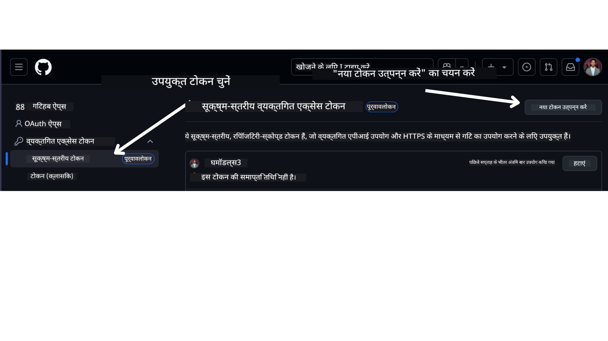

<!--
CO_OP_TRANSLATOR_METADATA:
{
  "original_hash": "366bc6709dd95b8a32ec7c705b0f179c",
  "translation_date": "2025-04-05T19:40:57+00:00",
  "source_file": "00-course-setup\\README.md",
  "language_code": "hi"
}
-->
# कोर्स सेटअप

## परिचय

इस पाठ में आप जानेंगे कि इस कोर्स के कोड नमूनों को कैसे चलाया जाए।

## आवश्यकताएँ

- एक GitHub खाता
- Python 3.12+
- Azure सदस्यता
- Azure AI Foundry खाता

## इस रिपॉजिटरी को क्लोन या फोर्क करें

शुरू करने के लिए, कृपया GitHub रिपॉजिटरी को क्लोन या फोर्क करें। इससे आपके पास कोर्स सामग्री की अपनी प्रति होगी, जिसे आप चला सकते हैं, टेस्ट कर सकते हैं और कोड में बदलाव कर सकते हैं!

यह लिंक पर क्लिक करके किया जा सकता है:

आपके पास अब इस कोर्स की अपनी फोर्क की गई प्रति निम्नलिखित लिंक पर होनी चाहिए:


## अपना GitHub व्यक्तिगत एक्सेस टोकन (PAT) प्राप्त करें

वर्तमान में, इस कोर्स में Github Models Marketplace का उपयोग किया गया है ताकि बड़े भाषा मॉडल (LLMs) तक मुफ्त पहुंच प्रदान की जा सके, जो AI एजेंट्स बनाने के लिए उपयोग किए जाएंगे।

इस सेवा तक पहुंचने के लिए, आपको एक GitHub व्यक्तिगत एक्सेस टोकन बनाना होगा।

यह आपके GitHub खाते पर जाकर किया जा सकता है।

अपने स्क्रीन के बाईं ओर `Fine-grained tokens` विकल्प चुनें।

फिर `Generate new token` चुनें।



उस नए टोकन को कॉपी करें जिसे आपने अभी बनाया है। अब आप इसे इस कोर्स में शामिल `.env` फ़ाइल में जोड़ेंगे।

## इसे अपने एनवायरनमेंट वेरिएबल्स में जोड़ें

अपनी `.env` फ़ाइल बनाने के लिए, अपने टर्मिनल में निम्नलिखित कमांड चलाएँ:

```bash
cp .env.example .env
```

यह उदाहरण फ़ाइल को कॉपी करेगा और आपकी डायरेक्टरी में `.env` बनाएगा। एनवायरनमेंट वेरिएबल्स के लिए मान भरें। प्रत्येक एनवायरनमेंट वेरिएबल के लिए मान आप [Azure AI Foundry](https://ai.azure.com?WT.mc_id=academic-105485-koreyst) पोर्टल के निम्नलिखित स्थानों में पा सकते हैं:

उस फ़ाइल को खोलें और आपने जो टोकन बनाया है उसे निम्नलिखित में पेस्ट करें:  
`GITHUB_TOKEN=` field of the .env file. 
- `AZURE_SUBSCRIPTION_ID` - On the **Overview** page of your project within **Project details**.
- `AZURE_AI_PROJECT_NAME` - At the top of the **Overview** page for your project.
- `AZURE_OPENAI_RESOURCE_GROUP` - On the **Overview** page of the **Management Center** within **Project properties**.
- `AZURE_OPENAI_SERVICE` - On the **Overview** page of your project in the **Included capabilities** tab for **Azure OpenAI Service**.
- `AZURE_OPENAI_API_VERSION` - On the [API version lifecycle](https://learn.microsoft.com/azure/ai-services/openai/api-version-deprecation#latest-ga-api-release?WT.mc_id=academic-105485-koreyst) webpage within the **Latest GA API release** section.
- `AZURE_OPENAI_ENDPOINT` - **Endpoint** के **Details** टैब पर आपके मॉडल डिप्लॉयमेंट के अंदर (जैसे **Target URI**)

## आवश्यक पैकेज इंस्टॉल करें

सुनिश्चित करें कि कोड चलाने के लिए आपके पास सभी आवश्यक Python पैकेज हैं। इसके लिए अपने टर्मिनल में निम्नलिखित कमांड चलाएँ।

हम किसी भी संघर्ष और समस्याओं से बचने के लिए एक Python वर्चुअल एनवायरनमेंट बनाने की सिफारिश करते हैं।

```bash
pip install -r requirements.txt
```

यह आवश्यक Python पैकेज इंस्टॉल कर देगा।

# Azure में साइन इन करें

सुरक्षा के सर्वोत्तम अभ्यास के रूप में, हम [keyless authentication](https://learn.microsoft.com/azure/developer/ai/keyless-connections?tabs=csharp%2Cazure-cli?WT.mc_id=academic-105485-koreyst) का उपयोग करेंगे ताकि Microsoft Entra ID के साथ Azure OpenAI में प्रमाणित किया जा सके। ऐसा करने से पहले, आपको अपने ऑपरेटिंग सिस्टम के लिए [स्थापना निर्देश](https://learn.microsoft.com/cli/azure/install-azure-cli?WT.mc_id=academic-105485-koreyst) के अनुसार **Azure CLI** इंस्टॉल करना होगा।

इसके बाद, एक टर्मिनल खोलें और `az login` to sign in to your Azure account.

## Sign in to Azure

Login with your Azure AI account used to provision the Azure resources.

Open a new terminal and enter the following command and follow the instructions in the terminal:

`az login --use-device-code`

Once you've logged in, select your subscription in the terminal.

## Access the environment variables.

We'll import `os` and `load_dotenv` चलाएँ ताकि आप एनवायरनमेंट वेरिएबल्स तक पहुंच सकें।

```python
import os
from dotenv import load_dotenv

load_dotenv()
```

## keyless authentication सेटअप करें

अपने क्रेडेंशियल्स को हार्डकोड करने के बजाय, हम Azure OpenAI के साथ एक keyless कनेक्शन का उपयोग करेंगे। ऐसा करने के लिए, हम `DefaultAzureCredential` and later call the `DefaultAzureCredential` फ़ंक्शन को आयात करेंगे ताकि क्रेडेंशियल प्राप्त किया जा सके।

```python
from azure.identity import DefaultAzureCredential, InteractiveBrowserCredential
```

अब आप इस कोर्स का कोड चलाने के लिए तैयार हैं। AI एजेंट्स की दुनिया के बारे में अधिक जानने का आनंद लें!

यदि इस सेटअप को चलाने में कोई समस्या हो, तो हमारे साथ जुड़ें।

## अगला पाठ

[AI एजेंट्स और एजेंट उपयोग मामलों का परिचय](../01-intro-to-ai-agents/README.md)

**अस्वीकरण**:  
यह दस्तावेज़ AI अनुवाद सेवा [Co-op Translator](https://github.com/Azure/co-op-translator) का उपयोग करके अनुवादित किया गया है। जबकि हम सटीकता सुनिश्चित करने का प्रयास करते हैं, कृपया ध्यान दें कि स्वचालित अनुवाद में त्रुटियां या अशुद्धियां हो सकती हैं। मूल दस्तावेज़ को इसकी मूल भाषा में आधिकारिक स्रोत माना जाना चाहिए। महत्वपूर्ण जानकारी के लिए, पेशेवर मानव अनुवाद की सिफारिश की जाती है। इस अनुवाद के उपयोग से उत्पन्न किसी भी गलतफहमी या गलत व्याख्या के लिए हम उत्तरदायी नहीं हैं।