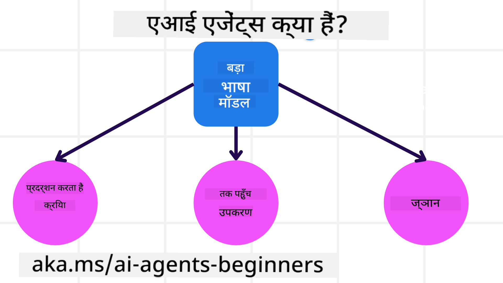
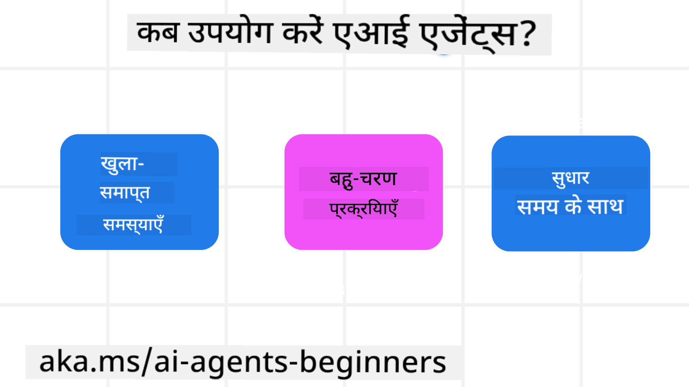

<!--
CO_OP_TRANSLATOR_METADATA:
{
  "original_hash": "1e1529d927f1ea6c72456d5ccc6718d2",
  "translation_date": "2025-04-05T19:41:28+00:00",
  "source_file": "01-intro-to-ai-agents\\README.md",
  "language_code": "hi"
}
-->

> _(इस पाठ का वीडियो देखने के लिए ऊपर दी गई छवि पर क्लिक करें)_

# AI एजेंट्स और उनके उपयोग के मामलों का परिचय

"AI एजेंट्स फॉर बिगिनर्स" कोर्स में आपका स्वागत है! यह कोर्स AI एजेंट्स बनाने के लिए बुनियादी जानकारी और व्यावहारिक उदाहरण प्रदान करता है।

अन्य शिक्षार्थियों और AI एजेंट निर्माताओं से मिलने और इस कोर्स के बारे में अपने सवाल पूछने के लिए शामिल हों।

इस कोर्स की शुरुआत हम यह समझने से करेंगे कि AI एजेंट्स क्या हैं और हम उन्हें अपने बनाए गए एप्लिकेशन और वर्कफ्लो में कैसे उपयोग कर सकते हैं।

## परिचय

यह पाठ कवर करता है:

- AI एजेंट्स क्या हैं और उनके अलग-अलग प्रकार क्या हैं?  
- कौन से उपयोग के मामले AI एजेंट्स के लिए सबसे उपयुक्त हैं और वे हमारी कैसे मदद कर सकते हैं?  
- एजेंटिक समाधान डिज़ाइन करते समय कुछ बुनियादी निर्माण खंड क्या हैं?  

## सीखने के लक्ष्य
इस पाठ को पूरा करने के बाद, आप:

- AI एजेंट्स की अवधारणाओं को समझ पाएंगे और वे अन्य AI समाधानों से कैसे अलग हैं।  
- AI एजेंट्स को सबसे कुशल तरीके से लागू कर पाएंगे।  
- उपयोगकर्ताओं और ग्राहकों के लिए उत्पादकता से एजेंटिक समाधान डिज़ाइन कर पाएंगे।  

## AI एजेंट्स और उनके प्रकार को परिभाषित करना

### AI एजेंट्स क्या हैं?

AI एजेंट्स वे **सिस्टम** हैं जो **लार्ज लैंग्वेज मॉडल्स (LLMs)** को **कार्रवाई करने** में सक्षम बनाते हैं। यह LLMs को **टूल्स** और **ज्ञान** तक पहुंच देकर उनकी क्षमताओं का विस्तार करते हैं।

आइए इस परिभाषा को छोटे हिस्सों में विभाजित करें:

- **सिस्टम** - एजेंट्स को केवल एक घटक के रूप में नहीं, बल्कि कई घटकों के सिस्टम के रूप में सोचना महत्वपूर्ण है। AI एजेंट्स के बुनियादी घटक हैं:  
  - **पर्यावरण** - वह परिभाषित स्थान जहां AI एजेंट काम कर रहा है। उदाहरण के लिए, यदि हमारे पास एक ट्रैवल बुकिंग AI एजेंट है, तो पर्यावरण वह ट्रैवल बुकिंग सिस्टम हो सकता है जिसे AI एजेंट कार्य पूरा करने के लिए उपयोग करता है।  
  - **सेंसर्स** - पर्यावरण में जानकारी होती है और यह फीडबैक प्रदान करता है। AI एजेंट्स सेंसर्स का उपयोग करके पर्यावरण की वर्तमान स्थिति के बारे में जानकारी एकत्र और व्याख्या करते हैं। ट्रैवल बुकिंग एजेंट के उदाहरण में, ट्रैवल बुकिंग सिस्टम होटल की उपलब्धता या फ्लाइट की कीमतों जैसी जानकारी प्रदान कर सकता है।  
  - **एक्चुएटर्स** - एक बार जब AI एजेंट पर्यावरण की वर्तमान स्थिति प्राप्त कर लेता है, तो वह यह निर्धारित करता है कि पर्यावरण को बदलने के लिए कौन सा कार्य करना है। ट्रैवल बुकिंग एजेंट के लिए, यह उपयोगकर्ता के लिए उपलब्ध कमरे को बुक करना हो सकता है।  

**लार्ज लैंग्वेज मॉडल्स** - एजेंट्स की अवधारणा LLMs के निर्माण से पहले भी मौजूद थी। LLMs के साथ AI एजेंट्स बनाने का लाभ यह है कि वे मानव भाषा और डेटा की व्याख्या करने में सक्षम हैं। यह क्षमता LLMs को पर्यावरणीय जानकारी की व्याख्या करने और पर्यावरण को बदलने की योजना बनाने में सक्षम बनाती है।  

**कार्रवाई करना** - AI एजेंट सिस्टम्स के बाहर, LLMs उपयोगकर्ता के प्रॉम्प्ट के आधार पर सामग्री या जानकारी उत्पन्न करने तक सीमित हैं। AI एजेंट सिस्टम्स के भीतर, LLMs उपयोगकर्ता के अनुरोध की व्याख्या करके और उनके पर्यावरण में उपलब्ध टूल्स का उपयोग करके कार्यों को पूरा कर सकते हैं।  

**टूल्स तक पहुंच** - LLMs को किस टूल्स तक पहुंच है, यह 1) उस पर्यावरण द्वारा परिभाषित किया जाता है जिसमें वे काम कर रहे हैं और 2) AI एजेंट के डेवलपर द्वारा। हमारे ट्रैवल एजेंट उदाहरण में, एजेंट के टूल्स ट्रैवल बुकिंग सिस्टम में उपलब्ध संचालन तक सीमित हैं, और/या डेवलपर एजेंट की टूल्स तक पहुंच को केवल फ्लाइट्स तक सीमित कर सकता है।  

**मेमोरी + ज्ञान** - मेमोरी, उपयोगकर्ता और एजेंट के बीच बातचीत के संदर्भ में, अल्पकालिक हो सकती है। दीर्घकालिक रूप से, पर्यावरण द्वारा प्रदान की गई जानकारी के अलावा, AI एजेंट्स अन्य सिस्टम्स, सेवाओं, टूल्स, और यहां तक कि अन्य एजेंट्स से भी ज्ञान प्राप्त कर सकते हैं। ट्रैवल एजेंट उदाहरण में, यह ज्ञान ग्राहक डेटाबेस में स्थित उपयोगकर्ता की यात्रा प्राथमिकताओं की जानकारी हो सकती है।  

### विभिन्न प्रकार के एजेंट्स

अब जब हमने AI एजेंट्स की सामान्य परिभाषा देख ली है, तो आइए कुछ विशिष्ट एजेंट प्रकारों और उन्हें ट्रैवल बुकिंग AI एजेंट में कैसे लागू किया जा सकता है, पर नजर डालें।  

| **एजेंट प्रकार**                | **विवरण**                                                                                                                       | **उदाहरण**                                                                                                                                                                                                                   |
| ----------------------------- | ------------------------------------------------------------------------------------------------------------------------------------- | ----------------------------------------------------------------------------------------------------------------------------------------------------------------------------------------------------------------------------- |
| **सिंपल रिफ्लेक्स एजेंट्स**      | पहले से परिभाषित नियमों के आधार पर तुरंत कार्रवाई करते हैं।                                                                                  | ट्रैवल एजेंट ईमेल के संदर्भ की व्याख्या करता है और ट्रैवल शिकायतों को ग्राहक सेवा को फॉरवर्ड करता है।                                                                                                                          |
| **मॉडल-बेस्ड रिफ्लेक्स एजेंट्स** | दुनिया के एक मॉडल और उस मॉडल में होने वाले परिवर्तनों के आधार पर कार्रवाई करते हैं।                                                              | ट्रैवल एजेंट ऐतिहासिक मूल्य डेटा तक पहुंच के आधार पर महत्वपूर्ण मूल्य परिवर्तनों वाले मार्गों को प्राथमिकता देता है।                                                                                                             |
| **गोल-बेस्ड एजेंट्स**         | विशिष्ट लक्ष्यों को प्राप्त करने के लिए योजनाएँ बनाते हैं, लक्ष्य की व्याख्या करते हैं और उसे प्राप्त करने के लिए कार्यों का निर्धारण करते हैं।                                  | ट्रैवल एजेंट एक यात्रा बुक करता है, वर्तमान स्थान से गंतव्य तक आवश्यक यात्रा व्यवस्था (कार, सार्वजनिक परिवहन, फ्लाइट्स) निर्धारित करता है।                                                                                |
| **यूटिलिटी-बेस्ड एजेंट्स**      | प्राथमिकताओं पर विचार करते हैं और लक्ष्यों को प्राप्त करने के लिए ट्रेडऑफ्स को संख्यात्मक रूप से तौलते हैं।                                               | ट्रैवल एजेंट यात्रा बुक करते समय सुविधा बनाम लागत को तौलकर उपयोगिता को अधिकतम करता है।                                                                                                                                          |
| **लर्निंग एजेंट्स**           | समय के साथ प्रतिक्रिया का जवाब देकर और तदनुसार कार्रवाई को समायोजित करके सुधार करते हैं।                                                        | ट्रैवल एजेंट ग्राहक की प्रतिक्रिया का उपयोग करके भविष्य की बुकिंग में समायोजन करने के लिए सुधार करता है।                                                                                                               |
| **हायरार्किकल एजेंट्स**       | एक स्तरीय प्रणाली में कई एजेंट्स को शामिल करते हैं, जहां उच्च-स्तरीय एजेंट्स कार्यों को छोटे कार्यों में विभाजित करते हैं जिन्हें निम्न-स्तरीय एजेंट्स पूरा करते हैं। | ट्रैवल एजेंट एक यात्रा रद्द करता है, कार्य को छोटे कार्यों में विभाजित करता है (जैसे, विशिष्ट बुकिंग रद्द करना) और निम्न-स्तरीय एजेंट्स को उन्हें पूरा करने के लिए देता है, जो उच्च-स्तरीय एजेंट को रिपोर्ट करते हैं।                                     |
| **मल्टी-एजेंट सिस्टम्स (MAS)** | एजेंट्स स्वतंत्र रूप से कार्यों को पूरा करते हैं, चाहे सहकारी हो या प्रतिस्पर्धात्मक।                                                           | सहकारी: कई एजेंट्स विशिष्ट यात्रा सेवाओं जैसे होटल, फ्लाइट्स, और मनोरंजन की बुकिंग करते हैं। प्रतिस्पर्धात्मक: कई एजेंट्स एक साझा होटल बुकिंग कैलेंडर का प्रबंधन और प्रतिस्पर्धा करते हैं ताकि ग्राहकों को होटल में बुक किया जा सके। |

## AI एजेंट्स का उपयोग कब करें

पिछले सेक्शन में, हमने ट्रैवल एजेंट उपयोग मामले का उपयोग यह समझाने के लिए किया कि ट्रैवल बुकिंग के विभिन्न परिदृश्यों में विभिन्न प्रकार के एजेंट्स का उपयोग कैसे किया जा सकता है। हम इस एप्लिकेशन का उपयोग पूरे कोर्स में जारी रखेंगे।

आइए उन प्रकार के उपयोग मामलों को देखें जिनके लिए AI एजेंट्स सबसे उपयुक्त हैं:

- **खुले-समाप्ति वाले समस्याएं** - LLM को यह तय करने देना कि कार्य पूरा करने के लिए कौन से कदम उठाने की आवश्यकता है क्योंकि इसे हमेशा वर्कफ़्लो में हार्डकोड नहीं किया जा सकता।  
- **मल्टी-स्टेप प्रक्रियाएं** - ऐसे कार्य जिनमें जटिलता का स्तर होता है जिसमें AI एजेंट को टूल्स या जानकारी का उपयोग कई चरणों में करना पड़ता है, न कि केवल एक बार की पुनर्प्राप्ति।  
- **समय के साथ सुधार** - ऐसे कार्य जहां एजेंट अपने पर्यावरण या उपयोगकर्ताओं से प्रतिक्रिया प्राप्त करके समय के साथ सुधार कर सकता है ताकि बेहतर उपयोगिता प्रदान की जा सके।  

AI एजेंट्स के उपयोग पर अधिक विचार हम "विश्वसनीय AI एजेंट्स का निर्माण" पाठ में कवर करेंगे।

## एजेंटिक समाधानों की बुनियादी बातें

### एजेंट विकास

AI एजेंट सिस्टम डिज़ाइन करने का पहला कदम टूल्स, कार्यों और व्यवहारों को परिभाषित करना है। इस कोर्स में, हम अपने एजेंट्स को परिभाषित करने के लिए **Azure AI Agent Service** का उपयोग करने पर ध्यान केंद्रित करेंगे। यह निम्नलिखित सुविधाएँ प्रदान करता है:

- OpenAI, Mistral, और Llama जैसे ओपन मॉडल्स का चयन  
- Tripadvisor जैसे प्रदाताओं के माध्यम से लाइसेंस प्राप्त डेटा का उपयोग  
- मानकीकृत OpenAPI 3.0 टूल्स का उपयोग  

### एजेंटिक पैटर्न्स

LLMs के साथ संचार प्रॉम्प्ट्स के माध्यम से होता है। AI एजेंट्स की अर्ध-स्वायत्त प्रकृति को देखते हुए, पर्यावरण में बदलाव के बाद LLM को मैन्युअल रूप से फिर से प्रॉम्प्ट करना हमेशा संभव या आवश्यक नहीं होता। हम **एजेंटिक पैटर्न्स** का उपयोग करते हैं जो हमें LLM को कई चरणों में अधिक स्केलेबल तरीके से प्रॉम्प्ट करने की अनुमति देते हैं।  

यह कोर्स कुछ वर्तमान लोकप्रिय एजेंटिक पैटर्न्स में विभाजित है।

### एजेंटिक फ्रेमवर्क्स

एजेंटिक फ्रेमवर्क्स डेवलपर्स को कोड के माध्यम से एजेंटिक पैटर्न्स को लागू करने की अनुमति देते हैं। ये फ्रेमवर्क्स टेम्पलेट्स, प्लगइन्स, और टूल्स प्रदान करते हैं जो बेहतर AI एजेंट सहयोग के लिए सहायक होते हैं। ये लाभ AI एजेंट सिस्टम्स के बेहतर अवलोकन और समस्या निवारण की क्षमताएँ प्रदान करते हैं।

इस कोर्स में, हम शोध-आधारित AutoGen फ्रेमवर्क और Semantic Kernel से प्रोडक्शन-रेडी Agent फ्रेमवर्क का अन्वेषण करेंगे।

## पिछला पाठ

[कोर्स सेटअप](../00-course-setup/README.md)

## अगला पाठ

[एजेंटिक फ्रेमवर्क्स की खोज](../02-explore-agentic-frameworks/README.md)

**अस्वीकरण**:  
यह दस्तावेज़ AI अनुवाद सेवा [Co-op Translator](https://github.com/Azure/co-op-translator) का उपयोग करके अनुवादित किया गया है। जबकि हम सटीकता के लिए प्रयासरत हैं, कृपया ध्यान दें कि स्वचालित अनुवाद में त्रुटियाँ या अशुद्धियाँ हो सकती हैं। इसकी मूल भाषा में मौजूद मूल दस्तावेज़ को आधिकारिक स्रोत माना जाना चाहिए। महत्वपूर्ण जानकारी के लिए, पेशेवर मानव अनुवाद की सिफारिश की जाती है। इस अनुवाद के उपयोग से उत्पन्न किसी भी गलतफहमी या गलत व्याख्या के लिए हम उत्तरदायी नहीं हैं।