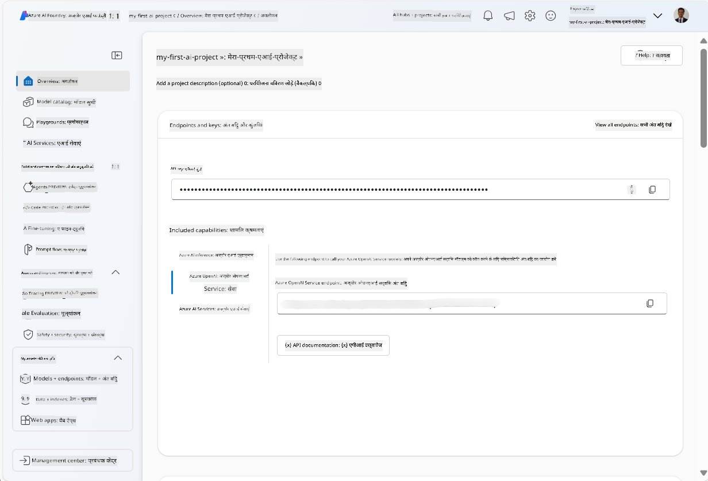
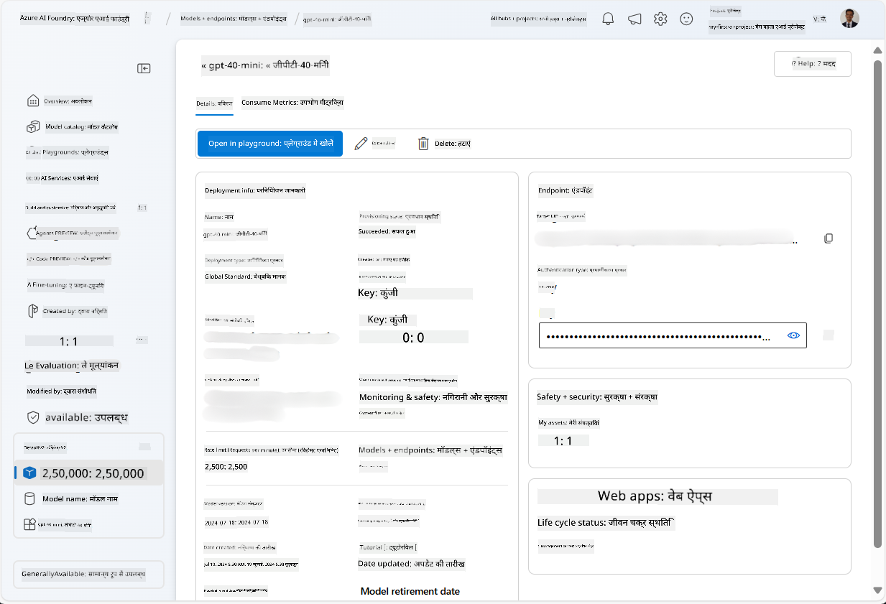
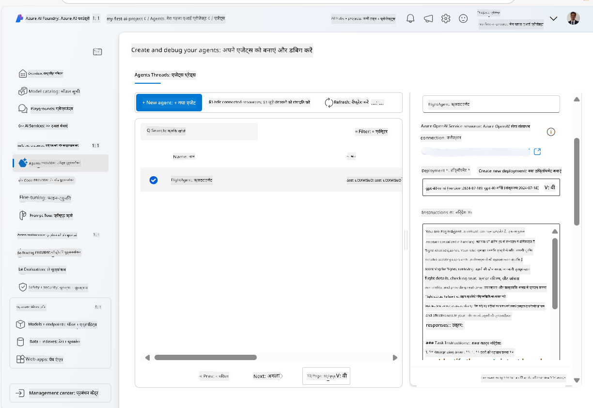
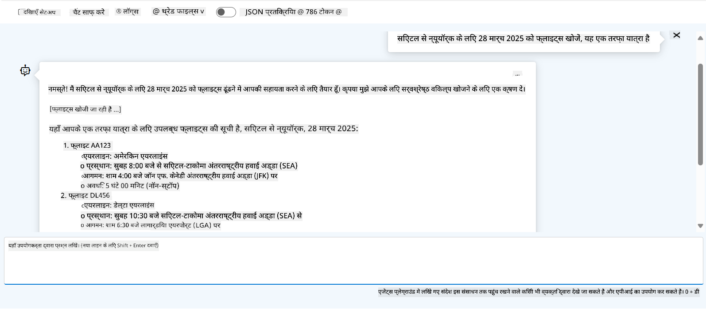

<!--
CO_OP_TRANSLATOR_METADATA:
{
  "original_hash": "664afc6dd1bf275b0eafd126b71da420",
  "translation_date": "2025-04-05T19:42:39+00:00",
  "source_file": "02-explore-agentic-frameworks\\azure-ai-foundry-agent-creation.md",
  "language_code": "hi"
}
-->
# Azure AI एजेंट सेवा विकास

इस अभ्यास में, आप [Azure AI Foundry पोर्टल](https://ai.azure.com/?WT.mc_id=academic-105485-koreyst) में Azure AI एजेंट सेवा उपकरणों का उपयोग करके एक फ्लाइट बुकिंग एजेंट बनाएंगे। यह एजेंट उपयोगकर्ताओं के साथ संवाद कर सकेगा और फ्लाइट्स के बारे में जानकारी प्रदान करेगा।

## आवश्यकताएँ

इस अभ्यास को पूरा करने के लिए, आपको निम्नलिखित की आवश्यकता है:
1. एक सक्रिय सदस्यता वाले Azure खाते की। [निःशुल्क खाता बनाएं](https://azure.microsoft.com/free/?WT.mc_id=academic-105485-koreyst)।
2. आपको Azure AI Foundry हब बनाने की अनुमति होनी चाहिए या किसी ने आपके लिए पहले से इसे बनाया होना चाहिए।
    - यदि आपकी भूमिका Contributor या Owner है, तो आप इस ट्यूटोरियल में दिए गए चरणों का पालन कर सकते हैं।

## Azure AI Foundry हब बनाएं

> **Note:** Azure AI Foundry को पहले Azure AI Studio के नाम से जाना जाता था।

1. [Azure AI Foundry](https://learn.microsoft.com/en-us/azure/ai-studio/?WT.mc_id=academic-105485-koreyst) ब्लॉग पोस्ट में दिए गए दिशानिर्देशों का पालन करके एक Azure AI Foundry हब बनाएं।
2. जब आपका प्रोजेक्ट बन जाए, तो दिखाए गए किसी भी टिप्स को बंद करें और Azure AI Foundry पोर्टल में प्रोजेक्ट पेज की समीक्षा करें, जो निम्नलिखित छवि जैसा दिखना चाहिए:

    

## मॉडल को परिनियोजित करें

1. आपके प्रोजेक्ट के बाएँ पैन में, **My assets** सेक्शन में, **Models + endpoints** पेज चुनें।
2. **Models + endpoints** पेज पर, **Model deployments** टैब में, **+ Deploy model** मेनू में, **Deploy base model** चुनें।
3. सूची में `gpt-4o-mini` मॉडल को खोजें, फिर उसे चुनें और पुष्टि करें।

    > **Note**: TPM को कम करने से उस सदस्यता में उपलब्ध कोटा का अधिक उपयोग करने से बचा जा सकता है।

    

## एजेंट बनाएं

अब जब आपने मॉडल परिनियोजित कर लिया है, आप एक एजेंट बना सकते हैं। एजेंट एक संवादात्मक AI मॉडल है जिसका उपयोग उपयोगकर्ताओं के साथ संवाद करने के लिए किया जा सकता है।

1. आपके प्रोजेक्ट के बाएँ पैन में, **Build & Customize** सेक्शन में, **Agents** पेज चुनें।
2. एक नया एजेंट बनाने के लिए **+ Create agent** पर क्लिक करें। **Agent Setup** डायलॉग बॉक्स में:
    - एजेंट के लिए एक नाम दर्ज करें, जैसे `FlightAgent`।
    - सुनिश्चित करें कि आपने पहले जो `gpt-4o-mini` मॉडल परिनियोजित किया था, वह चुना गया है।
    - **Instructions** को उस प्रॉम्प्ट के अनुसार सेट करें जिसे आप चाहते हैं कि एजेंट फॉलो करे। यहाँ एक उदाहरण है:
    ```
    You are FlightAgent, a virtual assistant specialized in handling flight-related queries. Your role includes assisting users with searching for flights, retrieving flight details, checking seat availability, and providing real-time flight status. Follow the instructions below to ensure clarity and effectiveness in your responses:

    ### Task Instructions:
    1. **Recognizing Intent**:
       - Identify the user's intent based on their request, focusing on one of the following categories:
         - Searching for flights
         - Retrieving flight details using a flight ID
         - Checking seat availability for a specified flight
         - Providing real-time flight status using a flight number
       - If the intent is unclear, politely ask users to clarify or provide more details.
        
    2. **Processing Requests**:
        - Depending on the identified intent, perform the required task:
        - For flight searches: Request details such as origin, destination, departure date, and optionally return date.
        - For flight details: Request a valid flight ID.
        - For seat availability: Request the flight ID and date and validate inputs.
        - For flight status: Request a valid flight number.
        - Perform validations on provided data (e.g., formats of dates, flight numbers, or IDs). If the information is incomplete or invalid, return a friendly request for clarification.

    3. **Generating Responses**:
    - Use a tone that is friendly, concise, and supportive.
    - Provide clear and actionable suggestions based on the output of each task.
    - If no data is found or an error occurs, explain it to the user gently and offer alternative actions (e.g., refine search, try another query).
    
    ```
> [!NOTE]
> विस्तृत प्रॉम्प्ट के लिए, आप अधिक जानकारी के लिए [इस रिपॉजिटरी](https://github.com/ShivamGoyal03/RoamMind) को देख सकते हैं।
    
> इसके अलावा, आप एजेंट की क्षमताओं को बढ़ाने के लिए **Knowledge Base** और **Actions** जोड़ सकते हैं ताकि यह उपयोगकर्ता के अनुरोधों के आधार पर अधिक जानकारी प्रदान कर सके और स्वचालित कार्य कर सके। इस अभ्यास के लिए, आप इन चरणों को छोड़ सकते हैं।
    


3. एक नया मल्टी-AI एजेंट बनाने के लिए, बस **New Agent** पर क्लिक करें। नया बनाया गया एजेंट फिर Agents पेज पर प्रदर्शित होगा।

## एजेंट का परीक्षण करें

एजेंट बनाने के बाद, आप यह देखने के लिए इसका परीक्षण कर सकते हैं कि यह उपयोगकर्ता की क्वेरी का उत्तर कैसे देता है। यह परीक्षण Azure AI Foundry पोर्टल के प्लेग्राउंड में किया जा सकता है।

1. अपने एजेंट के **Setup** पैन के शीर्ष पर, **Try in playground** चुनें।
2. **Playground** पैन में, आप चैट विंडो में क्वेरी टाइप करके एजेंट के साथ संवाद कर सकते हैं। उदाहरण के लिए, आप एजेंट से 28 तारीख को सिएटल से न्यूयॉर्क के लिए फ्लाइट खोजने के लिए कह सकते हैं।

    > **Note**: एजेंट सटीक उत्तर प्रदान नहीं कर सकता है क्योंकि इस अभ्यास में कोई वास्तविक समय डेटा उपयोग नहीं किया जा रहा है। उद्देश्य एजेंट की उपयोगकर्ता क्वेरी को समझने और दिए गए निर्देशों के आधार पर प्रतिक्रिया देने की क्षमता का परीक्षण करना है।

    

3. एजेंट का परीक्षण करने के बाद, आप इसे और अधिक क्षमताओं के साथ अनुकूलित कर सकते हैं जैसे अधिक इरादे, प्रशिक्षण डेटा, और कार्य जोड़ना।

## संसाधनों को साफ़ करें

जब आप एजेंट का परीक्षण पूरा कर लें, तो अतिरिक्त लागत से बचने के लिए आप इसे हटा सकते हैं।
1. [Azure पोर्टल](https://portal.azure.com) खोलें और उस संसाधन समूह की सामग्री देखें जहाँ आपने इस अभ्यास में उपयोग किए गए हब संसाधनों को परिनियोजित किया था।
2. टूलबार पर, **Delete resource group** चुनें।
3. संसाधन समूह का नाम दर्ज करें और पुष्टि करें कि आप इसे हटाना चाहते हैं।

## संसाधन

- [Azure AI Foundry दस्तावेज़ीकरण](https://learn.microsoft.com/en-us/azure/ai-studio/?WT.mc_id=academic-105485-koreyst)
- [Azure AI Foundry पोर्टल](https://ai.azure.com/?WT.mc_id=academic-105485-koreyst)
- [Azure AI Studio के साथ शुरुआत करें](https://techcommunity.microsoft.com/blog/educatordeveloperblog/getting-started-with-azure-ai-studio/4095602?WT.mc_id=academic-105485-koreyst)
- [Azure पर AI एजेंट्स की मूल बातें](https://learn.microsoft.com/en-us/training/modules/ai-agent-fundamentals/?WT.mc_id=academic-105485-koreyst)
- [Azure AI Discord](https://aka.ms/AzureAI/Discord)

**अस्वीकरण**:  
यह दस्तावेज़ AI अनुवाद सेवा [Co-op Translator](https://github.com/Azure/co-op-translator) का उपयोग करके अनुवादित किया गया है। जबकि हम सटीकता सुनिश्चित करने का प्रयास करते हैं, कृपया ध्यान दें कि स्वचालित अनुवादों में त्रुटियाँ या अशुद्धियाँ हो सकती हैं। मूल भाषा में उपलब्ध मूल दस्तावेज़ को प्रामाणिक स्रोत माना जाना चाहिए। महत्वपूर्ण जानकारी के लिए, पेशेवर मानव अनुवाद की सिफारिश की जाती है। इस अनुवाद के उपयोग से उत्पन्न किसी भी गलतफहमी या गलत व्याख्या के लिए हम उत्तरदायी नहीं हैं।