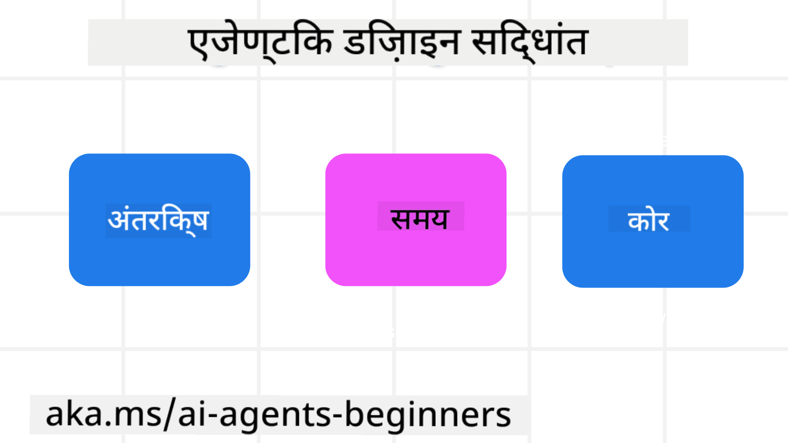

<!--
CO_OP_TRANSLATOR_METADATA:
{
  "original_hash": "969885aab5f923f67f134ce115fbbcaf",
  "translation_date": "2025-04-05T19:45:27+00:00",
  "source_file": "03-agentic-design-patterns\\README.md",
  "language_code": "hi"
}
-->

> _(ऊपर दी गई छवि पर क्लिक करें इस पाठ का वीडियो देखने के लिए)_
# AI एजेंटिक डिज़ाइन सिद्धांत

## परिचय

AI एजेंटिक सिस्टम बनाने के कई तरीके हैं। चूंकि जनरेटिव AI डिज़ाइन में अस्पष्टता एक विशेषता है, न कि त्रुटि, इंजीनियरों के लिए यह तय करना कभी-कभी मुश्किल हो सकता है कि शुरुआत कहाँ से करें। हमने डेवलपर्स को उनके व्यवसायिक जरूरतों को हल करने के लिए ग्राहक-केंद्रित एजेंटिक सिस्टम बनाने में सक्षम बनाने के लिए मानव-केंद्रित UX डिज़ाइन सिद्धांतों का एक सेट बनाया है। ये डिज़ाइन सिद्धांत एक निर्धारित आर्किटेक्चर नहीं हैं, बल्कि उन टीमों के लिए एक प्रारंभिक बिंदु हैं जो एजेंट अनुभवों को परिभाषित और विकसित कर रही हैं।

सामान्य तौर पर, एजेंट को निम्नलिखित करना चाहिए:

- मानव क्षमताओं को विस्तारित और स्केल करें (ब्रेनस्टॉर्मिंग, समस्या समाधान, स्वचालन आदि)
- ज्ञान की कमी को पूरा करें (मुझे ज्ञान क्षेत्रों, अनुवाद आदि पर अपडेट करें)
- सहयोग को सुविधाजनक बनाएं और उस तरीके से समर्थन करें जिसमें हम दूसरों के साथ काम करना पसंद करते हैं
- हमें अपने बेहतर संस्करण बनने में मदद करें (जैसे, लाइफ कोच/टास्क मास्टर, हमें भावनात्मक नियंत्रण और माइंडफुलनेस कौशल सीखने में मदद करना, लचीलापन बनाना आदि)

## इस पाठ में शामिल होगा

- एजेंटिक डिज़ाइन सिद्धांत क्या हैं
- इन डिज़ाइन सिद्धांतों को लागू करते समय किन दिशानिर्देशों का पालन करना चाहिए
- डिज़ाइन सिद्धांतों का उपयोग करने के कुछ उदाहरण

## सीखने के लक्ष्य

इस पाठ को पूरा करने के बाद, आप सक्षम होंगे:

1. समझाएं कि एजेंटिक डिज़ाइन सिद्धांत क्या हैं
2. एजेंटिक डिज़ाइन सिद्धांतों का उपयोग करने के दिशानिर्देश समझाएं
3. एजेंटिक डिज़ाइन सिद्धांतों का उपयोग करके एक एजेंट कैसे बनाएं, इसे समझें

## एजेंटिक डिज़ाइन सिद्धांत

### एजेंट (स्थान)

यह वह वातावरण है जिसमें एजेंट काम करता है। ये सिद्धांत इस बात की जानकारी देते हैं कि हम भौतिक और डिजिटल दुनिया में एजेंट को कैसे डिज़ाइन करें।

- **जोड़ना, न कि घटाना** – लोगों को अन्य लोगों, घटनाओं और क्रियात्मक ज्ञान से जोड़ने में मदद करें ताकि सहयोग और संबंध स्थापित हो सके।
  - एजेंट घटनाओं, ज्ञान और लोगों को जोड़ने में मदद करता है।
  - एजेंट लोगों को करीब लाता है। इन्हें लोगों को बदलने या उनकी उपेक्षा करने के लिए डिज़ाइन नहीं किया गया है।
- **आसानी से सुलभ लेकिन कभी-कभी अदृश्य** – एजेंट मुख्य रूप से पृष्ठभूमि में काम करता है और केवल तभी हमें सूचित करता है जब यह प्रासंगिक और उपयुक्त हो।
  - एजेंट किसी भी डिवाइस या प्लेटफ़ॉर्म पर अधिकृत उपयोगकर्ताओं के लिए आसानी से खोजने योग्य और सुलभ है।
  - एजेंट मल्टीमोडल इनपुट और आउटपुट (ध्वनि, आवाज, पाठ आदि) का समर्थन करता है।
  - एजेंट उपयोगकर्ता की जरूरतों को समझते हुए अग्रभूमि और पृष्ठभूमि के बीच, सक्रिय और प्रतिक्रियाशील के बीच सहजता से संक्रमण कर सकता है।
  - एजेंट अदृश्य रूप में काम कर सकता है, फिर भी इसकी पृष्ठभूमि प्रक्रिया का मार्ग और अन्य एजेंटों के साथ सहयोग उपयोगकर्ता के लिए पारदर्शी और नियंत्रित होता है।

### एजेंट (समय)

यह वह तरीका है जिससे एजेंट समय के साथ काम करता है। ये सिद्धांत इस बात की जानकारी देते हैं कि हम एजेंट को अतीत, वर्तमान और भविष्य में कैसे डिज़ाइन करें।

- **अतीत**: इतिहास पर विचार करना जिसमें राज्य और संदर्भ दोनों शामिल हैं।
  - एजेंट केवल घटना, लोग या राज्य के बजाय समृद्ध ऐतिहासिक डेटा के विश्लेषण के आधार पर अधिक प्रासंगिक परिणाम प्रदान करता है।
  - एजेंट पिछले घटनाओं से संबंध बनाता है और वर्तमान स्थितियों के साथ जुड़ने के लिए सक्रिय रूप से स्मृति पर विचार करता है।
- **अब**: सूचित करने से अधिक प्रेरित करना।
  - एजेंट लोगों के साथ बातचीत करने के लिए एक व्यापक दृष्टिकोण अपनाता है। जब कोई घटना होती है, तो एजेंट स्थिर अधिसूचना या अन्य स्थिर औपचारिकता से आगे जाता है। एजेंट प्रवाह को सरल कर सकता है या उपयोगकर्ता का ध्यान सही समय पर निर्देशित करने के लिए संकेत उत्पन्न कर सकता है।
  - एजेंट जानकारी को संदर्भात्मक वातावरण, सामाजिक और सांस्कृतिक परिवर्तनों और उपयोगकर्ता के इरादे के अनुसार वितरित करता है।
  - एजेंट का इंटरैक्शन क्रमिक हो सकता है, जो लंबे समय तक उपयोगकर्ताओं को सशक्त बनाने के लिए जटिलता में विकसित/बढ़ सकता है।
- **भविष्य**: अनुकूलन और विकसित होना।
  - एजेंट विभिन्न डिवाइस, प्लेटफ़ॉर्म और मोडालिटी के लिए अनुकूल होता है।
  - एजेंट उपयोगकर्ता व्यवहार, पहुंच आवश्यकताओं के लिए अनुकूल होता है और इसे स्वतंत्र रूप से अनुकूलित किया जा सकता है।
  - एजेंट निरंतर उपयोगकर्ता इंटरैक्शन के माध्यम से आकार लेता है और विकसित होता है।

### एजेंट (कोर)

ये एजेंट के डिज़ाइन के कोर में प्रमुख तत्व हैं।

- **अनिश्चितता को स्वीकार करें लेकिन विश्वास स्थापित करें**।
  - एजेंट डिज़ाइन में अनिश्चितता की एक निश्चित स्तर अपेक्षित है। अनिश्चितता एजेंट डिज़ाइन का एक प्रमुख तत्व है।
  - विश्वास और पारदर्शिता एजेंट डिज़ाइन की आधारभूत परतें हैं।
  - मनुष्य यह नियंत्रित करते हैं कि एजेंट कब चालू/बंद है और एजेंट की स्थिति हमेशा स्पष्ट रूप से दिखाई देती है।

## इन सिद्धांतों को लागू करने के दिशानिर्देश

जब आप पिछले डिज़ाइन सिद्धांतों का उपयोग कर रहे हों, तो निम्नलिखित दिशानिर्देशों का उपयोग करें:

1. **पारदर्शिता**: उपयोगकर्ता को सूचित करें कि AI शामिल है, यह कैसे काम करता है (पिछली क्रियाओं सहित), और सिस्टम को संशोधित करने और प्रतिक्रिया देने का तरीका।
2. **नियंत्रण**: उपयोगकर्ता को सिस्टम और इसकी विशेषताओं को अनुकूलित, प्राथमिकताएँ निर्दिष्ट और व्यक्तिगत करने में सक्षम बनाएं (भूलने की क्षमता सहित)।
3. **सुसंगतता**: डिवाइस और एंडपॉइंट्स पर सुसंगत, मल्टीमोडल अनुभवों का लक्ष्य रखें। जहाँ संभव हो, परिचित UI/UX तत्वों का उपयोग करें (जैसे, वॉयस इंटरैक्शन के लिए माइक्रोफोन आइकन) और ग्राहक के संज्ञानात्मक भार को यथासंभव कम करें (जैसे, संक्षिप्त उत्तर, दृश्य सहायता और 'अधिक जानें' सामग्री का लक्ष्य रखें)।

## इन सिद्धांतों और दिशानिर्देशों का उपयोग करके एक ट्रैवल एजेंट डिज़ाइन कैसे करें

कल्पना करें कि आप एक ट्रैवल एजेंट डिज़ाइन कर रहे हैं, यहाँ आप डिज़ाइन सिद्धांतों और दिशानिर्देशों का उपयोग करने के बारे में कैसे सोच सकते हैं:

1. **पारदर्शिता** – उपयोगकर्ता को बताएं कि ट्रैवल एजेंट एक AI-सक्षम एजेंट है। प्रारंभ करने के लिए कुछ बुनियादी निर्देश प्रदान करें (जैसे, एक "हैलो" संदेश, नमूना संकेत)। इसे उत्पाद पृष्ठ पर स्पष्ट रूप से दस्तावेज़ करें। उपयोगकर्ता ने पहले जो संकेत पूछे हैं उनकी सूची दिखाएँ। यह स्पष्ट करें कि प्रतिक्रिया कैसे दें (थम्ब्स अप और डाउन, फीडबैक बटन भेजें, आदि)। स्पष्ट रूप से बताएं कि एजेंट के उपयोग या विषय प्रतिबंध हैं।
2. **नियंत्रण** – सुनिश्चित करें कि यह स्पष्ट है कि उपयोगकर्ता एजेंट को सिस्टम प्रॉम्प्ट जैसी चीज़ों के साथ कैसे संशोधित कर सकता है। उपयोगकर्ता को चुनने में सक्षम बनाएं कि एजेंट कितना विस्तारपूर्वक उत्तर देता है, उसकी लेखन शैली और एजेंट को किन विषयों पर बात नहीं करनी चाहिए। उपयोगकर्ता को किसी भी संबंधित फ़ाइल या डेटा, संकेत और पिछली बातचीत को देखने और हटाने की अनुमति दें।
3. **सुसंगतता** – सुनिश्चित करें कि शेयर प्रॉम्प्ट, फाइल या फोटो जोड़ने और किसी को टैग करने के आइकन मानक और पहचानने योग्य हैं। एजेंट के साथ फ़ाइल अपलोड/शेयर करने का संकेत देने के लिए पेपरक्लिप आइकन और ग्राफिक्स अपलोड करने के लिए इमेज आइकन का उपयोग करें।

## अतिरिक्त संसाधन

## पिछले पाठ

[एजेंटिक फ्रेमवर्क्स का अन्वेषण](../02-explore-agentic-frameworks/README.md)

## अगला पाठ

[टूल उपयोग डिज़ाइन पैटर्न](../04-tool-use/README.md)

**अस्वीकरण**:  
यह दस्तावेज़ AI अनुवाद सेवा [Co-op Translator](https://github.com/Azure/co-op-translator) का उपयोग करके अनुवादित किया गया है। जबकि हम सटीकता सुनिश्चित करने का प्रयास करते हैं, कृपया ध्यान दें कि स्वचालित अनुवाद में त्रुटियां या अशुद्धियां हो सकती हैं। मूल दस्तावेज़, जो इसकी मूल भाषा में है, को प्रामाणिक स्रोत माना जाना चाहिए। महत्वपूर्ण जानकारी के लिए, पेशेवर मानव अनुवाद की अनुशंसा की जाती है। इस अनुवाद का उपयोग करने से उत्पन्न किसी भी गलतफहमी या गलत व्याख्या के लिए हम जिम्मेदार नहीं हैं।