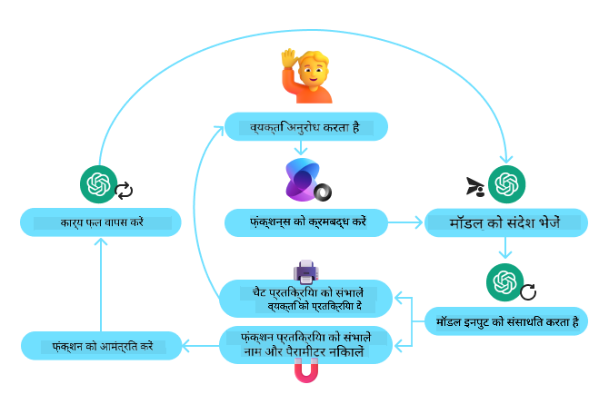
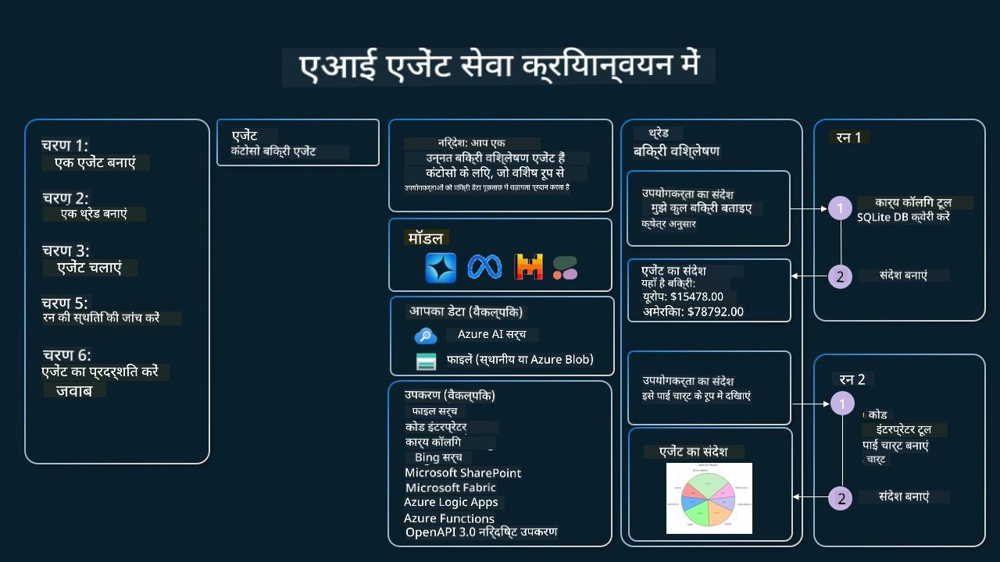

<!--
CO_OP_TRANSLATOR_METADATA:
{
  "original_hash": "b8ea2abd1a674f736d5fc08982e6ec06",
  "translation_date": "2025-04-05T19:46:06+00:00",
  "source_file": "04-tool-use\\README.md",
  "language_code": "hi"
}
-->
[](https://youtu.be/vieRiPRx-gI?si=cEZ8ApnT6Sus9rhn)

> _(ऊपर दी गई छवि पर क्लिक करें इस पाठ का वीडियो देखने के लिए)_

# टूल उपयोग डिज़ाइन पैटर्न

टूल्स दिलचस्प हैं क्योंकि वे AI एजेंट्स को व्यापक क्षमताएं प्रदान करते हैं। एजेंट के पास सीमित क्रियाओं के बजाय, एक टूल जोड़कर एजेंट अब कई प्रकार की क्रियाएं कर सकता है। इस अध्याय में, हम टूल उपयोग डिज़ाइन पैटर्न पर चर्चा करेंगे, जो यह बताता है कि AI एजेंट्स कैसे विशिष्ट टूल्स का उपयोग करके अपने लक्ष्यों को प्राप्त कर सकते हैं।

## परिचय

इस पाठ में, हम निम्नलिखित प्रश्नों के उत्तर देने की कोशिश करेंगे:

- टूल उपयोग डिज़ाइन पैटर्न क्या है?
- इसे किन उपयोग मामलों में लागू किया जा सकता है?
- डिज़ाइन पैटर्न को लागू करने के लिए आवश्यक तत्व/निर्माण खंड क्या हैं?
- भरोसेमंद AI एजेंट्स बनाने के लिए टूल उपयोग डिज़ाइन पैटर्न का उपयोग करते समय कौन-कौन से विशेष विचार करने चाहिए?

## सीखने के लक्ष्य

इस पाठ को पूरा करने के बाद, आप:

- टूल उपयोग डिज़ाइन पैटर्न और इसका उद्देश्य समझ पाएंगे।
- उन उपयोग मामलों की पहचान कर पाएंगे जहां टूल उपयोग डिज़ाइन पैटर्न लागू किया जा सकता है।
- डिज़ाइन पैटर्न को लागू करने के लिए आवश्यक प्रमुख तत्व समझ पाएंगे।
- इस डिज़ाइन पैटर्न का उपयोग करके AI एजेंट्स में भरोसेमंदता सुनिश्चित करने के विचारों को पहचान पाएंगे।

## टूल उपयोग डिज़ाइन पैटर्न क्या है?

**टूल उपयोग डिज़ाइन पैटर्न** LLMs को बाहरी टूल्स के साथ इंटरैक्ट करने की क्षमता देने पर केंद्रित है ताकि वे विशिष्ट लक्ष्यों को प्राप्त कर सकें। टूल्स ऐसा कोड होते हैं जिसे एजेंट द्वारा क्रियान्वित किया जा सकता है। एक टूल एक साधारण फ़ंक्शन हो सकता है, जैसे कि कैलकुलेटर, या किसी तृतीय-पक्ष सेवा जैसे स्टॉक मूल्य खोज या मौसम पूर्वानुमान के लिए API कॉल। AI एजेंट्स के संदर्भ में, टूल्स को **मॉडल-जनरेटेड फ़ंक्शन कॉल्स** के जवाब में एजेंट्स द्वारा क्रियान्वित करने के लिए डिज़ाइन किया गया है।

## इसे किन उपयोग मामलों में लागू किया जा सकता है?

AI एजेंट्स टूल्स का उपयोग करके जटिल कार्य पूरे कर सकते हैं, जानकारी प्राप्त कर सकते हैं, या निर्णय ले सकते हैं। टूल उपयोग डिज़ाइन पैटर्न का उपयोग अक्सर उन परिदृश्यों में किया जाता है जहां बाहरी सिस्टम, जैसे डेटाबेस, वेब सेवाएं, या कोड इंटरप्रेटर के साथ डायनामिक इंटरैक्शन की आवश्यकता होती है। यह क्षमता कई अलग-अलग उपयोग मामलों के लिए उपयोगी है, जैसे:

- **डायनामिक जानकारी प्राप्त करना:** एजेंट्स बाहरी APIs या डेटाबेस को क्वेरी कर सकते हैं ताकि नवीनतम डेटा प्राप्त किया जा सके (जैसे SQLite डेटाबेस का उपयोग करके डेटा एनालिसिस, स्टॉक मूल्य या मौसम की जानकारी प्राप्त करना)।
- **कोड निष्पादन और व्याख्या:** एजेंट्स गणितीय समस्याओं को हल करने, रिपोर्ट्स बनाने, या सिमुलेशन करने के लिए कोड या स्क्रिप्ट्स निष्पादित कर सकते हैं।
- **वर्कफ़्लो ऑटोमेशन:** टास्क शेड्यूलर्स, ईमेल सेवाएं, या डेटा पाइपलाइन्स जैसे टूल्स को एकीकृत करके दोहराए जाने वाले या बहु-चरणीय कार्यप्रवाहों को स्वचालित करना।
- **कस्टमर सपोर्ट:** एजेंट्स CRM सिस्टम, टिकटिंग प्लेटफ़ॉर्म, या नॉलेज बेस के साथ इंटरैक्ट कर सकते हैं ताकि उपयोगकर्ता की क्वेरी हल की जा सके।
- **सामग्री निर्माण और संपादन:** एजेंट्स ग्रामर चेकर्स, टेक्स्ट समरीज़र्स, या सामग्री सुरक्षा मूल्यांकनकर्ताओं जैसे टूल्स का उपयोग करके सामग्री निर्माण कार्यों में सहायता कर सकते हैं।

## डिज़ाइन पैटर्न को लागू करने के लिए आवश्यक तत्व/निर्माण खंड क्या हैं?

ये निर्माण खंड AI एजेंट्स को विभिन्न प्रकार के कार्य करने की अनुमति देते हैं। आइए टूल उपयोग डिज़ाइन पैटर्न को लागू करने के लिए आवश्यक प्रमुख तत्वों पर नज़र डालें:

- **फ़ंक्शन/टूल कॉलिंग:** यह LLMs को टूल्स के साथ इंटरैक्ट करने की प्राथमिक विधि है। फ़ंक्शंस या टूल्स पुन: उपयोग योग्य कोड के ब्लॉक होते हैं जिन्हें एजेंट्स कार्यों को पूरा करने के लिए उपयोग करते हैं। ये साधारण फ़ंक्शंस, जैसे कैलकुलेटर, से लेकर तृतीय-पक्ष सेवाओं जैसे स्टॉक मूल्य खोज या मौसम पूर्वानुमान के लिए API कॉल तक हो सकते हैं।

- **डायनामिक जानकारी प्राप्त करना:** एजेंट्स बाहरी APIs या डेटाबेस को क्वेरी कर सकते हैं ताकि नवीनतम डेटा प्राप्त किया जा सके। यह डेटा एनालिसिस, स्टॉक मूल्य प्राप्त करने, या मौसम की जानकारी के लिए उपयोगी है।

- **कोड निष्पादन और व्याख्या:** एजेंट्स गणितीय समस्याओं को हल करने, रिपोर्ट्स बनाने, या सिमुलेशन करने के लिए कोड या स्क्रिप्ट्स निष्पादित कर सकते हैं।

- **वर्कफ़्लो ऑटोमेशन:** इसमें टास्क शेड्यूलर्स, ईमेल सेवाएं, या डेटा पाइपलाइन्स जैसे टूल्स को एकीकृत करके दोहराए जाने वाले या बहु-चरणीय कार्यप्रवाहों को स्वचालित करना शामिल है।

- **कस्टमर सपोर्ट:** एजेंट्स CRM सिस्टम, टिकटिंग प्लेटफ़ॉर्म, या नॉलेज बेस के साथ इंटरैक्ट कर सकते हैं ताकि उपयोगकर्ता की क्वेरी हल की जा सके।

- **सामग्री निर्माण और संपादन:** एजेंट्स ग्रामर चेकर्स, टेक्स्ट समरीज़र्स, या सामग्री सुरक्षा मूल्यांकनकर्ताओं जैसे टूल्स का उपयोग करके सामग्री निर्माण कार्यों में सहायता कर सकते हैं।

आइए फ़ंक्शन/टूल कॉलिंग को अधिक विस्तार से समझते हैं।

### फ़ंक्शन/टूल कॉलिंग

फ़ंक्शन कॉलिंग वह प्राथमिक विधि है जिसके माध्यम से हम बड़े भाषा मॉडल (LLMs) को टूल्स के साथ इंटरैक्ट करने में सक्षम बनाते हैं। अक्सर आप 'फ़ंक्शन' और 'टूल' को एक-दूसरे के स्थान पर उपयोग करते देखेंगे क्योंकि 'फ़ंक्शंस' (पुन: उपयोग योग्य कोड ब्लॉक) वे 'टूल्स' हैं जिन्हें एजेंट कार्यों को पूरा करने के लिए उपयोग करते हैं। किसी फ़ंक्शन के कोड को क्रियान्वित करने के लिए, LLM को उपयोगकर्ता के अनुरोध की तुलना फ़ंक्शन के विवरण से करनी होती है। ऐसा करने के लिए सभी उपलब्ध फ़ंक्शंस के विवरणों वाला एक स्कीमा LLM को भेजा जाता है। LLM फिर कार्य के लिए सबसे उपयुक्त फ़ंक्शन का चयन करता है और उसका नाम और तर्क लौटाता है। चयनित फ़ंक्शन क्रियान्वित होता है, इसका उत्तर LLM को वापस भेजा जाता है, जो उपयोगकर्ता के अनुरोध का उत्तर देने के लिए जानकारी का उपयोग करता है।

एजेंट्स के लिए फ़ंक्शन कॉलिंग लागू करने के लिए, डेवलपर्स को निम्नलिखित की आवश्यकता होगी:

1. एक LLM मॉडल जो फ़ंक्शन कॉलिंग का समर्थन करता हो
2. फ़ंक्शन विवरणों वाला एक स्कीमा
3. प्रत्येक वर्णित फ़ंक्शन के लिए कोड

आइए शहर में वर्तमान समय प्राप्त करने के उदाहरण का उपयोग करें:

1. **एक LLM को प्रारंभ करें जो फ़ंक्शन कॉलिंग का समर्थन करता हो:**

    सभी मॉडल फ़ंक्शन कॉलिंग का समर्थन नहीं करते हैं, इसलिए यह सुनिश्चित करना महत्वपूर्ण है कि आप जिस LLM का उपयोग कर रहे हैं वह करता है। <a href="https://learn.microsoft.com/azure/ai-services/openai/how-to/function-calling" target="_blank">Azure OpenAI</a> फ़ंक्शन कॉलिंग का समर्थन करता है। हम Azure OpenAI क्लाइंट को प्रारंभ करके शुरुआत कर सकते हैं।

    ```python
    # Initialize the Azure OpenAI client
    client = AzureOpenAI(
        azure_endpoint = os.getenv("AZURE_OPENAI_ENDPOINT"), 
        api_key=os.getenv("AZURE_OPENAI_API_KEY"),  
        api_version="2024-05-01-preview"
    )
    ```

1. **एक फ़ंक्शन स्कीमा बनाएँ:**

    अब हम एक JSON स्कीमा परिभाषित करेंगे जिसमें फ़ंक्शन का नाम, फ़ंक्शन क्या करता है इसका विवरण, और फ़ंक्शन पैरामीटर्स के नाम और विवरण होंगे।
    हम इस स्कीमा को पहले बनाए गए क्लाइंट के साथ उपयोगकर्ता के अनुरोध को पास करेंगे ताकि सैन फ्रांसिस्को में समय का पता लगाया जा सके। महत्वपूर्ण बात यह है कि जो लौटाया जाता है वह **टूल कॉल** है, **प्रश्न का अंतिम उत्तर नहीं।** जैसा कि पहले उल्लेख किया गया है, LLM कार्य के लिए चुने गए फ़ंक्शन का नाम और उसे पास किए जाने वाले तर्क लौटाता है।

    ```python
    # Function description for the model to read
    tools = [
        {
            "type": "function",
            "function": {
                "name": "get_current_time",
                "description": "Get the current time in a given location",
                "parameters": {
                    "type": "object",
                    "properties": {
                        "location": {
                            "type": "string",
                            "description": "The city name, e.g. San Francisco",
                        },
                    },
                    "required": ["location"],
                },
            }
        }
    ]
    ```
   
    ```python
  
    # Initial user message
    messages = [{"role": "user", "content": "What's the current time in San Francisco"}] 
  
    # First API call: Ask the model to use the function
      response = client.chat.completions.create(
          model=deployment_name,
          messages=messages,
          tools=tools,
          tool_choice="auto",
      )
  
      # Process the model's response
      response_message = response.choices[0].message
      messages.append(response_message)
  
      print("Model's response:")  

      print(response_message)
  
    ```

    ```bash
    Model's response:
    ChatCompletionMessage(content=None, role='assistant', function_call=None, tool_calls=[ChatCompletionMessageToolCall(id='call_pOsKdUlqvdyttYB67MOj434b', function=Function(arguments='{"location":"San Francisco"}', name='get_current_time'), type='function')])
    ```
  
1. **कार्य को पूरा करने के लिए आवश्यक फ़ंक्शन कोड:**

    अब जब LLM ने तय कर लिया है कि कौन सा फ़ंक्शन चलाना है, कार्य को पूरा करने के लिए कोड को लागू और क्रियान्वित करने की आवश्यकता है।
    हम वर्तमान समय प्राप्त करने के लिए Python में कोड लागू कर सकते हैं। हमें response_message से नाम और तर्क निकालने के लिए कोड भी लिखना होगा ताकि अंतिम परिणाम प्राप्त किया जा सके।

    ```python
      def get_current_time(location):
        """Get the current time for a given location"""
        print(f"get_current_time called with location: {location}")  
        location_lower = location.lower()
        
        for key, timezone in TIMEZONE_DATA.items():
            if key in location_lower:
                print(f"Timezone found for {key}")  
                current_time = datetime.now(ZoneInfo(timezone)).strftime("%I:%M %p")
                return json.dumps({
                    "location": location,
                    "current_time": current_time
                })
      
        print(f"No timezone data found for {location_lower}")  
        return json.dumps({"location": location, "current_time": "unknown"})
    ```

     ```python
     # Handle function calls
      if response_message.tool_calls:
          for tool_call in response_message.tool_calls:
              if tool_call.function.name == "get_current_time":
     
                  function_args = json.loads(tool_call.function.arguments)
     
                  time_response = get_current_time(
                      location=function_args.get("location")
                  )
     
                  messages.append({
                      "tool_call_id": tool_call.id,
                      "role": "tool",
                      "name": "get_current_time",
                      "content": time_response,
                  })
      else:
          print("No tool calls were made by the model.")  
  
      # Second API call: Get the final response from the model
      final_response = client.chat.completions.create(
          model=deployment_name,
          messages=messages,
      )
  
      return final_response.choices[0].message.content
     ```

     ```bash
      get_current_time called with location: San Francisco
      Timezone found for san francisco
      The current time in San Francisco is 09:24 AM.
     ```

फ़ंक्शन कॉलिंग अधिकांश, यदि सभी नहीं, एजेंट टूल उपयोग डिज़ाइन का केंद्र है, हालांकि इसे शुरू से लागू करना कभी-कभी चुनौतीपूर्ण हो सकता है।
जैसा कि हमने [पाठ 2](../../../02-explore-agentic-frameworks) में सीखा था, एजेंटिक फ्रेमवर्क्स हमें टूल उपयोग को लागू करने के लिए पूर्व-निर्मित निर्माण ब्लॉक प्रदान करते हैं।

## एजेंटिक फ्रेमवर्क्स के साथ टूल उपयोग के उदाहरण

यहाँ कुछ उदाहरण दिए गए हैं कि आप विभिन्न एजेंटिक फ्रेमवर्क्स का उपयोग करके टूल उपयोग डिज़ाइन पैटर्न को कैसे लागू कर सकते हैं:

### सेमांटिक कर्नेल

<a href="https://learn.microsoft.com/azure/ai-services/agents/overview" target="_blank">सेमांटिक कर्नेल</a> .NET, Python, और Java डेवलपर्स के लिए एक ओपन-सोर्स AI फ्रेमवर्क है जो बड़े भाषा मॉडेल्स (LLMs) के साथ काम करते हैं। यह फ़ंक्शन कॉलिंग का उपयोग करने की प्रक्रिया को सरल बनाता है, आपके फ़ंक्शंस और उनके पैरामीटर्स को मॉडल के लिए स्वचालित रूप से वर्णित करके <a href="https://learn.microsoft.com/semantic-kernel/concepts/ai-services/chat-completion/function-calling/?pivots=programming-language-python#1-serializing-the-functions" target="_blank">सीरियलाइज़िंग</a> नामक प्रक्रिया के माध्यम से। यह मॉडल और आपके कोड के बीच संचार को भी संभालता है। सेमांटिक कर्नेल जैसे एजेंटिक फ्रेमवर्क का उपयोग करने का एक और लाभ यह है कि यह आपको <a href="https://github.com/microsoft/semantic-kernel/blob/main/python/samples/getting_started_with_agents/openai_assistant/step4_assistant_tool_file_search.py" target="_blank">File Search</a> और <a href="https://github.com/microsoft/semantic-kernel/blob/main/python/samples/getting_started_with_agents/openai_assistant/step3_assistant_tool_code_interpreter.py" target="_blank">Code Interpreter</a> जैसे पूर्व-निर्मित टूल्स तक पहुंच प्रदान करता है।

निम्नलिखित आरेख सेमांटिक कर्नेल के साथ फ़ंक्शन कॉलिंग की प्रक्रिया को दर्शाता है:



सेमांटिक कर्नेल में फ़ंक्शंस/टूल्स को <a href="https://learn.microsoft.com/semantic-kernel/concepts/plugins/?pivots=programming-language-python" target="_blank">Plugins</a> कहा जाता है। हम `get_current_time` function we saw earlier into a plugin by turning it into a class with the function in it. We can also import the `kernel_function` डेकोरेटर को कनवर्ट कर सकते हैं, जो फ़ंक्शन का विवरण लेता है। जब आप फिर GetCurrentTimePlugin के साथ एक कर्नेल बनाते हैं, तो कर्नेल स्वचालित रूप से फ़ंक्शन और उसके पैरामीटर्स को सीरियलाइज़ करेगा, प्रक्रिया में LLM को भेजने के लिए स्कीमा बनाते हुए।

```python
from semantic_kernel.functions import kernel_function

class GetCurrentTimePlugin:
    async def __init__(self, location):
        self.location = location

    @kernel_function(
        description="Get the current time for a given location"
    )
    def get_current_time(location: str = ""):
        ...

```

```python 
from semantic_kernel import Kernel

# Create the kernel
kernel = Kernel()

# Create the plugin
get_current_time_plugin = GetCurrentTimePlugin(location)

# Add the plugin to the kernel
kernel.add_plugin(get_current_time_plugin)
```
  
### Azure AI एजेंट सेवा

<a href="https://learn.microsoft.com/azure/ai-services/agents/overview" target="_blank">Azure AI एजेंट सेवा</a> एक नया एजेंटिक फ्रेमवर्क है जिसे डेवलपर्स को उच्च गुणवत्ता वाले और विस्तार योग्य AI एजेंट्स को सुरक्षित रूप से बनाने, तैनात करने, और स्केल करने में सक्षम बनाने के लिए डिज़ाइन किया गया है, बिना अंतर्निहित कंप्यूट और स्टोरेज संसाधनों को प्रबंधित करने की आवश्यकता के। यह विशेष रूप से एंटरप्राइज एप्लिकेशन के लिए उपयोगी है क्योंकि यह एक पूरी तरह से प्रबंधित सेवा है जिसमें एंटरप्राइज ग्रेड सुरक्षा है।

LLM API के साथ सीधे विकास की तुलना में, Azure AI एजेंट सेवा कुछ लाभ प्रदान करती है, जैसे:

- स्वचालित टूल कॉलिंग – टूल कॉल को पार्स करने, टूल को क्रियान्वित करने, और प्रतिक्रिया को संभालने की आवश्यकता नहीं है; यह सब अब सर्वर-साइड किया जाता है।
- सुरक्षित रूप से प्रबंधित डेटा – अपनी स्वयं की बातचीत की स्थिति प्रबंधित करने के बजाय, आप थ्रेड्स पर भरोसा कर सकते हैं ताकि आपको आवश्यक सभी जानकारी संग्रहीत की जा सके।
- आउट-ऑफ-द-बॉक्स टूल्स – टूल्स जिनका उपयोग आप अपने डेटा स्रोतों के साथ इंटरैक्ट करने के लिए कर सकते हैं, जैसे Bing, Azure AI Search, और Azure Functions।

Azure AI एजेंट सेवा में उपलब्ध टूल्स को दो श्रेणियों में विभाजित किया जा सकता है:

1. ज्ञान टूल्स:
    - <a href="https://learn.microsoft.com/azure/ai-services/agents/how-to/tools/bing-grounding?tabs=python&pivots=overview" target="_blank">Bing Search के साथ ग्राउंडिंग</a>
    - <a href="https://learn.microsoft.com/azure/ai-services/agents/how-to/tools/file-search?tabs=python&pivots=overview" target="_blank">File Search</a>
    - <a href="https://learn.microsoft.com/azure/ai-services/agents/how-to/tools/azure-ai-search?tabs=azurecli%2Cpython&pivots=overview-azure-ai-search" target="_blank">Azure AI Search</a>

2. क्रिया टूल्स:
    - <a href="https://learn.microsoft.com/azure/ai-services/agents/how-to/tools/function-calling?tabs=python&pivots=overview" target="_blank">Function Calling</a>
    - <a href="https://learn.microsoft.com/azure/ai-services/agents/how-to/tools/code-interpreter?tabs=python&pivots=overview" target="_blank">Code Interpreter</a>
    - <a href="https://learn.microsoft.com/azure/ai-services/agents/how-to/tools/openapi-spec?tabs=python&pivots=overview" target="_blank">OpenAI द्वारा परिभाषित टूल्स</a>
    - <a href="https://learn.microsoft.com/azure/ai-services/agents/how-to/tools/azure-functions?pivots=overview" target="_blank">Azure Functions</a>

एजेंट सेवा हमें इन टूल्स को `toolset`. It also utilizes `threads` which keep track of the history of messages from a particular conversation.

Imagine you are a sales agent at a company called Contoso. You want to develop a conversational agent that can answer questions about your sales data.

The following image illustrates how you could use Azure AI Agent Service to analyze your sales data:



To use any of these tools with the service we can create a client and define a tool or toolset. To implement this practically we can use the following Python code. The LLM will be able to look at the toolset and decide whether to use the user created function, `fetch_sales_data_using_sqlite_query` या उपयोगकर्ता अनुरोध के आधार पर पूर्व-निर्मित Code Interpreter के रूप में एक साथ उपयोग करने की अनुमति देती है।

```python 
import os
from azure.ai.projects import AIProjectClient
from azure.identity import DefaultAzureCredential
from fecth_sales_data_functions import fetch_sales_data_using_sqlite_query # fetch_sales_data_using_sqlite_query function which can be found in a fetch_sales_data_functions.py file.
from azure.ai.projects.models import ToolSet, FunctionTool, CodeInterpreterTool

project_client = AIProjectClient.from_connection_string(
    credential=DefaultAzureCredential(),
    conn_str=os.environ["PROJECT_CONNECTION_STRING"],
)

# Initialize function calling agent with the fetch_sales_data_using_sqlite_query function and adding it to the toolset
fetch_data_function = FunctionTool(fetch_sales_data_using_sqlite_query)
toolset = ToolSet()
toolset.add(fetch_data_function)

# Initialize Code Interpreter tool and adding it to the toolset. 
code_interpreter = code_interpreter = CodeInterpreterTool()
toolset = ToolSet()
toolset.add(code_interpreter)

agent = project_client.agents.create_agent(
    model="gpt-4o-mini", name="my-agent", instructions="You are helpful agent", 
    toolset=toolset
)
```

## भरोसेमंद AI एजेंट्स बनाने के लिए टूल उपयोग डिज़ाइन पैटर्न का उपयोग करते समय कौन-कौन से विशेष विचार करने चाहिए?

LLMs द्वारा डायनामिक रूप से उत्पन्न SQL के साथ एक सामान्य चिंता सुरक्षा है, विशेष रूप से SQL इंजेक्शन या दुर्भावनापूर्ण क्रियाओं, जैसे डेटाबेस को गिराने या छेड़छाड़ करने का जोखिम। जबकि ये चिंताएँ वैध हैं, इन्हें डेटाबेस एक्सेस अनुमतियों को सही ढंग से कॉन्फ़िगर करके प्रभावी ढंग से कम किया जा सकता है। अधिकांश डेटाबेस के लिए, इसका मतलब डेटाबेस को केवल-पढ़ने योग्य के रूप में कॉन्फ़िगर करना है। PostgreSQL या Azure SQL जैसी डेटाबेस सेवाओं के लिए, ऐप को केवल-पढ़ने योग्य (SELECT) भूमिका सौंपी जानी चाहिए।

ऐप को सुरक्षित वातावरण में चलाना सुरक्षा को और बढ़ाता है। एंटरप्राइज परिदृश्यों में, डेटा को आमतौर पर परिचालन प्रणालियों से निकाला और बदल दिया जाता है, एक केवल-पढ़ने योग्य डेटाबेस या डेटा वेयरहाउस में उपयोगकर्ता-अनुकूल स्कीमा के साथ। यह दृष्टिकोण सुनिश्चित करता है कि डेटा सुरक्षित है, प्रदर्शन और पहुंच के लिए अनुकूलित है, और ऐप का प्रतिबंधित, केवल-पढ़ने योग्य एक्सेस है।

## अतिरिक्त संसाधन

- <a href="https://microsoft.github.io/build-your-first-agent-with-azure-ai-agent-service-workshop/" target="_blank">Azure AI एजेंट्स सेवा कार्यशाला</a>
- <a href="https://github.com/Azure-Samples/contoso-creative-writer/tree/main/docs/workshop" target="_blank">Contoso Creative Writer मल्टी-एजेंट कार्यशाला</a>
- <a href="https://learn.microsoft.com/semantic-kernel/concepts/ai-services/chat-completion/function-calling/?pivots=programming-language-python#1-serializing-the-functions" target="_blank">सेमांटिक कर्नेल फ़ंक्शन कॉलिंग ट्यूटोरियल</a>
- <a href="https://github.com/microsoft/semantic-kernel/blob/main/python/samples/getting_started_with_agents/open

**अस्वीकरण**:  
यह दस्तावेज़ AI अनुवाद सेवा [Co-op Translator](https://github.com/Azure/co-op-translator) का उपयोग करके अनुवादित किया गया है। हम सटीकता के लिए प्रयासरत हैं, लेकिन कृपया ध्यान दें कि स्वचालित अनुवादों में त्रुटियां या अशुद्धियां हो सकती हैं। मूल भाषा में उपलब्ध मूल दस्तावेज़ को प्रामाणिक स्रोत माना जाना चाहिए। महत्वपूर्ण जानकारी के लिए, पेशेवर मानव अनुवाद की सिफारिश की जाती है। इस अनुवाद के उपयोग से उत्पन्न किसी भी गलतफहमी या गलत व्याख्या के लिए हम उत्तरदायी नहीं हैं।