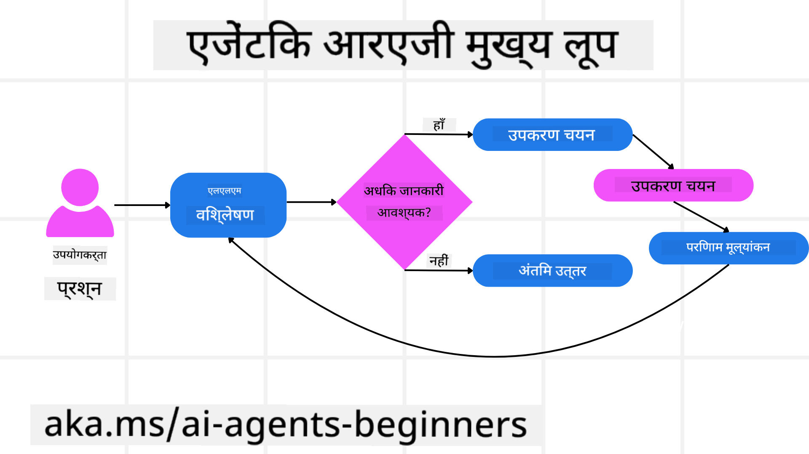
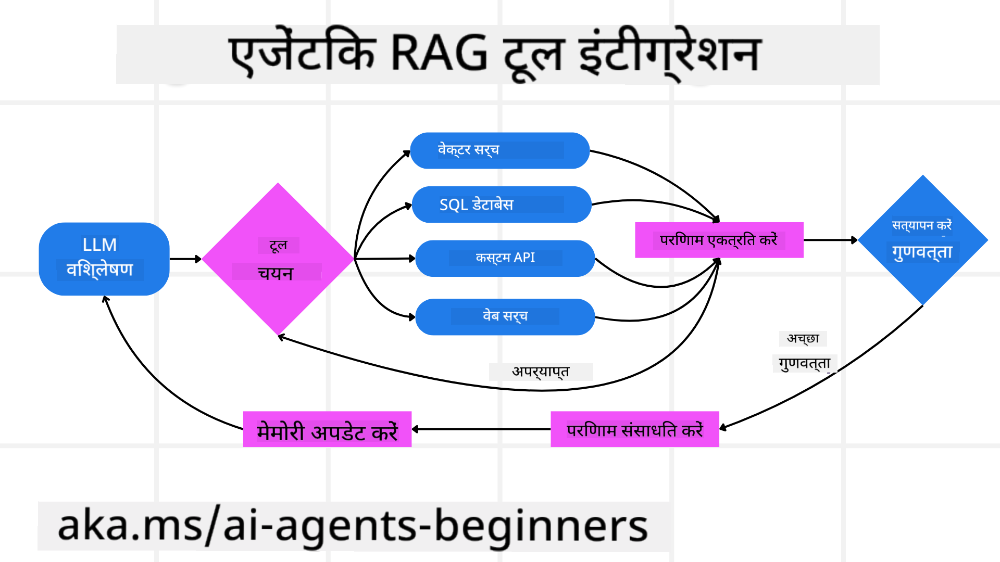
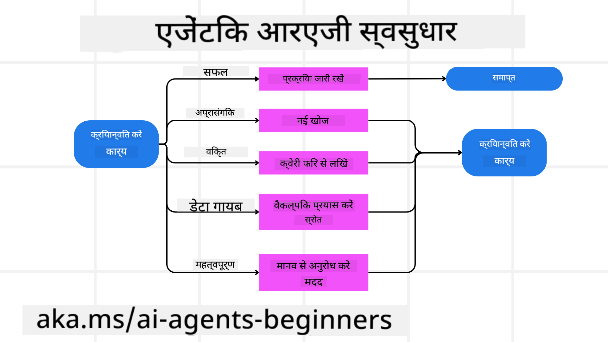

<!--
CO_OP_TRANSLATOR_METADATA:
{
  "original_hash": "4d215d159f2f3b96644fd62657988d23",
  "translation_date": "2025-04-05T19:48:08+00:00",
  "source_file": "05-agentic-rag\\README.md",
  "language_code": "hi"
}
-->

> _(ऊपर दी गई छवि पर क्लिक करें इस पाठ का वीडियो देखने के लिए)_

# एजेंटिक RAG

यह पाठ एजेंटिक रिट्रीवल-ऑग्मेंटेड जनरेशन (Agentic RAG) का एक व्यापक अवलोकन प्रदान करता है। यह एक उभरता हुआ एआई प्रतिमान है, जिसमें बड़े भाषा मॉडल (LLMs) बाहरी स्रोतों से जानकारी खींचते हुए स्वायत्त रूप से अपने अगले कदमों की योजना बनाते हैं। स्थिर "retrieval-then-read" पैटर्न के विपरीत, Agentic RAG में LLM को बार-बार कॉल करना, टूल या फ़ंक्शन कॉल और संरचित आउटपुट के साथ इंटरलेस करना शामिल है। यह प्रणाली परिणामों का मूल्यांकन करती है, क्वेरीज़ को परिष्कृत करती है, आवश्यक होने पर अतिरिक्त उपकरणों को बुलाती है, और तब तक इस चक्र को जारी रखती है जब तक कि संतोषजनक समाधान प्राप्त नहीं हो जाता।

## परिचय

इस पाठ में आप सीखेंगे:

- **एजेंटिक RAG को समझना:** AI के इस उभरते प्रतिमान के बारे में जानें, जहां बड़े भाषा मॉडल (LLMs) बाहरी डेटा स्रोतों से जानकारी खींचते हुए स्वायत्त रूप से अपने अगले कदमों की योजना बनाते हैं।
- **इटरेटिव मेकर-चेककर शैली को समझना:** LLM को बार-बार कॉल करने, टूल या फ़ंक्शन कॉल और संरचित आउटपुट के साथ इंटरलेस करने के चक्र को समझें, जो सही उत्तर देने और गलत क्वेरीज़ को संभालने के लिए डिज़ाइन किया गया है।
- **व्यावहारिक अनुप्रयोगों का अन्वेषण:** उन परिदृश्यों की पहचान करें जहां Agentic RAG उत्कृष्ट प्रदर्शन करता है, जैसे कि सही उत्तरों की प्राथमिकता वाले वातावरण, जटिल डेटाबेस इंटरैक्शन, और विस्तारित वर्कफ़्लो।

## सीखने के उद्देश्य

इस पाठ को पूरा करने के बाद, आप जान पाएंगे और समझ पाएंगे:

- **एजेंटिक RAG को समझना:** AI के इस उभरते प्रतिमान के बारे में जानें, जहां बड़े भाषा मॉडल (LLMs) बाहरी डेटा स्रोतों से जानकारी खींचते हुए स्वायत्त रूप से अपने अगले कदमों की योजना बनाते हैं।
- **इटरेटिव मेकर-चेककर शैली:** LLM को बार-बार कॉल करने, टूल या फ़ंक्शन कॉल और संरचित आउटपुट के साथ इंटरलेस करने के चक्र को समझें, जो सही उत्तर देने और गलत क्वेरीज़ को संभालने के लिए डिज़ाइन किया गया है।
- **तर्क प्रक्रिया को अपनाना:** यह समझें कि सिस्टम अपनी तर्क प्रक्रिया का स्वामित्व कैसे लेता है और पूर्व-परिभाषित पथों पर निर्भर हुए बिना समस्याओं से निपटने के लिए निर्णय करता है।
- **वर्कफ़्लो:** समझें कि एक एजेंटिक मॉडल स्वतंत्र रूप से बाज़ार प्रवृत्ति रिपोर्ट्स प्राप्त करने, प्रतिस्पर्धी डेटा की पहचान करने, आंतरिक बिक्री मीट्रिक्स को सहसंबद्ध करने, निष्कर्षों को संश्लेषित करने और रणनीति का मूल्यांकन करने का निर्णय कैसे लेता है।
- **इटरेटिव लूप्स, टूल इंटीग्रेशन और मेमोरी:** सिस्टम के लूप इंटरैक्शन पैटर्न, स्टेट और मेमोरी को बनाए रखने के महत्व को समझें ताकि दोहराव से बचा जा सके और सूचित निर्णय लिए जा सकें।
- **विफलता मोड और आत्म-सुधार को संभालना:** सिस्टम के मजबूत आत्म-सुधार तंत्रों का अन्वेषण करें, जिसमें पुनरावृत्ति और पुनः-क्वेरी, डायग्नोस्टिक टूल का उपयोग और मानव निरीक्षण पर निर्भरता शामिल है।
- **एजेंसी की सीमाएं:** Agentic RAG की सीमाओं को समझें, जिसमें डोमेन-विशिष्ट स्वायत्तता, इंफ्रास्ट्रक्चर पर निर्भरता और सुरक्षा उपायों का पालन शामिल है।
- **व्यावहारिक उपयोग के मामले और मूल्य:** उन परिदृश्यों की पहचान करें जहां Agentic RAG उत्कृष्ट प्रदर्शन करता है, जैसे कि सही उत्तरों की प्राथमिकता वाले वातावरण, जटिल डेटाबेस इंटरैक्शन, और विस्तारित वर्कफ़्लो।
- **गवर्नेंस, पारदर्शिता और विश्वास:** गवर्नेंस और पारदर्शिता के महत्व के बारे में जानें, जिसमें समझने योग्य तर्क, पक्षपात नियंत्रण, और मानव निरीक्षण शामिल हैं।

## Agentic RAG क्या है?

एजेंटिक रिट्रीवल-ऑग्मेंटेड जनरेशन (Agentic RAG) एक उभरता हुआ एआई प्रतिमान है, जिसमें बड़े भाषा मॉडल (LLMs) बाहरी स्रोतों से जानकारी खींचते हुए स्वायत्त रूप से अपने अगले कदमों की योजना बनाते हैं। स्थिर "retrieval-then-read" पैटर्न के विपरीत, Agentic RAG में LLM को बार-बार कॉल करना, टूल या फ़ंक्शन कॉल और संरचित आउटपुट के साथ इंटरलेस करना शामिल है। यह प्रणाली परिणामों का मूल्यांकन करती है, क्वेरीज़ को परिष्कृत करती है, आवश्यक होने पर अतिरिक्त उपकरणों को बुलाती है, और तब तक इस चक्र को जारी रखती है जब तक कि संतोषजनक समाधान प्राप्त नहीं हो जाता। इस पुनरावृत्त "मेकर-चेककर" शैली का उद्देश्य सही उत्तर देना, गलत क्वेरीज़ को संभालना और उच्च गुणवत्ता वाले परिणाम सुनिश्चित करना है।

सिस्टम सक्रिय रूप से अपनी तर्क प्रक्रिया का स्वामित्व लेता है, असफल क्वेरीज़ को फिर से लिखता है, विभिन्न रिट्रीवल विधियों का चयन करता है, और अंतिम उत्तर देने से पहले कई उपकरणों—जैसे Azure AI Search में वेक्टर सर्च, SQL डेटाबेस, या कस्टम APIs—को एकीकृत करता है। एक एजेंटिक सिस्टम की विशिष्ट गुणवत्ता यह है कि यह अपनी तर्क प्रक्रिया का स्वामित्व लेता है। पारंपरिक RAG कार्यान्वयन पूर्व-परिभाषित पथों पर निर्भर करते हैं, लेकिन एक एजेंटिक सिस्टम स्वायत्त रूप से उस जानकारी की गुणवत्ता के आधार पर कदमों का क्रम निर्धारित करता है जो यह पाता है।

## एजेंटिक रिट्रीवल-ऑग्मेंटेड जनरेशन (Agentic RAG) को परिभाषित करना

एजेंटिक रिट्रीवल-ऑग्मेंटेड जनरेशन (Agentic RAG) AI विकास का एक उभरता हुआ प्रतिमान है, जहां LLMs न केवल बाहरी डेटा स्रोतों से जानकारी खींचते हैं, बल्कि स्वायत्त रूप से अपने अगले कदमों की योजना भी बनाते हैं। स्थिर "retrieval-then-read" पैटर्न या सावधानीपूर्वक स्क्रिप्टेड प्रॉम्प्ट अनुक्रमों के विपरीत, Agentic RAG में LLM को बार-बार कॉल करना, टूल या फ़ंक्शन कॉल और संरचित आउटपुट के साथ इंटरलेस करना शामिल है। प्रत्येक चरण में, प्रणाली प्राप्त परिणामों का मूल्यांकन करती है, यह तय करती है कि क्वेरीज़ को परिष्कृत करना है या नहीं, आवश्यक होने पर अतिरिक्त उपकरणों को बुलाती है, और इस चक्र को तब तक जारी रखती है जब तक कि यह एक संतोषजनक समाधान प्राप्त नहीं कर लेती।

इस पुनरावृत्त "मेकर-चेककर" शैली का संचालन सही उत्तर देने, संरचित डेटाबेस (जैसे NL2SQL) के लिए गलत क्वेरीज़ को संभालने, और संतुलित, उच्च गुणवत्ता वाले परिणाम सुनिश्चित करने के लिए डिज़ाइन किया गया है। सावधानीपूर्वक डिज़ाइन किए गए प्रॉम्प्ट चेन पर पूरी तरह से निर्भर होने के बजाय, सिस्टम सक्रिय रूप से अपनी तर्क प्रक्रिया का स्वामित्व लेता है। यह असफल क्वेरीज़ को फिर से लिख सकता है, विभिन्न रिट्रीवल विधियों का चयन कर सकता है, और अंतिम उत्तर देने से पहले कई उपकरणों—जैसे Azure AI Search में वेक्टर सर्च, SQL डेटाबेस, या कस्टम APIs—को एकीकृत कर सकता है। इससे अत्यधिक जटिल ऑर्केस्ट्रेशन फ्रेमवर्क की आवश्यकता समाप्त हो जाती है। इसके बजाय, "LLM कॉल → टूल उपयोग → LLM कॉल → …" का एक अपेक्षाकृत सरल लूप परिष्कृत और अच्छी तरह से आधारित आउटपुट दे सकता है।

## तर्क प्रक्रिया का स्वामित्व लेना

एजेंटिक सिस्टम की विशिष्ट विशेषता यह है कि यह अपनी तर्क प्रक्रिया का स्वामित्व लेता है। पारंपरिक RAG कार्यान्वयन अक्सर मानवों पर निर्भर करते हैं कि वे मॉडल के लिए एक पथ पहले से परिभाषित करें: एक विचार-श्रृंखला जो बताती है कि क्या और कब रिट्रीव करना है।  
लेकिन जब एक सिस्टम वास्तव में एजेंटिक होता है, तो यह आंतरिक रूप से तय करता है कि समस्या से कैसे निपटा जाए। यह सिर्फ एक स्क्रिप्ट को निष्पादित नहीं कर रहा है; यह स्वायत्त रूप से उस जानकारी की गुणवत्ता के आधार पर कदमों का क्रम निर्धारित करता है जो यह पाता है।  
उदाहरण के लिए, यदि इसे एक उत्पाद लॉन्च रणनीति बनाने के लिए कहा जाता है, तो यह केवल एक प्रॉम्प्ट पर निर्भर नहीं करता है जो पूरे अनुसंधान और निर्णय लेने के वर्कफ़्लो को स्पष्ट करता है। इसके बजाय, एजेंटिक मॉडल स्वतंत्र रूप से निर्णय लेता है:

1. वर्तमान बाज़ार प्रवृत्ति रिपोर्ट्स को Bing Web Grounding का उपयोग करके रिट्रीव करें।
2. Azure AI Search का उपयोग करके प्रासंगिक प्रतिस्पर्धी डेटा की पहचान करें।
3. Azure SQL Database का उपयोग करके ऐतिहासिक आंतरिक बिक्री मीट्रिक्स को सहसंबद्ध करें।
4. निष्कर्षों को एक संगठित रणनीति में संश्लेषित करें, जिसे Azure OpenAI Service के माध्यम से ऑर्केस्ट्रेट किया गया हो।
5. रणनीति में अंतराल या विसंगतियों का मूल्यांकन करें और यदि आवश्यक हो तो पुनः रिट्रीवल के लिए संकेत दें।

इन सभी चरणों—क्वेरीज़ को परिष्कृत करना, स्रोतों का चयन करना, उत्तर से "संतुष्ट" होने तक पुनरावृत्ति करना—का निर्णय मॉडल द्वारा किया जाता है, न कि किसी मानव द्वारा पहले से स्क्रिप्टेड।

## पुनरावृत्त लूप्स, टूल इंटीग्रेशन और मेमोरी

एक एजेंटिक सिस्टम लूप इंटरैक्शन पैटर्न पर निर्भर करता है:

- **प्रारंभिक कॉल:** उपयोगकर्ता का लक्ष्य (उर्फ उपयोगकर्ता प्रॉम्प्ट) LLM को प्रस्तुत किया जाता है।
- **टूल का उपयोग:** यदि मॉडल को जानकारी अधूरी लगती है या निर्देश अस्पष्ट होते हैं, तो यह एक टूल या रिट्रीवल विधि का चयन करता है—जैसे वेक्टर डेटाबेस क्वेरी (जैसे Azure AI Search Hybrid search निजी डेटा पर) या एक संरचित SQL कॉल—अधिक संदर्भ प्राप्त करने के लिए।
- **मूल्यांकन और परिष्करण:** लौटाए गए डेटा की समीक्षा के बाद, मॉडल यह तय करता है कि जानकारी पर्याप्त है या नहीं। यदि नहीं, तो यह क्वेरी को परिष्कृत करता है, एक अलग टूल आज़माता है, या अपने दृष्टिकोण को समायोजित करता है।
- **संतुष्ट होने तक दोहराएं:** यह चक्र तब तक जारी रहता है जब तक कि मॉडल यह निर्धारित न कर ले कि उसके पास एक अंतिम, सुविचारित उत्तर देने के लिए पर्याप्त स्पष्टता और सबूत हैं।
- **मेमोरी और स्टेट:** क्योंकि सिस्टम स्टेट और मेमोरी को बनाए रखता है, यह पिछले प्रयासों और उनके परिणामों को याद कर सकता है, दोहराव वाले लूप से बच सकता है, और जैसे-जैसे यह आगे बढ़ता है, अधिक सूचित निर्णय ले सकता है।

समय के साथ, यह एक विकसित समझ की भावना पैदा करता है, जिससे मॉडल को जटिल, बहु-चरणीय कार्यों को नेविगेट करने में मदद मिलती है, बिना मानव के लगातार हस्तक्षेप करने या प्रॉम्प्ट को फिर से आकार देने की आवश्यकता के।

## विफलता मोड और आत्म-सुधार को संभालना

Agentic RAG की स्वायत्तता में मजबूत आत्म-सुधार तंत्र भी शामिल हैं। जब सिस्टम गतिरोध का सामना करता है—जैसे अप्रासंगिक दस्तावेज़ों को पुनः प्राप्त करना या खराब क्वेरीज़ का सामना करना—तो यह:

- **पुनरावृत्ति और पुनः-क्वेरी:** कम मूल्य वाले उत्तर देने के बजाय, मॉडल नई खोज रणनीतियाँ आज़माता है, डेटाबेस क्वेरीज़ को फिर से लिखता है, या वैकल्पिक डेटा सेट देखता है।
- **डायग्नोस्टिक टूल का उपयोग:** सिस्टम अतिरिक्त फ़ंक्शन को बुला सकता है जो इसे अपनी तर्क प्रक्रिया को डीबग करने या पुनः प्राप्त डेटा की शुद्धता की पुष्टि करने में मदद करने के लिए डिज़ाइन किया गया है। Azure AI Tracing जैसे टूल्स मजबूत अवलोकन और मॉनिटरिंग को सक्षम करने के लिए महत्वपूर्ण होंगे।
- **मानव निरीक्षण पर निर्भरता:** उच्च-जोखिम या बार-बार विफल होने वाले परिदृश्यों के लिए, मॉडल अनिश्चितता को चिह्नित कर सकता है और मानव मार्गदर्शन का अनुरोध कर सकता है। एक बार जब मानव सुधारात्मक प्रतिक्रिया प्रदान करता है, तो मॉडल उस पाठ को भविष्य में शामिल कर सकता है।

यह पुनरावृत्त और गतिशील दृष्टिकोण मॉडल को लगातार सुधारने की अनुमति देता है, यह सुनिश्चित करते हुए कि यह केवल एक बार का सिस्टम नहीं है, बल्कि एक ऐसा है जो किसी दिए गए सत्र के दौरान अपनी गलतियों से सीखता है।

## एजेंसी की सीमाएं

एक कार्य के भीतर अपनी स्वायत्तता के बावजूद, Agentic RAG कृत्रिम सामान्य बुद्धिमत्ता के समान नहीं है। इसके "एजेंटिक" क्षमताएं मानव डेवलपर्स द्वारा प्रदान किए गए टूल, डेटा स्रोतों और नीतियों तक ही सीमित हैं। यह अपने स्वयं के टूल का आविष्कार नहीं कर सकता है या उन डोमेन सीमाओं से बाहर नहीं जा सकता जो निर्धारित की गई हैं। बल्कि, यह उपलब्ध संसाधनों का गतिशील रूप से समन्वय करने में उत्कृष्टता प्राप्त करता है।  
उन्नत AI रूपों से प्रमुख अंतर में शामिल हैं:

1. **डोमेन-विशिष्ट स्वायत्तता:** Agentic RAG सिस्टम ज्ञात डोमेन के भीतर उपयोगकर्ता-परिभाषित लक्ष्यों को प्राप्त करने पर केंद्रित होते हैं, जैसे कि क्वेरी को फिर से लिखना या टूल चयन रणनीतियों को परिणाम सुधारने के लिए लागू करना।
2. **इंफ्रास्ट्रक्चर पर निर्भरता:** सिस्टम की क्षमताएं डेवलपर्स द्वारा एकीकृत किए गए टूल्स और डेटा पर निर्भर करती हैं। यह इन सीमाओं को मानव हस्तक्षेप के बिना पार नहीं कर सकता।
3. **गार्डरेल्स का सम्मान:** नैतिक दिशानिर्देश, अनुपालन नियम, और व्यावसायिक नीतियां बहुत महत्वपूर्ण रहती हैं। एजेंट की स्वतंत्रता हमेशा सुरक्षा उपायों और निरीक्षण तंत्रों द्वारा बाधित रहती है (आशा है?)।

## व्यावहारिक उपयोग के मामले और मूल्य

Agentic RAG उन परिदृश्यों में उत्कृष्ट प्रदर्शन करता है जिनमें पुनरावृत्ति परिशोधन और सटीकता की आवश्यकता होती है:

1. **सही उत्तरों की प्राथमिकता वाले वातावरण:** अनुपालन जांच, नियामक विश्लेषण, या कानूनी शोध में, एजेंटिक मॉडल बार-बार तथ्यों की पुष्टि कर सकता है, कई स्रोतों से परामर्श कर सकता है, और पूरी तरह से सत्यापित उत्तर तैयार करने तक क्वेरीज़ को फिर से लिख सकता है।
2. **जटिल डेटाबेस इंटरैक्शन:** संरचित डेटा के साथ काम करते समय, जहां क्वेरीज़ अक्सर विफल हो सकती हैं या समायोजन की आवश्यकता हो सकती है, सिस्टम Azure SQL या Microsoft Fabric OneLake का उपयोग करके अपनी क्वेरीज़ को स्वायत्त रूप से परिष्कृत कर सकता है, यह सुनिश्चित करते हुए कि अंतिम पुनः प्राप्ति उपयोगकर्ता के इरादे के साथ मेल खाती है।
3. **विस्तारित वर्कफ़्लो:** लंबे समय तक चलने वाले सत्रों में जैसे-जैसे नई जानकारी सामने आती है, Agentic RAG लगातार नए डेटा को शामिल कर सकता है, समस्या स्थान के बारे में अधिक जानने के साथ रणनीतियों को बदल सकता है।

## गवर्नेंस, पारदर्शिता और विश्वास

जैसे-जैसे ये सिस्टम अपनी तर्क प्रक्रिया में अधिक स्वायत्त होते जाते हैं, गवर्नेंस और पारदर्शिता महत्वपूर्ण हो जाते हैं:

- **समझने योग्य तर्क:** मॉडल उन क्वेरीज़ का ऑडिट ट्रेल प्रदान कर सकता है जो उसने कीं, जिन स्रोतों से उसने परामर्श किया, और जिन तर्क चरणों के माध्यम से यह अपने निष्कर्ष पर पहुँचा। Azure AI Content Safety और Azure AI Tracing / GenAIOps जैसे टूल पारदर्शिता बनाए रखने और जोखिमों को कम करने में मदद कर सकते हैं।
- **पक्षपात नियंत्रण और संतुलित पुनः प्राप्ति:** डेवलपर्स पुनः प्राप्ति रणनीतियों को ट्यून कर सकते हैं ताकि यह सुनिश्चित हो सके कि संतुलित, प्रतिनिधि डेटा स्रोतों पर विचार किया गया है, और आउटपुट का नियमित रूप से ऑडिट कर सकते हैं ताकि पक्षपात या असंतुलित पैटर्न का पता लगाया जा सके, विशेष रूप से उन्नत डेटा विज्ञान संगठनों के लिए जो Azure Machine Learning का उपयोग कर रहे हैं।
- **मानव निरीक्षण और अनुपालन:** संवेदनशील कार्यों के लिए, मानव समीक्षा आवश्यक बनी रहती है। Agentic RAG उच्च-दांव वाले निर्णयों में मानव निर्णय को प्रतिस्थापित नहीं करता—यह अधिक पूरी तरह से सत्यापित विकल्प प्रदान करके इसे बढ़ाता है।

उन उपकरणों का होना जो कार्यों का स्पष्ट रिकॉर्ड प्रदान करते हैं, आवश्यक

**अस्वीकरण**:  
यह दस्तावेज़ AI अनुवाद सेवा [Co-op Translator](https://github.com/Azure/co-op-translator) का उपयोग करके अनुवादित किया गया है। जबकि हम सटीकता के लिए प्रयासरत हैं, कृपया ध्यान दें कि स्वचालित अनुवादों में त्रुटियाँ या अशुद्धियाँ हो सकती हैं। मूल भाषा में लिखा गया मूल दस्तावेज़ ही प्रामाणिक स्रोत माना जाना चाहिए। महत्वपूर्ण जानकारी के लिए, पेशेवर मानव अनुवाद की सिफारिश की जाती है। इस अनुवाद के उपयोग से उत्पन्न किसी भी गलतफहमी या गलत व्याख्या के लिए हम उत्तरदायी नहीं हैं।