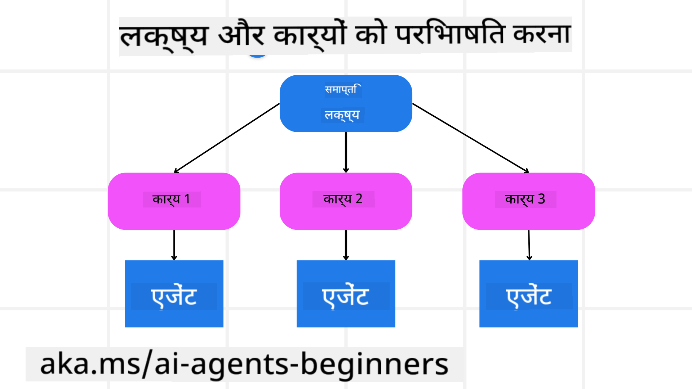

<!--
CO_OP_TRANSLATOR_METADATA:
{
  "original_hash": "8dd9a05d4dc18d3ff510e68e3798a080",
  "translation_date": "2025-04-05T19:50:50+00:00",
  "source_file": "07-planning-design\\README.md",
  "language_code": "hi"
}
-->
[](https://youtu.be/kPfJ2BrBCMY?si=9pYpPXp0sSbK91Dr)

> _(ऊपर दी गई छवि पर क्लिक करें इस पाठ का वीडियो देखने के लिए)_

# योजना डिज़ाइन

## परिचय

इस पाठ में आप सीखेंगे:

* एक स्पष्ट समग्र लक्ष्य को परिभाषित करना और जटिल कार्य को प्रबंधनीय कार्यों में विभाजित करना।
* संरचित आउटपुट का उपयोग करके अधिक विश्वसनीय और मशीन-पढ़ने योग्य उत्तर प्राप्त करना।
* गतिशील कार्यों और अप्रत्याशित इनपुट को संभालने के लिए इवेंट-ड्रिवन दृष्टिकोण लागू करना।

## अधिगम लक्ष्य

इस पाठ को पूरा करने के बाद, आप समझ पाएंगे:

* एआई एजेंट के लिए एक समग्र लक्ष्य को पहचानना और सेट करना, यह सुनिश्चित करते हुए कि उसे स्पष्ट रूप से पता हो कि क्या हासिल करना है।
* जटिल कार्य को प्रबंधनीय उप-कार्य में विभाजित करना और उन्हें तार्किक क्रम में व्यवस्थित करना।
* एजेंट्स को सही उपकरणों (जैसे खोज उपकरण या डेटा एनालिटिक्स टूल्स) से लैस करना, यह तय करना कि उन्हें कब और कैसे उपयोग करना है, और उत्पन्न अप्रत्याशित स्थितियों को संभालना।
* उप-कार्य के परिणामों का मूल्यांकन करना, प्रदर्शन मापना और अंतिम आउटपुट को बेहतर बनाने के लिए क्रियाओं को दोहराना।

## समग्र लक्ष्य को परिभाषित करना और कार्य को विभाजित करना



अधिकांश वास्तविक-विश्व कार्य इतने जटिल होते हैं कि उन्हें एक ही चरण में हल करना असंभव होता है। एआई एजेंट को एक संक्षिप्त उद्देश्य की आवश्यकता होती है जो उसकी योजना और क्रियाओं को निर्देशित कर सके। उदाहरण के लिए, यह लक्ष्य लें:

    "3-दिन की यात्रा की योजना तैयार करें।"

जबकि इसे कहना सरल है, इसे अभी भी परिष्कृत करने की आवश्यकता है। लक्ष्य जितना स्पष्ट होगा, एजेंट (और कोई भी मानव सहयोगी) सही परिणाम प्राप्त करने पर उतना ही बेहतर ध्यान केंद्रित कर सकते हैं, जैसे कि उड़ान विकल्पों, होटल अनुशंसाओं और गतिविधियों के सुझावों के साथ एक व्यापक यात्रा योजना बनाना।

### कार्य का विभाजन

बड़े या जटिल कार्यों को छोटे, लक्ष्य-उन्मुख उप-कार्य में विभाजित करने से उन्हें अधिक प्रबंधनीय बनाया जा सकता है। 
यात्रा योजना के उदाहरण के लिए, आप इस लक्ष्य को विभाजित कर सकते हैं:

* उड़ान बुकिंग
* होटल बुकिंग
* कार किराया
* व्यक्तिगतकरण

प्रत्येक उप-कार्य को समर्पित एजेंट्स या प्रक्रियाओं द्वारा संभाला जा सकता है। एक एजेंट सबसे अच्छे उड़ान सौदों की खोज में विशेषज्ञ हो सकता है, दूसरा होटल बुकिंग पर ध्यान केंद्रित कर सकता है, और इसी तरह। एक समन्वयक या “डाउनस्ट्रीम” एजेंट फिर इन परिणामों को एक एकीकृत यात्रा कार्यक्रम में संकलित कर सकता है और उपयोगकर्ता को प्रस्तुत कर सकता है।

यह मॉड्यूलर दृष्टिकोण वृद्धिशील सुधारों की भी अनुमति देता है। उदाहरण के लिए, आप भोजन अनुशंसाओं या स्थानीय गतिविधि सुझावों के लिए विशेष एजेंट जोड़ सकते हैं और समय के साथ यात्रा कार्यक्रम को परिष्कृत कर सकते हैं।

### संरचित आउटपुट

बड़े भाषा मॉडल (LLMs) संरचित आउटपुट (जैसे JSON) उत्पन्न कर सकते हैं जो डाउनस्ट्रीम एजेंट्स या सेवाओं के लिए पार्स और प्रोसेस करना आसान होता है। यह विशेष रूप से एक बहु-एजेंट संदर्भ में उपयोगी होता है, जहां योजना आउटपुट प्राप्त होने के बाद इन कार्यों को क्रियान्वित किया जा सकता है। संक्षेप में समझने के लिए देखें:

उपरोक्त कोड स्निपेट एक सरल योजना एजेंट को एक लक्ष्य को उप-कार्य में विभाजित करते हुए और एक संरचित योजना उत्पन्न करते हुए दिखाता है:

```python
from pydantic import BaseModel
from enum import Enum
from typing import List, Optional, Union
import json
import os
from typing import Optional
from pprint import pprint
from autogen_core.models import UserMessage, SystemMessage, AssistantMessage
from autogen_ext.models.azure import AzureAIChatCompletionClient
from azure.core.credentials import AzureKeyCredential

class AgentEnum(str, Enum):
    FlightBooking = "flight_booking"
    HotelBooking = "hotel_booking"
    CarRental = "car_rental"
    ActivitiesBooking = "activities_booking"
    DestinationInfo = "destination_info"
    DefaultAgent = "default_agent"
    GroupChatManager = "group_chat_manager"

# Travel SubTask Model
class TravelSubTask(BaseModel):
    task_details: str
    assigned_agent: AgentEnum  # we want to assign the task to the agent

class TravelPlan(BaseModel):
    main_task: str
    subtasks: List[TravelSubTask]
    is_greeting: bool

client = AzureAIChatCompletionClient(
    model="gpt-4o-mini",
    endpoint="https://models.inference.ai.azure.com",
    # To authenticate with the model you will need to generate a personal access token (PAT) in your GitHub settings.
    # Create your PAT token by following instructions here: https://docs.github.com/en/authentication/keeping-your-account-and-data-secure/managing-your-personal-access-tokens
    credential=AzureKeyCredential(os.environ["GITHUB_TOKEN"]),
    model_info={
        "json_output": False,
        "function_calling": True,
        "vision": True,
        "family": "unknown",
    },
)

# Define the user message
messages = [
    SystemMessage(content="""You are an planner agent.
    Your job is to decide which agents to run based on the user's request.
                      Provide your response in JSON format with the following structure:
{'main_task': 'Plan a family trip from Singapore to Melbourne.',
 'subtasks': [{'assigned_agent': 'flight_booking',
               'task_details': 'Book round-trip flights from Singapore to '
                               'Melbourne.'}
    Below are the available agents specialised in different tasks:
    - FlightBooking: For booking flights and providing flight information
    - HotelBooking: For booking hotels and providing hotel information
    - CarRental: For booking cars and providing car rental information
    - ActivitiesBooking: For booking activities and providing activity information
    - DestinationInfo: For providing information about destinations
    - DefaultAgent: For handling general requests""", source="system"),
    UserMessage(
        content="Create a travel plan for a family of 2 kids from Singapore to Melboune", source="user"),
]

response = await client.create(messages=messages, extra_create_args={"response_format": 'json_object'})

response_content: Optional[str] = response.content if isinstance(
    response.content, str) else None
if response_content is None:
    raise ValueError("Response content is not a valid JSON string" )

pprint(json.loads(response_content))

# # Ensure the response content is a valid JSON string before loading it
# response_content: Optional[str] = response.content if isinstance(
#     response.content, str) else None
# if response_content is None:
#     raise ValueError("Response content is not a valid JSON string")

# # Print the response content after loading it as JSON
# pprint(json.loads(response_content))

# Validate the response content with the MathReasoning model
# TravelPlan.model_validate(json.loads(response_content))
```

### बहु-एजेंट समन्वय के साथ योजना एजेंट

इस उदाहरण में, एक सेमांटिक राउटर एजेंट उपयोगकर्ता के अनुरोध (जैसे, "मुझे अपनी यात्रा के लिए होटल योजना चाहिए।") को प्राप्त करता है।

योजना एजेंट:

* होटल योजना प्राप्त करता है: योजना एजेंट उपयोगकर्ता का संदेश लेता है और एक सिस्टम प्रॉम्प्ट (जिसमें उपलब्ध एजेंट विवरण शामिल हैं) के आधार पर एक संरचित यात्रा योजना उत्पन्न करता है।
* एजेंट्स और उनके उपकरणों की सूची बनाता है: एजेंट रजिस्ट्री में एजेंट्स (जैसे, उड़ान, होटल, कार किराया, और गतिविधियों के लिए) की सूची होती है और उनके द्वारा प्रदान किए जाने वाले कार्य या उपकरण सूचीबद्ध होते हैं।
* योजना को संबंधित एजेंट्स को रूट करता है: उप-कार्य की संख्या के आधार पर, योजना एजेंट या तो संदेश को सीधे एक समर्पित एजेंट को भेजता है (एकल-कार्य परिदृश्य के लिए) या बहु-एजेंट सहयोग के लिए एक समूह चैट प्रबंधक के माध्यम से समन्वय करता है।
* परिणाम का सारांश प्रस्तुत करता है: अंततः, योजना एजेंट स्पष्टता के लिए उत्पन्न योजना का सारांश प्रस्तुत करता है। 

निम्नलिखित कोड स्निपेट इन चरणों को दर्शाता है:

```python

from pydantic import BaseModel

from enum import Enum
from typing import List, Optional, Union

class AgentEnum(str, Enum):
    FlightBooking = "flight_booking"
    HotelBooking = "hotel_booking"
    CarRental = "car_rental"
    ActivitiesBooking = "activities_booking"
    DestinationInfo = "destination_info"
    DefaultAgent = "default_agent"
    GroupChatManager = "group_chat_manager"

# Travel SubTask Model

class TravelSubTask(BaseModel):
    task_details: str
    assigned_agent: AgentEnum # we want to assign the task to the agent

class TravelPlan(BaseModel):
    main_task: str
    subtasks: List[TravelSubTask]
    is_greeting: bool
import json
import os
from typing import Optional

from autogen_core.models import UserMessage, SystemMessage, AssistantMessage
from autogen_ext.models.openai import AzureOpenAIChatCompletionClient

# Create the client with type-checked environment variables

client = AzureOpenAIChatCompletionClient(
    azure_deployment=os.getenv("AZURE_OPENAI_DEPLOYMENT_NAME"),
    model=os.getenv("AZURE_OPENAI_DEPLOYMENT_NAME"),
    api_version=os.getenv("AZURE_OPENAI_API_VERSION"),
    azure_endpoint=os.getenv("AZURE_OPENAI_ENDPOINT"),
    api_key=os.getenv("AZURE_OPENAI_API_KEY"),
)

from pprint import pprint

# Define the user message

messages = [
    SystemMessage(content="""You are an planner agent.
    Your job is to decide which agents to run based on the user's request.
    Below are the available agents specialized in different tasks:
    - FlightBooking: For booking flights and providing flight information
    - HotelBooking: For booking hotels and providing hotel information
    - CarRental: For booking cars and providing car rental information
    - ActivitiesBooking: For booking activities and providing activity information
    - DestinationInfo: For providing information about destinations
    - DefaultAgent: For handling general requests""", source="system"),
    UserMessage(content="Create a travel plan for a family of 2 kids from Singapore to Melbourne", source="user"),
]

response = await client.create(messages=messages, extra_create_args={"response_format": TravelPlan})

# Ensure the response content is a valid JSON string before loading it

response_content: Optional[str] = response.content if isinstance(response.content, str) else None
if response_content is None:
    raise ValueError("Response content is not a valid JSON string")

# Print the response content after loading it as JSON

pprint(json.loads(response_content))
```

पिछले कोड का आउटपुट यह दिखाता है कि आप इस संरचित आउटपुट का उपयोग `assigned_agent` को रूट करने और अंतिम उपयोगकर्ता को यात्रा योजना का सारांश प्रस्तुत करने के लिए कर सकते हैं।

```json
{
    "is_greeting": "False",
    "main_task": "Plan a family trip from Singapore to Melbourne.",
    "subtasks": [
        {
            "assigned_agent": "flight_booking",
            "task_details": "Book round-trip flights from Singapore to Melbourne."
        },
        {
            "assigned_agent": "hotel_booking",
            "task_details": "Find family-friendly hotels in Melbourne."
        },
        {
            "assigned_agent": "car_rental",
            "task_details": "Arrange a car rental suitable for a family of four in Melbourne."
        },
        {
            "assigned_agent": "activities_booking",
            "task_details": "List family-friendly activities in Melbourne."
        },
        {
            "assigned_agent": "destination_info",
            "task_details": "Provide information about Melbourne as a travel destination."
        }
    ]
}
```

उपरोक्त कोड का एक उदाहरण नोटबुक [यहां](../../../07-planning-design/07-autogen.ipynb) उपलब्ध है।

### पुनरावृत्त योजना

कुछ कार्यों के लिए आगे-पीछे या पुनः योजना की आवश्यकता होती है, जहां एक उप-कार्य का परिणाम अगले कार्य को प्रभावित करता है। उदाहरण के लिए, यदि एजेंट उड़ान बुकिंग करते समय अप्रत्याशित डेटा प्रारूप का सामना करता है, तो उसे होटल बुकिंग पर जाने से पहले अपनी रणनीति को अनुकूलित करना पड़ सकता है।

इसके अलावा, उपयोगकर्ता प्रतिक्रिया (जैसे, उपयोगकर्ता यह तय करता है कि उन्हें पहले की उड़ान पसंद है) आंशिक पुनः योजना को ट्रिगर कर सकती है। यह गतिशील, पुनरावृत्त दृष्टिकोण सुनिश्चित करता है कि अंतिम समाधान वास्तविक-विश्व बाधाओं और बदलती उपयोगकर्ता प्राथमिकताओं के साथ संरेखित हो।

उदाहरण कोड:

```python
from autogen_core.models import UserMessage, SystemMessage, AssistantMessage
#.. same as previous code and pass on the user history, current plan
messages = [
    SystemMessage(content="""You are a planner agent to optimize the
    Your job is to decide which agents to run based on the user's request.
    Below are the available agents specialized in different tasks:
    - FlightBooking: For booking flights and providing flight information
    - HotelBooking: For booking hotels and providing hotel information
    - CarRental: For booking cars and providing car rental information
    - ActivitiesBooking: For booking activities and providing activity information
    - DestinationInfo: For providing information about destinations
    - DefaultAgent: For handling general requests""", source="system"),
    UserMessage(content="Create a travel plan for a family of 2 kids from Singapore to Melbourne", source="user"),
    AssistantMessage(content=f"Previous travel plan - {TravelPlan}", source="assistant")
]
# .. re-plan and send the tasks to respective agents
```

अधिक व्यापक योजना के लिए Magnetic One अवश्य देखें।

## सारांश

इस लेख में हमने एक उदाहरण देखा कि कैसे हम एक ऐसा प्लानर बना सकते हैं जो उपलब्ध एजेंट्स को परिभाषित कर गतिशील रूप से चयन कर सके। प्लानर का आउटपुट कार्यों को विभाजित करता है और एजेंट्स को सौंपता है ताकि वे निष्पादित हो सकें। यह मान लिया गया है कि एजेंट्स के पास उन कार्यों को करने के लिए आवश्यक कार्य/उपकरण तक पहुंच है। एजेंट्स के अलावा, आप अन्य पैटर्न जैसे रिफ्लेक्शन, समराइज़र, और राउंड रॉबिन चैट को शामिल करके इसे और अधिक अनुकूलित कर सकते हैं।

## अतिरिक्त संसाधन

* AutoGen Magnetic One - जटिल कार्यों को हल करने के लिए एक सामान्य बहु-एजेंट प्रणाली है और इसने कई चुनौतीपूर्ण एजेंटिक बेंचमार्क पर प्रभावशाली परिणाम प्राप्त किए हैं। संदर्भ:

इस कार्यान्वयन में ऑर्केस्ट्रेटर कार्य-विशिष्ट योजना बनाता है और इन कार्यों को उपलब्ध एजेंट्स को सौंपता है। योजना बनाने के अलावा, ऑर्केस्ट्रेटर एक ट्रैकिंग मैकेनिज्म भी लागू करता है ताकि कार्य की प्रगति की निगरानी की जा सके और आवश्यकतानुसार पुनः योजना बनाई जा सके।

## पिछला पाठ

[विश्वसनीय एआई एजेंट बनाना](../06-building-trustworthy-agents/README.md)

## अगला पाठ

[बहु-एजेंट डिज़ाइन पैटर्न](../08-multi-agent/README.md)

**अस्वीकरण**:  
यह दस्तावेज़ AI अनुवाद सेवा [Co-op Translator](https://github.com/Azure/co-op-translator) का उपयोग करके अनुवादित किया गया है। जबकि हम सटीकता सुनिश्चित करने का प्रयास करते हैं, कृपया ध्यान दें कि स्वचालित अनुवाद में त्रुटियाँ या अशुद्धियाँ हो सकती हैं। मूल दस्तावेज़, जो उसकी मूल भाषा में है, को आधिकारिक स्रोत माना जाना चाहिए। महत्वपूर्ण जानकारी के लिए, पेशेवर मानव अनुवाद की सिफारिश की जाती है। इस अनुवाद के उपयोग से उत्पन्न किसी भी गलतफहमी या गलत व्याख्या के लिए हम जिम्मेदार नहीं हैं।