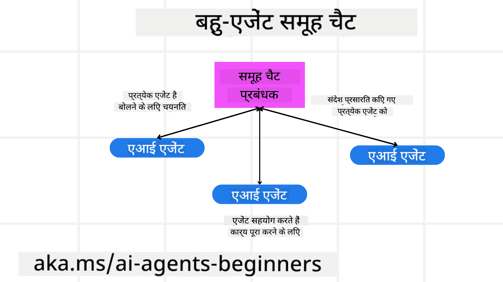
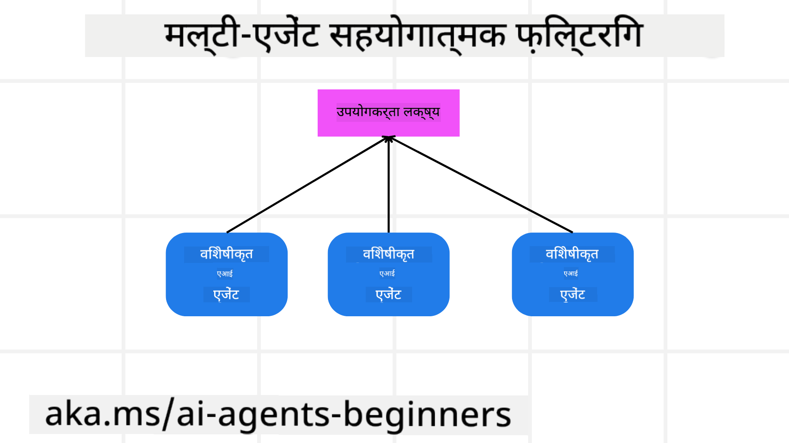

<!--
CO_OP_TRANSLATOR_METADATA:
{
  "original_hash": "bdb0a92e5a437d5fa985a6863f4a836c",
  "translation_date": "2025-04-05T19:52:46+00:00",
  "source_file": "08-multi-agent\\README.md",
  "language_code": "hi"
}
-->

> _(ऊपर दी गई छवि पर क्लिक करें इस पाठ का वीडियो देखने के लिए)_

# मल्टी-एजेंट डिज़ाइन पैटर्न

जैसे ही आप किसी ऐसे प्रोजेक्ट पर काम करना शुरू करते हैं जिसमें कई एजेंट शामिल होते हैं, आपको मल्टी-एजेंट डिज़ाइन पैटर्न पर विचार करना होगा। हालांकि, यह तुरंत स्पष्ट नहीं हो सकता कि मल्टी-एजेंट्स का उपयोग कब करना है और इसके क्या लाभ हैं।

## परिचय

इस पाठ में, हम निम्नलिखित प्रश्नों का उत्तर देने की कोशिश करेंगे:

- कौन-कौन से परिदृश्य हैं जहाँ मल्टी-एजेंट्स लागू हो सकते हैं?
- कई कार्यों को करने वाले एकल एजेंट की तुलना में मल्टी-एजेंट्स का उपयोग करने के क्या फायदे हैं?
- मल्टी-एजेंट डिज़ाइन पैटर्न को लागू करने के निर्माण खंड क्या हैं?
- हम यह कैसे देख सकते हैं कि कई एजेंट एक-दूसरे के साथ कैसे इंटरैक्ट कर रहे हैं?

## सीखने के लक्ष्य

इस पाठ के बाद, आप निम्नलिखित में सक्षम होने चाहिए:

- उन परिदृश्यों की पहचान करें जहाँ मल्टी-एजेंट्स लागू हो सकते हैं।
- एकल एजेंट की तुलना में मल्टी-एजेंट्स का उपयोग करने के लाभों को पहचानें।
- मल्टी-एजेंट डिज़ाइन पैटर्न को लागू करने के निर्माण खंडों को समझें।

बड़ी तस्वीर क्या है?

*मल्टी-एजेंट्स एक डिज़ाइन पैटर्न है जो कई एजेंट्स को एक सामान्य लक्ष्य प्राप्त करने के लिए एक साथ काम करने की अनुमति देता है।*

यह पैटर्न विभिन्न क्षेत्रों में व्यापक रूप से उपयोग किया जाता है, जिनमें रोबोटिक्स, स्वायत्त प्रणाली, और वितरित कंप्यूटिंग शामिल हैं।

## परिदृश्य जहाँ मल्टी-एजेंट्स लागू हो सकते हैं

तो कौन से परिदृश्य मल्टी-एजेंट्स का उपयोग करने के लिए अच्छे हैं? इसका उत्तर है कि कई परिदृश्य हैं जहाँ कई एजेंट्स का उपयोग करना विशेष रूप से निम्नलिखित मामलों में लाभदायक है:

- **बड़ा कार्यभार**: बड़े कार्यभार को छोटे कार्यों में विभाजित किया जा सकता है और विभिन्न एजेंट्स को सौंपा जा सकता है, जिससे समानांतर प्रसंस्करण और तेजी से पूर्णता हो सकती है। इसका एक उदाहरण बड़े डेटा प्रसंस्करण कार्य में है।
- **जटिल कार्य**: जटिल कार्य, बड़े कार्यभार की तरह, छोटे उप-कार्य में विभाजित किए जा सकते हैं और विभिन्न एजेंट्स को सौंपा जा सकता है, प्रत्येक कार्य के एक विशिष्ट पहलू में विशेषज्ञता रखते हुए। इसका एक अच्छा उदाहरण स्वायत्त वाहनों के मामले में है जहाँ विभिन्न एजेंट्स नेविगेशन, बाधा का पता लगाने, और अन्य वाहनों के साथ संचार का प्रबंधन करते हैं।
- **विविध विशेषज्ञता**: विभिन्न एजेंट्स विविध विशेषज्ञता रख सकते हैं, जिससे वे किसी कार्य के विभिन्न पहलुओं को एकल एजेंट की तुलना में अधिक प्रभावी ढंग से संभाल सकते हैं। इसके लिए एक अच्छा उदाहरण स्वास्थ्य देखभाल के मामले में है जहाँ एजेंट्स निदान, उपचार योजनाओं, और रोगी की निगरानी का प्रबंधन कर सकते हैं।

## एकल एजेंट की तुलना में मल्टी-एजेंट्स का उपयोग करने के लाभ

एकल एजेंट प्रणाली सरल कार्यों के लिए अच्छी तरह से काम कर सकती है, लेकिन अधिक जटिल कार्यों के लिए, कई एजेंट्स का उपयोग कई लाभ प्रदान कर सकता है:

- **विशेषज्ञता**: प्रत्येक एजेंट एक विशिष्ट कार्य के लिए विशेषज्ञ हो सकता है। एकल एजेंट में विशेषज्ञता की कमी का मतलब है कि आपके पास ऐसा एजेंट है जो सब कुछ कर सकता है लेकिन जटिल कार्य का सामना करने पर भ्रमित हो सकता है। उदाहरण के लिए, यह ऐसा कार्य कर सकता है जिसके लिए वह सबसे उपयुक्त नहीं है।
- **स्केलेबिलिटी**: सिस्टम को स्केल करना एकल एजेंट को ओवरलोड करने के बजाय अधिक एजेंट्स जोड़कर आसान होता है।
- **फॉल्ट टॉलरेंस**: यदि एक एजेंट विफल हो जाता है, तो अन्य कार्य करना जारी रख सकते हैं, जिससे सिस्टम की विश्वसनीयता सुनिश्चित होती है।

एक उदाहरण लेते हैं, चलिए उपयोगकर्ता के लिए यात्रा बुक करते हैं। एकल एजेंट प्रणाली को यात्रा बुकिंग प्रक्रिया के सभी पहलुओं को संभालना होगा, फ्लाइट खोजने से लेकर होटल और किराये की कार बुक करने तक। इसे एकल एजेंट के साथ प्राप्त करने के लिए, एजेंट को इन सभी कार्यों को संभालने के लिए उपकरणों की आवश्यकता होगी। इससे एक जटिल और मोनोलिथिक प्रणाली बन सकती है जिसे बनाए रखना और स्केल करना कठिन है। दूसरी ओर, एक मल्टी-एजेंट प्रणाली में फ्लाइट खोजने, होटल बुक करने और किराये की कार बुक करने में विशेषज्ञता वाले विभिन्न एजेंट्स हो सकते हैं। इससे सिस्टम अधिक मॉड्यूलर, बनाए रखने में आसान और स्केलेबल हो जाएगा।

इसकी तुलना एक छोटे से चलने वाले ट्रैवल ब्यूरो और फ्रैंचाइज़ी के रूप में चलने वाले ट्रैवल ब्यूरो से करें। छोटा ट्रैवल ब्यूरो यात्रा बुकिंग प्रक्रिया के सभी पहलुओं को संभालने वाला एकल एजेंट होगा, जबकि फ्रैंचाइज़ी में यात्रा बुकिंग प्रक्रिया के विभिन्न पहलुओं को संभालने वाले विभिन्न एजेंट्स होंगे।

## मल्टी-एजेंट डिज़ाइन पैटर्न को लागू करने के निर्माण खंड

मल्टी-एजेंट डिज़ाइन पैटर्न को लागू करने से पहले, आपको उन निर्माण खंडों को समझना होगा जो पैटर्न बनाते हैं।

चलो इसे फिर से उपयोगकर्ता के लिए यात्रा बुकिंग के उदाहरण को देखकर और अधिक ठोस बनाते हैं। इस मामले में, निर्माण खंडों में शामिल होंगे:

- **एजेंट संचार**: फ्लाइट खोजने, होटल बुक करने, और किराये की कारों के लिए एजेंट्स को उपयोगकर्ता की प्राथमिकताओं और बाधाओं के बारे में जानकारी साझा करने और संचार करने की आवश्यकता है। आपको इस संचार के लिए प्रोटोकॉल और विधियाँ तय करनी होंगी। इसका मतलब यह है कि फ्लाइट खोजने वाला एजेंट होटल बुक करने वाले एजेंट के साथ संचार करता है ताकि यह सुनिश्चित हो सके कि होटल फ्लाइट के समान तारीखों के लिए बुक किया गया है। इसका मतलब यह है कि एजेंट्स को उपयोगकर्ता की यात्रा की तारीखों के बारे में जानकारी साझा करनी होगी, जिसका मतलब है कि आपको तय करना होगा *कौन-कौन से एजेंट्स जानकारी साझा कर रहे हैं और वे कैसे साझा कर रहे हैं।*
- **समन्वय तंत्र**: एजेंट्स को अपनी क्रियाओं को समन्वयित करना होगा ताकि उपयोगकर्ता की प्राथमिकताओं और बाधाओं को पूरा किया जा सके। उपयोगकर्ता की प्राथमिकता यह हो सकती है कि वे हवाई अड्डे के पास एक होटल चाहते हैं जबकि बाधा यह हो सकती है कि किराये की कारें केवल हवाई अड्डे पर उपलब्ध हैं। इसका मतलब है कि होटल बुक करने वाला एजेंट किराये की कार बुक करने वाले एजेंट के साथ समन्वय करता है ताकि उपयोगकर्ता की प्राथमिकताओं और बाधाओं को पूरा किया जा सके। इसका मतलब है कि आपको तय करना होगा *एजेंट्स अपनी क्रियाओं को कैसे समन्वयित कर रहे हैं।*
- **एजेंट संरचना**: एजेंट्स को निर्णय लेने और उपयोगकर्ता के साथ अपनी बातचीत से सीखने के लिए आंतरिक संरचना की आवश्यकता होती है। इसका मतलब है कि फ्लाइट खोजने वाला एजेंट उपयोगकर्ता को कौन सी फ्लाइट्स सिफारिश करने का निर्णय लेने के लिए आंतरिक संरचना रखता है। इसका मतलब है कि आपको तय करना होगा *एजेंट्स उपयोगकर्ता के साथ अपनी बातचीत से कैसे निर्णय ले रहे हैं और सीख रहे हैं।* उदाहरण के लिए, फ्लाइट खोजने वाला एजेंट उपयोगकर्ता की पिछली प्राथमिकताओं के आधार पर सिफारिश करने के लिए मशीन लर्निंग मॉडल का उपयोग कर सकता है।
- **मल्टी-एजेंट इंटरैक्शन में दृश्यता**: आपको यह देखने की आवश्यकता है कि कई एजेंट्स एक-दूसरे के साथ कैसे इंटरैक्ट कर रहे हैं। इसका मतलब है कि एजेंट गतिविधियों और इंटरैक्शन को ट्रैक करने के लिए आपके पास टूल्स और तकनीक होनी चाहिए। यह लॉगिंग और मॉनिटरिंग टूल्स, विज़ुअलाइज़ेशन टूल्स, और प्रदर्शन मेट्रिक्स के रूप में हो सकता है।
- **मल्टी-एजेंट पैटर्न्स**: मल्टी-एजेंट सिस्टम को लागू करने के लिए विभिन्न पैटर्न हैं, जैसे केंद्रीयकृत, विकेंद्रीकृत, और हाइब्रिड आर्किटेक्चर। आपको अपने उपयोग के मामले के लिए सबसे उपयुक्त पैटर्न तय करना होगा।
- **मानव हस्तक्षेप**: अधिकांश मामलों में, आपके पास प्रक्रिया में एक मानव होगा और आपको एजेंट्स को निर्देश देना होगा कि कब मानव हस्तक्षेप के लिए पूछना है। यह उपयोगकर्ता द्वारा किसी विशेष होटल या फ्लाइट के लिए पूछने के रूप में हो सकता है जिसे एजेंट्स ने सिफारिश नहीं की है या फ्लाइट या होटल बुक करने से पहले पुष्टि के लिए पूछना हो सकता है।

## मल्टी-एजेंट इंटरैक्शन में दृश्यता

यह महत्वपूर्ण है कि आपके पास यह देखने की क्षमता हो कि कई एजेंट्स एक-दूसरे के साथ कैसे इंटरैक्ट कर रहे हैं। यह दृश्यता डीबगिंग, ऑप्टिमाइज़िंग, और समग्र सिस्टम की प्रभावशीलता सुनिश्चित करने के लिए आवश्यक है। इसे प्राप्त करने के लिए, आपके पास एजेंट गतिविधियों और इंटरैक्शन को ट्रैक करने के लिए टूल्स और तकनीक होनी चाहिए। यह लॉगिंग और मॉनिटरिंग टूल्स, विज़ुअलाइज़ेशन टूल्स, और प्रदर्शन मेट्रिक्स के रूप में हो सकता है।

उदाहरण के लिए, उपयोगकर्ता के लिए यात्रा बुकिंग के मामले में, आपके पास एक डैशबोर्ड हो सकता है जो प्रत्येक एजेंट की स्थिति, उपयोगकर्ता की प्राथमिकताओं और बाधाओं, और एजेंट्स के बीच इंटरैक्शन दिखाता है। यह डैशबोर्ड उपयोगकर्ता की यात्रा की तारीखें, फ्लाइट एजेंट द्वारा अनुशंसित फ्लाइट्स, होटल एजेंट द्वारा अनुशंसित होटल्स, और किराये की कार एजेंट द्वारा अनुशंसित किराये की कारें दिखा सकता है। इससे आपको स्पष्ट रूप से दिखेगा कि एजेंट्स एक-दूसरे के साथ कैसे इंटरैक्ट कर रहे हैं और क्या उपयोगकर्ता की प्राथमिकताओं और बाधाओं को पूरा किया जा रहा है।

आइए इन पहलुओं को और विस्तार से देखें।

- **लॉगिंग और मॉनिटरिंग टूल्स**: आप प्रत्येक एजेंट द्वारा किए गए कार्य के लिए लॉगिंग करना चाहते हैं। लॉग एंट्री में उस एजेंट की जानकारी स्टोर हो सकती है जिसने कार्य किया, लिया गया कार्य, कार्य लिया गया समय, और कार्य का परिणाम। इस जानकारी का उपयोग डीबगिंग, ऑप्टिमाइज़िंग और अन्य उद्देश्यों के लिए किया जा सकता है।

- **विज़ुअलाइज़ेशन टूल्स**: विज़ुअलाइज़ेशन टूल्स आपको एजेंट्स के बीच इंटरैक्शन को अधिक सहज तरीके से देखने में मदद कर सकते हैं। उदाहरण के लिए, आपके पास एक ग्राफ़ हो सकता है जो एजेंट्स के बीच सूचना प्रवाह दिखाता है। इससे आपको सिस्टम में बॉटलनेक, अक्षमताएं, और अन्य मुद्दों की पहचान करने में मदद मिल सकती है।

- **प्रदर्शन मेट्रिक्स**: प्रदर्शन मेट्रिक्स आपको मल्टी-एजेंट सिस्टम की प्रभावशीलता को ट्रैक करने में मदद कर सकते हैं। उदाहरण के लिए, आप कार्य पूरा करने में लगने वाला समय, प्रति समय इकाई में पूर्ण किए गए कार्यों की संख्या, और एजेंट्स द्वारा की गई सिफारिशों की सटीकता को ट्रैक कर सकते हैं। यह जानकारी आपको सुधार के क्षेत्रों की पहचान करने और सिस्टम को ऑप्टिमाइज़ करने में मदद कर सकती है।

## मल्टी-एजेंट पैटर्न्स

आइए कुछ ठोस पैटर्न्स पर ध्यान दें जिन्हें हम मल्टी-एजेंट ऐप्स बनाने के लिए उपयोग कर सकते हैं। यहां कुछ रोचक पैटर्न्स हैं जिन्हें विचार करना चाहिए:

### ग्रुप चैट

यह पैटर्न उपयोगी है जब आप एक ग्रुप चैट एप्लिकेशन बनाना चाहते हैं जहाँ कई एजेंट्स एक-दूसरे के साथ संवाद कर सकें। इस पैटर्न के सामान्य उपयोग के मामलों में टीम सहयोग, ग्राहक समर्थन, और सोशल नेटवर्किंग शामिल हैं।

इस पैटर्न में, प्रत्येक एजेंट ग्रुप चैट में एक उपयोगकर्ता का प्रतिनिधित्व करता है, और संदेश एजेंट्स के बीच एक संदेश प्रोटोकॉल का उपयोग करके आदान-प्रदान किए जाते हैं। एजेंट्स ग्रुप चैट को संदेश भेज सकते हैं, ग्रुप चैट से संदेश प्राप्त कर सकते हैं, और अन्य एजेंट्स से संदेशों का जवाब दे सकते हैं।

इस पैटर्न को एक केंद्रीयकृत आर्किटेक्चर का उपयोग करके लागू किया जा सकता है जहाँ सभी संदेश एक केंद्रीय सर्वर के माध्यम से रूट किए जाते हैं, या एक विकेंद्रीकृत आर्किटेक्चर का उपयोग करके जहाँ संदेश सीधे आदान-प्रदान किए जाते हैं।

### हैंड-ऑफ

यह पैटर्न उपयोगी है जब आप एक एप्लिकेशन बनाना चाहते हैं जहाँ कई एजेंट्स एक-दूसरे को कार्य सौंप सकें।

इस पैटर्न के सामान्य उपयोग के मामलों में ग्राहक समर्थन, कार्य प्रबंधन, और कार्यप्रवाह स्वचालन शामिल हैं।

इस पैटर्न में, प्रत्येक एजेंट एक कार्य या कार्यप्रवाह में एक चरण का प्रतिनिधित्व करता है, और एजेंट्स पूर्वनिर्धारित नियमों के आधार पर अन्य एजेंट्स को कार्य सौंप सकते हैं।

### सहयोगी फ़िल्टरिंग

यह पैटर्न उपयोगी है जब आप एक एप्लिकेशन बनाना चाहते हैं जहाँ कई एजेंट्स उपयोगकर्ताओं को सिफारिशें देने के लिए सहयोग कर सकें।

क्योंकि प्रत्येक एजेंट के पास अलग-अलग विशेषज्ञता हो सकती है और वे सिफारिश प्रक्रिया में अलग-अलग तरीकों से योगदान कर सकते हैं।

आइए एक उदाहरण लें जहाँ एक उपयोगकर्ता शेयर बाजार में खरीदने के लिए सबसे अच्छे स्टॉक की सिफारिश चाहता है।

- **उद्योग विशेषज्ञ**: एक एजेंट किसी विशिष्ट उद्योग में विशेषज्ञ हो सकता है।
- **तकनीकी विश्लेषण**: दूसरा एजेंट तकनीकी विश्लेषण में विशेषज्ञ हो सकता है।
- **मूलभूत विश्लेषण**: और एक अन्य एजेंट मूलभूत विश्लेषण में विशेषज्ञ हो सकता है। सहयोग करके, ये एजेंट उपयोगकर्ता को अधिक व्यापक सिफारिश प्रदान कर सकते हैं।

## परिदृश्य: रिफंड प्रक्रिया

मान लें कि एक ग्राहक उत्पाद के लिए रिफंड प्राप्त करने की कोशिश कर रहा है, इस प्रक्रिया में काफी सारे एजेंट्स शामिल हो सकते हैं, लेकिन चलिए इसे इस प्रक्रिया के लिए विशिष्ट एजेंट्स और आपके व्यवसाय के अन्य हिस्सों में उपयोग किए जा सकने वाले सामान्य एजेंट्स के बीच विभाजित करते हैं।

**रिफंड प्रक्रिया के लिए विशिष्ट एजेंट्स**:

निम्नलिखित कुछ एजेंट्स हैं जो रिफंड प्रक्रिया में शामिल हो सकते हैं:

- **ग्राहक एजेंट**: यह एजेंट ग्राहक का प्रतिनिधित्व करता है और रिफंड प्रक्रिया शुरू करने के लिए जिम्मेदार है।
- **विक्रेता एजेंट**: यह एजेंट विक्रेता का प्रतिनिधित्व करता है और रिफंड प्रक्रिया को संभालने के लिए जिम्मेदार है।
- **भुगतान एजेंट**: यह एजेंट भुगतान प्रक्रिया का प्रतिनिधित्व करता है और ग्राहक के भुगतान को रिफंड करने के लिए जिम्मेदार है।
- **समाधान एजेंट**: यह एजेंट समाधान प्रक्रिया का प्रतिनिधित्व करता है और रिफंड प्रक्रिया के दौरान उत्पन्न होने वाले किसी भी मुद्दे को हल करने के लिए जिम्म

**अस्वीकरण**:  
यह दस्तावेज़ AI अनुवाद सेवा [Co-op Translator](https://github.com/Azure/co-op-translator) का उपयोग करके अनुवादित किया गया है। जबकि हम सटीकता सुनिश्चित करने का प्रयास करते हैं, कृपया ध्यान दें कि स्वचालित अनुवाद में त्रुटियां या अशुद्धियां हो सकती हैं। मूल दस्तावेज़, जो इसकी मूल भाषा में है, को प्रामाणिक स्रोत माना जाना चाहिए। महत्वपूर्ण जानकारी के लिए, पेशेवर मानव अनुवाद की सिफारिश की जाती है। इस अनुवाद के उपयोग से उत्पन्न किसी भी गलतफहमी या गलत व्याख्या के लिए हम उत्तरदायी नहीं हैं।