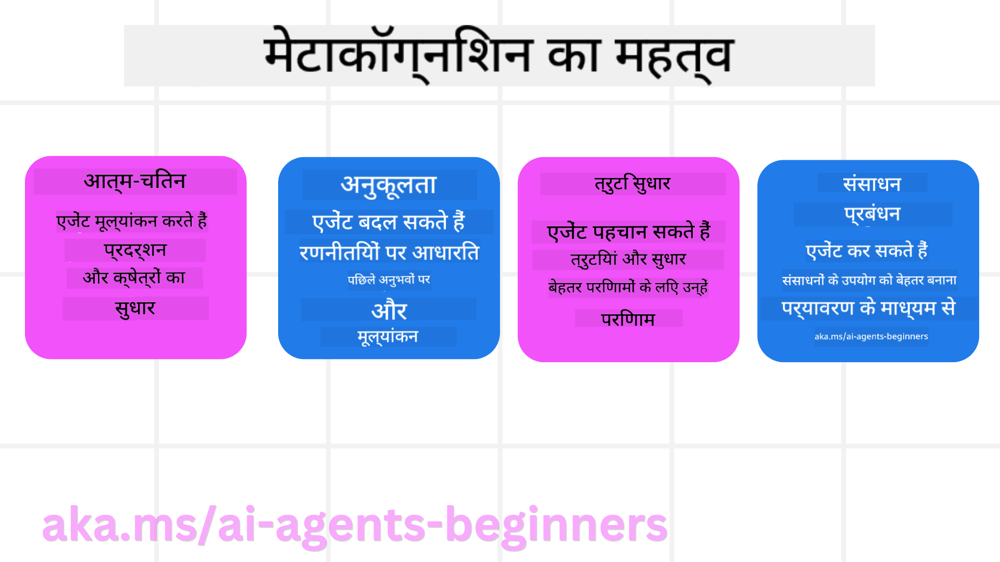
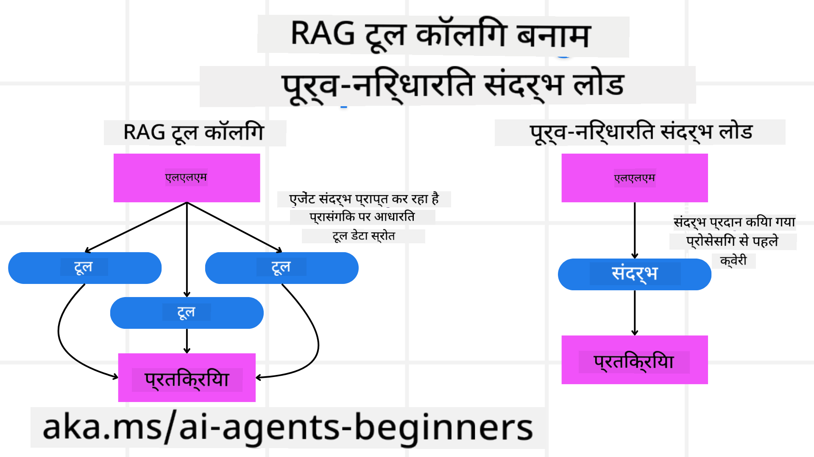

<!--
CO_OP_TRANSLATOR_METADATA:
{
  "original_hash": "3171ed887315c3ddeaccf966e40e9a50",
  "translation_date": "2025-04-05T19:55:50+00:00",
  "source_file": "09-metacognition\\README.md",
  "language_code": "hi"
}
-->
[](https://youtu.be/His9R6gw6Ec?si=3_RMb8VprNvdLRhX)

> _(ऊपर दी गई छवि पर क्लिक करें इस पाठ के वीडियो को देखने के लिए)_
# AI एजेंट्स में मेटाकॉग्निशन ## परिचय AI एजेंट्स में मेटाकॉग्निशन पर पाठ में आपका स्वागत है! यह अध्याय उन शुरुआती लोगों के लिए बनाया गया है जो यह जानने के लिए उत्सुक हैं कि AI एजेंट्स अपने सोचने की प्रक्रिया के बारे में कैसे सोच सकते हैं। इस पाठ के अंत तक, आप मुख्य अवधारणाओं को समझेंगे और AI एजेंट डिज़ाइन में मेटाकॉग्निशन लागू करने के लिए व्यावहारिक उदाहरणों से लैस होंगे। ## सीखने के लक्ष्य इस पाठ को पूरा करने के बाद, आप सक्षम होंगे: 1. एजेंट परिभाषाओं में तर्क चक्रों के प्रभाव को समझें। 2. आत्म-सुधार करने वाले एजेंट्स की मदद के लिए योजना और मूल्यांकन तकनीकों का उपयोग करें। 3. अपने खुद के एजेंट्स बनाएं जो कार्यों को पूरा करने के लिए कोड को बदलने में सक्षम हों। ## मेटाकॉग्निशन का परिचय मेटाकॉग्निशन उच्च-स्तरीय संज्ञानात्मक प्रक्रियाओं को संदर्भित करता है जो किसी के अपने सोचने के तरीके के बारे में सोचने को शामिल करती हैं। AI एजेंट्स के लिए, इसका मतलब है कि वे आत्म-जागरूकता और पिछले अनुभवों के आधार पर अपने कार्यों का मूल्यांकन और समायोजन कर सकते हैं। मेटाकॉग्निशन, या "सोचने के बारे में सोचना," एजेंटिक AI सिस्टम्स के विकास में एक महत्वपूर्ण अवधारणा है। इसमें AI सिस्टम्स शामिल होते हैं जो अपने आंतरिक प्रक्रियाओं के बारे में जागरूक होते हैं और अपनी व्यवहार को निगरानी, विनियमित और अनुकूलित करने में सक्षम होते हैं। ठीक उसी तरह जैसे हम किसी स्थिति को पढ़ते हैं या किसी समस्या को देखते हैं। यह आत्म-जागरूकता AI सिस्टम्स को बेहतर निर्णय लेने, त्रुटियों की पहचान करने और समय के साथ अपने प्रदर्शन को सुधारने में मदद कर सकती है- फिर से ट्यूरिंग टेस्ट और इस बहस से जुड़ते हुए कि क्या AI सब कुछ संभालने वाला है। एजेंटिक AI सिस्टम्स के संदर्भ में, मेटाकॉग्निशन कई चुनौतियों का समाधान करने में मदद कर सकता है, जैसे: - पारदर्शिता: यह सुनिश्चित करना कि AI सिस्टम्स अपने तर्क और निर्णयों को समझा सकें। - तर्क: AI सिस्टम्स की जानकारी को संश्लेषित करने और सही निर्णय लेने की क्षमता को बढ़ाना। - अनुकूलन: AI सिस्टम्स को नए वातावरण और बदलती परिस्थितियों के अनुकूल बनाने की अनुमति देना। - धारणा: AI सिस्टम्स की सटीकता में सुधार करना ताकि वे अपने वातावरण से डेटा को पहचान सकें और उसकी व्याख्या कर सकें। ### मेटाकॉग्निशन क्या है? मेटाकॉग्निशन, या "सोचने के बारे में सोचना," एक उच्च-स्तरीय संज्ञानात्मक प्रक्रिया है जो आत्म-जागरूकता और किसी के संज्ञानात्मक प्रक्रियाओं के आत्म-नियमन को शामिल करती है। AI के क्षेत्र में, मेटाकॉग्निशन एजेंट्स को उनकी रणनीतियों और कार्यों का मूल्यांकन और अनुकूलन करने में सक्षम बनाता है, जिससे समस्या-समाधान और निर्णय लेने की क्षमता में सुधार होता है। मेटाकॉग्निशन को समझकर, आप AI एजेंट्स को डिज़ाइन कर सकते हैं जो न केवल अधिक बुद्धिमान हैं बल्कि अधिक अनुकूलनीय और कुशल भी हैं। वास्तविक मेटाकॉग्निशन में, आप देखेंगे कि AI स्पष्ट रूप से अपने तर्क के बारे में तर्क करता है। उदाहरण: “मैंने सस्ते फ्लाइट्स को प्राथमिकता दी क्योंकि… मैं शायद सीधे फ्लाइट्स को नजरअंदाज कर रहा हूं, तो चलिए फिर से जांच करता हूं।” यह ट्रैक करना कि उसने एक निश्चित मार्ग क्यों चुना। - यह ध्यान देना कि उसने गलतियां कीं क्योंकि उसने पिछली बार की उपयोगकर्ता प्राथमिकताओं पर बहुत अधिक भरोसा किया, तो वह अपनी निर्णय लेने की रणनीति को संशोधित करता है न कि केवल अंतिम सिफारिश। - पैटर्न का निदान करना जैसे, “जब भी मैं देखता हूं कि उपयोगकर्ता 'बहुत भीड़भाड़' का उल्लेख करता है, मुझे न केवल कुछ आकर्षण हटाने चाहिए बल्कि यह भी समझना चाहिए कि 'शीर्ष आकर्षण' चुनने की मेरी विधि दोषपूर्ण है अगर मैं हमेशा लोकप्रियता के आधार पर रैंक करता हूं।” ### AI एजेंट्स में मेटाकॉग्निशन का महत्व AI एजेंट डिज़ाइन में मेटाकॉग्निशन कई कारणों से महत्वपूर्ण भूमिका निभाता है:  - आत्म-चिंतन: एजेंट्स अपने प्रदर्शन का आकलन कर सकते हैं और सुधार के क्षेत्रों की पहचान कर सकते हैं। - अनुकूलनशीलता: एजेंट्स पिछले अनुभवों और बदलते वातावरण के आधार पर अपनी रणनीतियों को संशोधित कर सकते हैं। - त्रुटि सुधार: एजेंट्स स्वत: त्रुटियों का पता लगा सकते हैं और उन्हें सुधार सकते हैं, जिससे अधिक सटीक परिणाम प्राप्त होते हैं। - संसाधन प्रबंधन: एजेंट्स समय और कंप्यूटिंग शक्ति जैसे संसाधनों का उपयोग अनुकूलित कर सकते हैं, अपने कार्यों की योजना बनाकर और उनका मूल्यांकन करके। ## AI एजेंट का घटक मेटाकॉग्निशन प्रक्रियाओं में गहराई से जाने से पहले, AI एजेंट के मूल घटकों को समझना आवश्यक है। एक AI एजेंट आमतौर पर निम्नलिखित से बना होता है: - व्यक्तित्व: एजेंट की व्यक्तित्व और विशेषताएं, जो यह परिभाषित करती हैं कि वह उपयोगकर्ताओं के साथ कैसे इंटरैक्ट करता है। - उपकरण: क्षमताएं और कार्य जो एजेंट कर सकता है। - कौशल: ज्ञान और विशेषज्ञता जो एजेंट के पास है। ये घटक मिलकर एक "विशेषज्ञता इकाई" बनाते हैं जो विशिष्ट कार्यों को पूरा कर सकती है। **उदाहरण**: एक ट्रैवल एजेंट पर विचार करें, जो आपकी छुट्टी की योजना बनाने के साथ-साथ वास्तविक समय के डेटा और पिछले ग्राहक यात्रा अनुभवों के आधार पर अपने मार्ग को समायोजित करता है। ### उदाहरण: ट्रैवल एजेंट सेवा में मेटाकॉग्निशन कल्पना करें कि आप AI द्वारा संचालित ट्रैवल एजेंट सेवा डिज़ाइन कर रहे हैं। यह एजेंट, "ट्रैवल एजेंट," उपयोगकर्ताओं को उनकी छुट्टियों की योजना बनाने में मदद करता है। मेटाकॉग्निशन को शामिल करने के लिए, ट्रैवल एजेंट को आत्म-जागरूकता और पिछले अनुभवों के आधार पर अपने कार्यों का मूल्यांकन और समायोजन करना होगा। यहाँ मेटाकॉग्निशन कैसे भूमिका निभा सकता है: #### वर्तमान कार्य वर्तमान कार्य एक उपयोगकर्ता को पेरिस की यात्रा की योजना बनाने में मदद करना है। #### कार्य को पूरा करने के चरण 1. **उपयोगकर्ता प्राथमिकताएं इकट्ठा करें**: उपयोगकर्ता से उनकी यात्रा की तारीखों, बजट, रुचियों (जैसे संग्रहालय, भोजन, खरीदारी), और किसी भी विशिष्ट आवश्यकताओं के बारे में पूछें। 2. **जानकारी प्राप्त करें**: उपयोगकर्ता की प्राथमिकताओं से मेल खाने वाले फ्लाइट विकल्प, आवास, आकर्षण और रेस्तरां खोजें। 3. **सिफारिशें उत्पन्न करें**: फ्लाइट विवरण, होटल आरक्षण और सुझाई गई गतिविधियों के साथ एक व्यक्तिगत यात्रा कार्यक्रम प्रदान करें। 4. **प्रतिक्रिया के आधार पर समायोजन करें**: सिफारिशों पर उपयोगकर्ता से प्रतिक्रिया मांगें और आवश्यक समायोजन करें। #### आवश्यक संसाधन - फ्लाइट और होटल बुकिंग डेटाबेस तक पहुंच। - पेरिस के आकर्षण और रेस्तरां पर जानकारी। - पिछले इंटरैक्शन से उपयोगकर्ता प्रतिक्रिया डेटा। #### अनुभव और आत्म-चिंतन ट्रैवल एजेंट अपने प्रदर्शन का मूल्यांकन करने और पिछले अनुभवों से सीखने के लिए मेटाकॉग्निशन का उपयोग करता है। उदाहरण के लिए: 1. **उपयोगकर्ता प्रतिक्रिया का विश्लेषण करना**: ट्रैवल एजेंट यह समीक्षा करता है कि कौन सी सिफारिशें अच्छी तरह से स्वीकार की गईं और कौन सी नहीं। यह अपनी भविष्य की सिफारिशों को तदनुसार समायोजित करता है। 2. **अनुकूलनशीलता**: यदि उपयोगकर्ता ने पहले भीड़भाड़ वाली जगहों के लिए नापसंदगी का उल्लेख किया है, तो ट्रैवल एजेंट भविष्य में व्यस्त समय के दौरान लोकप्रिय पर्यटन स्थलों की सिफारिश करने से बचता है। 3. **त्रुटि सुधार**: यदि ट्रैवल एजेंट ने पिछले बुकिंग में कोई गलती की, जैसे कि एक होटल की सिफारिश करना जो पूरी तरह से बुक था, तो यह भविष्य में सिफारिशें करने से पहले उपलब्धता की अधिक सख्ती से जांच करना सीखता है। #### व्यावहारिक डेवलपर उदाहरण यहाँ ट्रैवल एजेंट के कोड का एक सरलीकृत उदाहरण है जब मेटाकॉग्निशन को शामिल किया गया है: ```python
class Travel_Agent:
    def __init__(self):
        self.user_preferences = {}
        self.experience_data = []

    def gather_preferences(self, preferences):
        self.user_preferences = preferences

    def retrieve_information(self):
        # Search for flights, hotels, and attractions based on preferences
        flights = search_flights(self.user_preferences)
        hotels = search_hotels(self.user_preferences)
        attractions = search_attractions(self.user_preferences)
        return flights, hotels, attractions

    def generate_recommendations(self):
        flights, hotels, attractions = self.retrieve_information()
        itinerary = create_itinerary(flights, hotels, attractions)
        return itinerary

    def adjust_based_on_feedback(self, feedback):
        self.experience_data.append(feedback)
        # Analyze feedback and adjust future recommendations
        self.user_preferences = adjust_preferences(self.user_preferences, feedback)

# Example usage
travel_agent = Travel_Agent()
preferences = {
    "destination": "Paris",
    "dates": "2025-04-01 to 2025-04-10",
    "budget": "moderate",
    "interests": ["museums", "cuisine"]
}
travel_agent.gather_preferences(preferences)
itinerary = travel_agent.generate_recommendations()
print("Suggested Itinerary:", itinerary)
feedback = {"liked": ["Louvre Museum"], "disliked": ["Eiffel Tower (too crowded)"]}
travel_agent.adjust_based_on_feedback(feedback)
``` #### मेटाकॉग्निशन क्यों मायने रखता है - **आत्म-चिंतन**: एजेंट्स अपने प्रदर्शन का विश्लेषण कर सकते हैं और सुधार के क्षेत्रों की पहचान कर सकते हैं। - **अनुकूलनशीलता**: एजेंट्स प्रतिक्रिया और बदलती परिस्थितियों के आधार पर रणनीतियों को संशोधित कर सकते हैं। - **त्रुटि सुधार**: एजेंट्स स्वत: गलतियों का पता लगा सकते हैं और उन्हें सुधार सकते हैं। - **संसाधन प्रबंधन**: एजेंट्स संसाधनों का उपयोग अनुकूलित कर सकते हैं, जैसे समय और कंप्यूटिंग शक्ति। मेटाकॉग्निशन को शामिल करके, ट्रैवल एजेंट अधिक व्यक्तिगत और सटीक यात्रा सिफारिशें प्रदान कर सकता है, जिससे उपयोगकर्ता अनुभव में सुधार होता है। --- ## 2. एजेंट्स में योजना बनाना योजना बनाना AI एजेंट व्यवहार का एक महत्वपूर्ण घटक है। इसमें एक लक्ष्य प्राप्त करने के लिए आवश्यक चरणों को रेखांकित करना, वर्तमान स्थिति, संसाधनों और संभावित बाधाओं को ध्यान में रखना शामिल है। ### योजना के तत्व - **वर्तमान कार्य**: कार्य को स्पष्ट रूप से परिभाषित करें। - **कार्य को पूरा करने के चरण**: कार्य को प्रबंधनीय चरणों में विभाजित करें। - **आवश्यक संसाधन**: आवश्यक संसाधनों की पहचान करें। - **अनुभव**: योजना बनाने के लिए पिछले अनुभवों का उपयोग करें। **उदाहरण**: यहाँ वे चरण दिए गए हैं जिन्हें ट्रैवल एजेंट को उपयोगकर्ता की यात्रा को प्रभावी ढंग से योजना बनाने में मदद करने के लिए लेने की आवश्यकता है: ### ट्रैवल एजेंट के चरण 1. **उपयोगकर्ता प्राथमिकताएं इकट्ठा करें** - उपयोगकर्ता से उनकी यात्रा की तारीखों, बजट, रुचियों, और किसी भी विशिष्ट आवश्यकताओं के बारे में पूछें। - उदाहरण: "आप यात्रा कब करने की योजना बना रहे हैं?" "आपका बजट क्या है?" "आप छुट्टी पर कौन सी गतिविधियों का आनंद लेते हैं?" 2. **जानकारी प्राप्त करें** - उपयोगकर्ता की प्राथमिकताओं के आधार पर प्रासंगिक यात्रा विकल्प खोजें। - **फ्लाइट्स**: उपयोगकर्ता के बजट और पसंदीदा यात्रा तिथियों के भीतर उपलब्ध फ्लाइट्स खोजें। - **आवास**: उपयोगकर्ता की प्राथमिकताओं के लिए स्थान, मूल्य, और सुविधाओं से मेल खाने वाले होटल या किराए की संपत्तियां खोजें। - **आकर्षण और रेस्तरां**: उपयोगकर्ता की रुचियों के साथ मेल खाने वाले लोकप्रिय आकर्षण, गतिविधियां, और भोजन विकल्पों की पहचान करें। 3. **सिफारिशें उत्पन्न करें** - प्राप्त की गई जानकारी को एक व्यक्तिगत यात्रा कार्यक्रम में संकलित करें। - उपयोगकर्ता की प्राथमिकताओं के लिए सिफारिशों को तैयार करते हुए फ्लाइट विकल्प, होटल आरक्षण, और सुझाई गई गतिविधियों जैसे विवरण प्रदान करें। 4. **उपयोगकर्ता को यात्रा कार्यक्रम प्रस्तुत करें** - उपयोगकर्ता को समीक्षा के लिए प्रस्तावित यात्रा कार्यक्रम साझा करें। - उदाहरण: "यहाँ पेरिस की आपकी यात्रा के लिए एक सुझाई गई यात्रा कार्यक्रम है। इसमें फ्लाइट विवरण, होटल बुकिंग, और अनुशंसित गतिविधियों और रेस्तरां की सूची शामिल है। कृपया अपनी राय दें!" 5. **प्रतिक्रिया प्राप्त करें** - प्रस्तावित यात्रा कार्यक्रम पर उपयोगकर्ता से प्रतिक्रिया मांगें। - उदाहरण: "क्या आपको फ्लाइट विकल्प पसंद हैं?" "क्या होटल आपकी आवश्यकताओं के लिए उपयुक्त है?" "क्या कोई गतिविधियां हैं जिन्हें आप जोड़ना या हटाना चाहेंगे?" 6. **प्रतिक्रिया के आधार पर समायोजन करें** - उपयोगकर्ता की प्रतिक्रिया के आधार पर यात्रा कार्यक्रम को संशोधित करें। - फ्लाइट, आवास, और गतिविधि सिफारिशों को उपयोगकर्ता की प्राथमिकताओं से बेहतर मेल खाने के लिए आवश्यक परिवर्तन करें। 7. **अंतिम पुष्टि** - उपयोगकर्ता को अंतिम पुष्टि के लिए अद्यतन यात्रा कार्यक्रम प्रस्तुत करें। - उदाहरण: "मैंने आपकी प्रतिक्रिया के आधार पर समायोजन किए हैं। यहाँ अद्यतन यात्रा कार्यक्रम है। क्या सब कुछ आपको ठीक लग रहा है?" 8. **बुकिंग और आरक्षण की पुष्टि करें** - एक बार उपयोगकर्ता यात्रा कार्यक्रम को मंजूरी देता है, फ्लाइट्स, आवास, और किसी भी पूर्व-योजना गतिविधियों की बुकिंग के साथ आगे बढ़ें। - उपयोगकर्ता को पुष्टि विवरण भेजें। 9. **निरंतर सहायता प्रदान करें** - उपयोगकर्ता की यात्रा से पहले और यात्रा के दौरान किसी भी परिवर्तन या अतिरिक्त अनुरोधों में सहायता प्रदान करने के लिए उपलब्ध रहें। - उदाहरण: "यदि आपको अपनी यात्रा के दौरान कोई अतिरिक्त सहायता की आवश्यकता हो, तो मुझसे कभी भी संपर्क करें!" ### उदाहरण इंटरैक्शन ```python
class Travel_Agent:
    def __init__(self):
        self.user_preferences = {}
        self.experience_data = []

    def gather_preferences(self, preferences):
        self.user_preferences = preferences

    def retrieve_information(self):
        flights = search_flights(self.user_preferences)
        hotels = search_hotels(self.user_preferences)
        attractions = search_attractions(self.user_preferences)
        return flights, hotels, attractions

    def generate_recommendations(self):
        flights, hotels, attractions = self.retrieve_information()
        itinerary = create_itinerary(flights, hotels, attractions)
        return itinerary

    def adjust_based_on_feedback(self, feedback):
        self.experience_data.append(feedback)
        self.user_preferences = adjust_preferences(self.user_preferences, feedback)

# Example usage within a booing request
travel_agent = Travel_Agent()
preferences = {
    "destination": "Paris",
    "dates": "2025-04-01 to 2025-04-10",
    "budget": "moderate",
    "interests": ["museums", "cuisine"]
}
travel_agent.gather_preferences(preferences)
itinerary = travel_agent.generate_recommendations()
print("Suggested Itinerary:", itinerary)
feedback = {"liked": ["Louvre Museum"], "disliked": ["Eiffel Tower (too crowded)"]}
travel_agent.adjust_based_on_feedback(feedback)
``` ## 3. सुधारात्मक RAG प्रणाली पहले आइए RAG टूल और प्री-एम्प्टिव कॉन्टेक्स्ट लोड के बीच का अंतर समझते हैं  ### रिट्रीवल-ऑगमेंटेड जनरेशन (RAG) RAG एक रिट्रीवल सिस्टम को एक जनरेटिव मॉडल के साथ जोड़ता है। जब कोई क्वेरी की जाती है, तो रिट्रीवल सिस्टम बाहरी स्रोत से प्रासंगिक दस्तावेज़ या डेटा प्राप्त करता है, और इस प्राप्त जानकारी का उपयोग जनरेटिव मॉडल के इनपुट को बढ़ाने के लिए किया जाता है। इससे मॉडल को अधिक सटीक और संदर्भ के अनुसार उत्तर उत्पन्न करने में मदद मिलती है। RAG सिस्टम में, एजेंट ज्ञान आधार से प्रासंगिक जानकारी प्राप्त करता है और उपयुक्त उत्तर या कार्य उत्पन्न करने के लिए इसका उपयोग करता है। ### सुधारात्मक RAG दृष्टिकोण सुधारात्मक RAG दृष्टिकोण RAG तकनीकों का उपयोग करके त्रुटियों को सुधारने और AI एजेंट्स की सटीकता में सुधार पर केंद्रित है। इसमें शामिल है: 1. **प्रॉम्प्टिंग तकनीक**: एजेंट को प्रासंगिक जानकारी प्राप्त करने के लिए विशिष्ट प्रॉम्प्ट का उपयोग करना। 2. **उपकरण**: एल्गोरिदम और तंत्र लागू करना जो एजेंट को प्राप्त जानकारी की प्रासंगिकता का मूल्यांकन करने और सटीक उत्तर उत्पन्न करने में सक्षम बनाते हैं। 3. **मूल्यांकन**: एजेंट के प्रदर्शन का लगातार आकलन करना और इसकी सटीकता और दक्षता में सुधार के लिए समायोजन करना। ####
सर्च एजेंट में सुधारात्मक RAG

एक सर्च एजेंट पर विचार करें जो उपयोगकर्ता की क्वेरी का उत्तर देने के लिए वेब से जानकारी प्राप्त करता है। सुधारात्मक RAG दृष्टिकोण में निम्नलिखित शामिल हो सकते हैं:

1. **प्रॉम्प्टिंग तकनीक**: उपयोगकर्ता के इनपुट के आधार पर सर्च क्वेरी तैयार करना।
2. **टूल**: सर्च परिणामों को रैंक और फ़िल्टर करने के लिए प्राकृतिक भाषा प्रसंस्करण और मशीन लर्निंग एल्गोरिदम का उपयोग।
3. **मूल्यांकन**: उपयोगकर्ता की प्रतिक्रिया का विश्लेषण करना और प्राप्त जानकारी में त्रुटियों को सुधारना।

### ट्रैवल एजेंट में सुधारात्मक RAG

सुधारात्मक RAG (रिट्रीवल-ऑगमेंटेड जनरेशन) AI की जानकारी को पुनः प्राप्त करने और उत्पन्न करने की क्षमता को बढ़ाता है, साथ ही किसी भी त्रुटि को सुधारता है। आइए देखें कि ट्रैवल एजेंट अधिक सटीक और प्रासंगिक यात्रा अनुशंसाएँ प्रदान करने के लिए सुधारात्मक RAG दृष्टिकोण का उपयोग कैसे कर सकता है। इसमें शामिल हैं:

- **प्रॉम्प्टिंग तकनीक**: एजेंट को प्रासंगिक जानकारी प्राप्त करने के लिए विशिष्ट प्रॉम्प्ट्स का उपयोग करना।
- **टूल**: एल्गोरिदम और तंत्र को लागू करना जो एजेंट को प्राप्त जानकारी की प्रासंगिकता का मूल्यांकन करने और सटीक उत्तर उत्पन्न करने में सक्षम बनाते हैं।
- **मूल्यांकन**: एजेंट के प्रदर्शन का लगातार मूल्यांकन करना और उसकी सटीकता और दक्षता में सुधार करने के लिए समायोजन करना।

#### ट्रैवल एजेंट में सुधारात्मक RAG लागू करने के चरण

1. **प्रारंभिक उपयोगकर्ता इंटरैक्शन**
   - ट्रैवल एजेंट उपयोगकर्ता से गंतव्य, यात्रा तिथियां, बजट और रुचियों जैसी प्राथमिकताएँ एकत्र करता है।
   - उदाहरण: ```python
     preferences = {
         "destination": "Paris",
         "dates": "2025-04-01 to 2025-04-10",
         "budget": "moderate",
         "interests": ["museums", "cuisine"]
     }
     ```

2. **जानकारी का पुनः प्राप्ति**
   - ट्रैवल एजेंट उपयोगकर्ता की प्राथमिकताओं के आधार पर उड़ानों, आवास, आकर्षण और रेस्तरां की जानकारी पुनः प्राप्त करता है।
   - उदाहरण: ```python
     flights = search_flights(preferences)
     hotels = search_hotels(preferences)
     attractions = search_attractions(preferences)
     ```

3. **प्रारंभिक अनुशंसाएँ उत्पन्न करना**
   - ट्रैवल एजेंट पुनः प्राप्त जानकारी का उपयोग करके एक व्यक्तिगत यात्रा कार्यक्रम तैयार करता है।
   - उदाहरण: ```python
     itinerary = create_itinerary(flights, hotels, attractions)
     print("Suggested Itinerary:", itinerary)
     ```

4. **उपयोगकर्ता प्रतिक्रिया एकत्र करना**
   - ट्रैवल एजेंट प्रारंभिक अनुशंसाओं पर उपयोगकर्ता से प्रतिक्रिया मांगता है।
   - उदाहरण: ```python
     feedback = {
         "liked": ["Louvre Museum"],
         "disliked": ["Eiffel Tower (too crowded)"]
     }
     ```

5. **सुधारात्मक RAG प्रक्रिया**
   - **प्रॉम्प्टिंग तकनीक**: ट्रैवल एजेंट उपयोगकर्ता की प्रतिक्रिया के आधार पर नई सर्च क्वेरी तैयार करता है।
     - उदाहरण: ```python
       if "disliked" in feedback:
           preferences["avoid"] = feedback["disliked"]
       ```
   - **टूल**: ट्रैवल एजेंट एल्गोरिदम का उपयोग करके नई सर्च परिणामों को रैंक और फ़िल्टर करता है, उपयोगकर्ता की प्रतिक्रिया के आधार पर प्रासंगिकता पर जोर देता है।
     - उदाहरण: ```python
       new_attractions = search_attractions(preferences)
       new_itinerary = create_itinerary(flights, hotels, new_attractions)
       print("Updated Itinerary:", new_itinerary)
       ```
   - **मूल्यांकन**: ट्रैवल एजेंट उपयोगकर्ता की प्रतिक्रिया का विश्लेषण करके अपनी अनुशंसाओं की प्रासंगिकता और सटीकता का लगातार आकलन करता है और आवश्यक समायोजन करता है।
     - उदाहरण: ```python
       def adjust_preferences(preferences, feedback):
           if "liked" in feedback:
               preferences["favorites"] = feedback["liked"]
           if "disliked" in feedback:
               preferences["avoid"] = feedback["disliked"]
           return preferences

       preferences = adjust_preferences(preferences, feedback)
       ```

#### व्यावहारिक उदाहरण

यहाँ ट्रैवल एजेंट में सुधारात्मक RAG दृष्टिकोण को शामिल करने का एक सरलीकृत पायथन कोड उदाहरण है:

```python
class Travel_Agent:
    def __init__(self):
        self.user_preferences = {}
        self.experience_data = []

    def gather_preferences(self, preferences):
        self.user_preferences = preferences

    def retrieve_information(self):
        flights = search_flights(self.user_preferences)
        hotels = search_hotels(self.user_preferences)
        attractions = search_attractions(self.user_preferences)
        return flights, hotels, attractions

    def generate_recommendations(self):
        flights, hotels, attractions = self.retrieve_information()
        itinerary = create_itinerary(flights, hotels, attractions)
        return itinerary

    def adjust_based_on_feedback(self, feedback):
        self.experience_data.append(feedback)
        self.user_preferences = adjust_preferences(self.user_preferences, feedback)
        new_itinerary = self.generate_recommendations()
        return new_itinerary

# Example usage
travel_agent = Travel_Agent()
preferences = {
    "destination": "Paris",
    "dates": "2025-04-01 to 2025-04-10",
    "budget": "moderate",
    "interests": ["museums", "cuisine"]
}
travel_agent.gather_preferences(preferences)
itinerary = travel_agent.generate_recommendations()
print("Suggested Itinerary:", itinerary)
feedback = {"liked": ["Louvre Museum"], "disliked": ["Eiffel Tower (too crowded)"]}
new_itinerary = travel_agent.adjust_based_on_feedback(feedback)
print("Updated Itinerary:", new_itinerary)
```

### पूर्व-खाली संदर्भ लोड

पूर्व-खाली संदर्भ लोड का अर्थ है किसी क्वेरी को प्रोसेस करने से पहले मॉडल में प्रासंगिक संदर्भ या पृष्ठभूमि जानकारी लोड करना। इसका मतलब है कि मॉडल के पास शुरुआत से ही यह जानकारी होती है, जो इसे प्रक्रिया के दौरान अतिरिक्त डेटा पुनः प्राप्त किए बिना अधिक सूचित उत्तर उत्पन्न करने में मदद कर सकती है।

यहाँ पायथन में एक ट्रैवल एजेंट एप्लिकेशन के लिए पूर्व-खाली संदर्भ लोड का एक सरलीकृत उदाहरण है:

```python
class TravelAgent:
    def __init__(self):
        # Pre-load popular destinations and their information
        self.context = {
            "Paris": {"country": "France", "currency": "Euro", "language": "French", "attractions": ["Eiffel Tower", "Louvre Museum"]},
            "Tokyo": {"country": "Japan", "currency": "Yen", "language": "Japanese", "attractions": ["Tokyo Tower", "Shibuya Crossing"]},
            "New York": {"country": "USA", "currency": "Dollar", "language": "English", "attractions": ["Statue of Liberty", "Times Square"]},
            "Sydney": {"country": "Australia", "currency": "Dollar", "language": "English", "attractions": ["Sydney Opera House", "Bondi Beach"]}
        }

    def get_destination_info(self, destination):
        # Fetch destination information from pre-loaded context
        info = self.context.get(destination)
        if info:
            return f"{destination}:\nCountry: {info['country']}\nCurrency: {info['currency']}\nLanguage: {info['language']}\nAttractions: {', '.join(info['attractions'])}"
        else:
            return f"Sorry, we don't have information on {destination}."

# Example usage
travel_agent = TravelAgent()
print(travel_agent.get_destination_info("Paris"))
print(travel_agent.get_destination_info("Tokyo"))
```

#### स्पष्टीकरण

1. **आरंभिककरण (`__init__` method)**: The `TravelAgent` class pre-loads a dictionary containing information about popular destinations such as Paris, Tokyo, New York, and Sydney. This dictionary includes details like the country, currency, language, and major attractions for each destination.

2. **Retrieving Information (`get_destination_info` method)**: When a user queries about a specific destination, the `get_destination_info` विधि प्रीलोडेड संदर्भ डिक्शनरी से प्रासंगिक जानकारी पुनः प्राप्त करती है। संदर्भ को प्रीलोड करके, ट्रैवल एजेंट एप्लिकेशन उपयोगकर्ता क्वेरी का उत्तर जल्दी से दे सकता है, बिना वास्तविक समय में इस जानकारी को किसी बाहरी स्रोत से पुनः प्राप्त किए। यह एप्लिकेशन को अधिक कुशल और उत्तरदायी बनाता है।

### लक्ष्य के साथ योजना को बूटस्ट्रैप करना और पुनरावृत्ति करना

योजना को बूटस्ट्रैप करने का अर्थ है एक स्पष्ट उद्देश्य या लक्ष्य परिणाम के साथ शुरुआत करना। इस लक्ष्य को पहले से परिभाषित करके, मॉडल इसका उपयोग पूरे पुनरावृत्त प्रक्रिया के दौरान एक मार्गदर्शक सिद्धांत के रूप में कर सकता है। यह सुनिश्चित करने में मदद करता है कि प्रत्येक पुनरावृत्ति वांछित परिणाम प्राप्त करने के करीब आती है, जिससे प्रक्रिया अधिक कुशल और केंद्रित हो जाती है।

यहाँ पायथन में ट्रैवल एजेंट के लिए पुनरावृत्ति से पहले लक्ष्य के साथ यात्रा योजना को बूटस्ट्रैप करने का एक उदाहरण है:

### परिदृश्य

एक ट्रैवल एजेंट एक ग्राहक के लिए एक अनुकूलित अवकाश योजना बनाना चाहता है। लक्ष्य ग्राहक की प्राथमिकताओं और बजट के आधार पर एक यात्रा कार्यक्रम बनाना है जो उनकी संतुष्टि को अधिकतम करता है।

### चरण

1. ग्राहक की प्राथमिकताओं और बजट को परिभाषित करें।
2. इन प्राथमिकताओं के आधार पर प्रारंभिक योजना बूटस्ट्रैप करें।
3. योजना को परिष्कृत करने के लिए पुनरावृत्ति करें, ग्राहक की संतुष्टि को अनुकूलित करें।

#### पायथन कोड

```python
class TravelAgent:
    def __init__(self, destinations):
        self.destinations = destinations

    def bootstrap_plan(self, preferences, budget):
        plan = []
        total_cost = 0

        for destination in self.destinations:
            if total_cost + destination['cost'] <= budget and self.match_preferences(destination, preferences):
                plan.append(destination)
                total_cost += destination['cost']

        return plan

    def match_preferences(self, destination, preferences):
        for key, value in preferences.items():
            if destination.get(key) != value:
                return False
        return True

    def iterate_plan(self, plan, preferences, budget):
        for i in range(len(plan)):
            for destination in self.destinations:
                if destination not in plan and self.match_preferences(destination, preferences) and self.calculate_cost(plan, destination) <= budget:
                    plan[i] = destination
                    break
        return plan

    def calculate_cost(self, plan, new_destination):
        return sum(destination['cost'] for destination in plan) + new_destination['cost']

# Example usage
destinations = [
    {"name": "Paris", "cost": 1000, "activity": "sightseeing"},
    {"name": "Tokyo", "cost": 1200, "activity": "shopping"},
    {"name": "New York", "cost": 900, "activity": "sightseeing"},
    {"name": "Sydney", "cost": 1100, "activity": "beach"},
]

preferences = {"activity": "sightseeing"}
budget = 2000

travel_agent = TravelAgent(destinations)
initial_plan = travel_agent.bootstrap_plan(preferences, budget)
print("Initial Plan:", initial_plan)

refined_plan = travel_agent.iterate_plan(initial_plan, preferences, budget)
print("Refined Plan:", refined_plan)
```

#### कोड स्पष्टीकरण

1. **आरंभिककरण (`__init__` method)**: The `TravelAgent` class is initialized with a list of potential destinations, each having attributes like name, cost, and activity type.

2. **Bootstrapping the Plan (`bootstrap_plan` method)**: This method creates an initial travel plan based on the client's preferences and budget. It iterates through the list of destinations and adds them to the plan if they match the client's preferences and fit within the budget.

3. **Matching Preferences (`match_preferences` method)**: This method checks if a destination matches the client's preferences.

4. **Iterating the Plan (`iterate_plan` method)**: This method refines the initial plan by trying to replace each destination in the plan with a better match, considering the client's preferences and budget constraints.

5. **Calculating Cost (`calculate_cost` विधि)**: यह विधि वर्तमान योजना की कुल लागत की गणना करती है, जिसमें एक संभावित नया गंतव्य भी शामिल है।

#### उदाहरण उपयोग

- **प्रारंभिक योजना**: ट्रैवल एजेंट ग्राहक की दर्शनीय स्थलों की यात्रा प्राथमिकताओं और $2000 के बजट के आधार पर एक प्रारंभिक योजना बनाता है।
- **परिष्कृत योजना**: ट्रैवल एजेंट योजना को पुनरावृत्त करता है, ग्राहक की प्राथमिकताओं और बजट को अनुकूलित करता है।

लक्ष्य के साथ योजना को बूटस्ट्रैप करके (जैसे ग्राहक की संतुष्टि को अधिकतम करना) और योजना को परिष्कृत करने के लिए पुनरावृत्त करके, ट्रैवल एजेंट ग्राहक के लिए एक अनुकूलित और अनुकूलित यात्रा कार्यक्रम बना सकता है। यह दृष्टिकोण सुनिश्चित करता है कि यात्रा योजना शुरुआत से ही ग्राहक की प्राथमिकताओं और बजट के साथ संरेखित होती है और प्रत्येक पुनरावृत्ति के साथ सुधार करती है।
एजेंट को उपयोगकर्ता की क्वेरी के पीछे की मंशा का अनुमान लगाना चाहिए ताकि सबसे प्रासंगिक जानकारी प्रदान की जा सके।  
- उदाहरण: यदि उपयोगकर्ता "बजट-अनुकूल होटल" मांगता है, तो एजेंट को किफायती विकल्पों को प्राथमिकता देनी चाहिए।  

4. **प्रतिक्रिया लूप**:  
- उपयोगकर्ता की प्रतिक्रिया को लगातार एकत्रित और विश्लेषित करना एजेंट को अपनी प्रासंगिकता मूल्यांकन प्रक्रिया को परिष्कृत करने में मदद करता है।  
- उदाहरण: पिछले अनुशंसाओं पर उपयोगकर्ता रेटिंग और प्रतिक्रिया को शामिल करना ताकि भविष्य की प्रतिक्रियाओं को बेहतर बनाया जा सके।  

#### प्रासंगिकता का मूल्यांकन करने के व्यावहारिक तकनीकें  
1. **प्रासंगिकता स्कोरिंग**:  
- प्रत्येक प्राप्त वस्तु को उपयोगकर्ता की क्वेरी और प्राथमिकताओं से कितनी अच्छी तरह मेल खाती है, इसके आधार पर एक प्रासंगिकता स्कोर सौंपें।  
- उदाहरण: ```python
     def relevance_score(item, query):
         score = 0
         if item['category'] in query['interests']:
             score += 1
         if item['price'] <= query['budget']:
             score += 1
         if item['location'] == query['destination']:
             score += 1
         return score
     ```  

2. **फ़िल्टरिंग और रैंकिंग**:  
- अप्रासंगिक वस्तुओं को फ़िल्टर करें और शेष वस्तुओं को उनके प्रासंगिकता स्कोर के आधार पर रैंक करें।  
- उदाहरण: ```python
     def filter_and_rank(items, query):
         ranked_items = sorted(items, key=lambda item: relevance_score(item, query), reverse=True)
         return ranked_items[:10]  # Return top 10 relevant items
     ```  

3. **प्राकृतिक भाषा प्रसंस्करण (NLP)**:  
- उपयोगकर्ता की क्वेरी को समझने और प्रासंगिक जानकारी प्राप्त करने के लिए NLP तकनीकों का उपयोग करें।  
- उदाहरण: ```python
     def process_query(query):
         # Use NLP to extract key information from the user's query
         processed_query = nlp(query)
         return processed_query
     ```  

4. **उपयोगकर्ता प्रतिक्रिया एकीकरण**:  
- प्रदान की गई अनुशंसाओं पर उपयोगकर्ता प्रतिक्रिया एकत्र करें और भविष्य की प्रासंगिकता मूल्यांकन को समायोजित करने के लिए इसका उपयोग करें।  
- उदाहरण: ```python
     def adjust_based_on_feedback(feedback, items):
         for item in items:
             if item['name'] in feedback['liked']:
                 item['relevance'] += 1
             if item['name'] in feedback['disliked']:
                 item['relevance'] -= 1
         return items
     ```  

#### उदाहरण: ट्रैवल एजेंट में प्रासंगिकता का मूल्यांकन  
यहां बताया गया है कि ट्रैवल एजेंट यात्रा अनुशंसाओं की प्रासंगिकता का मूल्यांकन कैसे कर सकता है:  
```python
class Travel_Agent:
    def __init__(self):
        self.user_preferences = {}
        self.experience_data = []

    def gather_preferences(self, preferences):
        self.user_preferences = preferences

    def retrieve_information(self):
        flights = search_flights(self.user_preferences)
        hotels = search_hotels(self.user_preferences)
        attractions = search_attractions(self.user_preferences)
        return flights, hotels, attractions

    def generate_recommendations(self):
        flights, hotels, attractions = self.retrieve_information()
        ranked_hotels = self.filter_and_rank(hotels, self.user_preferences)
        itinerary = create_itinerary(flights, ranked_hotels, attractions)
        return itinerary

    def filter_and_rank(self, items, query):
        ranked_items = sorted(items, key=lambda item: self.relevance_score(item, query), reverse=True)
        return ranked_items[:10]  # Return top 10 relevant items

    def relevance_score(self, item, query):
        score = 0
        if item['category'] in query['interests']:
            score += 1
        if item['price'] <= query['budget']:
            score += 1
        if item['location'] == query['destination']:
            score += 1
        return score

    def adjust_based_on_feedback(self, feedback, items):
        for item in items:
            if item['name'] in feedback['liked']:
                item['relevance'] += 1
            if item['name'] in feedback['disliked']:
                item['relevance'] -= 1
        return items

# Example usage
travel_agent = Travel_Agent()
preferences = {
    "destination": "Paris",
    "dates": "2025-04-01 to 2025-04-10",
    "budget": "moderate",
    "interests": ["museums", "cuisine"]
}
travel_agent.gather_preferences(preferences)
itinerary = travel_agent.generate_recommendations()
print("Suggested Itinerary:", itinerary)
feedback = {"liked": ["Louvre Museum"], "disliked": ["Eiffel Tower (too crowded)"]}
updated_items = travel_agent.adjust_based_on_feedback(feedback, itinerary['hotels'])
print("Updated Itinerary with Feedback:", updated_items)
```  

### मंशा के साथ खोज  
मंशा के साथ खोज में उपयोगकर्ता की क्वेरी के पीछे की अंतर्निहित उद्देश्य या लक्ष्य को समझना और व्याख्या करना शामिल है ताकि सबसे प्रासंगिक और उपयोगी जानकारी प्राप्त और उत्पन्न की जा सके। यह दृष्टिकोण केवल कीवर्ड को मिलाने से आगे बढ़ता है और उपयोगकर्ता की वास्तविक आवश्यकताओं और संदर्भ को समझने पर केंद्रित होता है।  

#### मंशा के साथ खोज में मुख्य अवधारणाएं  
1. **उपयोगकर्ता मंशा को समझना**:  
- उपयोगकर्ता मंशा को तीन मुख्य प्रकारों में वर्गीकृत किया जा सकता है: सूचनात्मक, नेविगेशनल, और लेन-देनात्मक।  
- **सूचनात्मक मंशा**: उपयोगकर्ता किसी विषय के बारे में जानकारी चाहता है (जैसे, "पेरिस में सबसे अच्छे संग्रहालय कौन से हैं?")।  
- **नेविगेशनल मंशा**: उपयोगकर्ता किसी विशिष्ट वेबसाइट या पेज पर जाना चाहता है (जैसे, "लूव्र संग्रहालय आधिकारिक वेबसाइट")।  
- **लेन-देनात्मक मंशा**: उपयोगकर्ता लेन-देन करना चाहता है, जैसे फ्लाइट बुक करना या खरीदारी करना (जैसे, "पेरिस के लिए फ्लाइट बुक करें")।  

2. **संदर्भ जागरूकता**:  
- उपयोगकर्ता की क्वेरी के संदर्भ का विश्लेषण करना उनकी मंशा को सटीक रूप से पहचानने में मदद करता है। इसमें पिछले इंटरैक्शन, उपयोगकर्ता प्राथमिकताओं, और वर्तमान क्वेरी के विशिष्ट विवरणों पर विचार करना शामिल है।  

3. **प्राकृतिक भाषा प्रसंस्करण (NLP)**:  
- उपयोगकर्ताओं द्वारा प्रदान की गई प्राकृतिक भाषा क्वेरी को समझने और व्याख्या करने के लिए NLP तकनीकों का उपयोग किया जाता है। इसमें इकाई मान्यता, भावना विश्लेषण, और क्वेरी पार्सिंग जैसे कार्य शामिल हैं।  

4. **व्यक्तिकरण**:  
- उपयोगकर्ता के इतिहास, प्राथमिकताओं, और प्रतिक्रिया के आधार पर खोज परिणामों को वैयक्तिकृत करना प्राप्त जानकारी की प्रासंगिकता को बढ़ाता है।  

#### व्यावहारिक उदाहरण: ट्रैवल एजेंट में मंशा के साथ खोज  
आइए देखें कि ट्रैवल एजेंट में मंशा के साथ खोज को कैसे लागू किया जा सकता है।  
1. **उपयोगकर्ता प्राथमिकताएं एकत्रित करना**  
```python
   class Travel_Agent:
       def __init__(self):
           self.user_preferences = {}

       def gather_preferences(self, preferences):
           self.user_preferences = preferences
   ```  
2. **उपयोगकर्ता मंशा को समझना**  
```python
   def identify_intent(query):
       if "book" in query or "purchase" in query:
           return "transactional"
       elif "website" in query or "official" in query:
           return "navigational"
       else:
           return "informational"
   ```  
3. **संदर्भ जागरूकता**  
```python
   def analyze_context(query, user_history):
       # Combine current query with user history to understand context
       context = {
           "current_query": query,
           "user_history": user_history
       }
       return context
   ```  
4. **खोज और परिणामों को वैयक्तिकृत करना**  
```python
   def search_with_intent(query, preferences, user_history):
       intent = identify_intent(query)
       context = analyze_context(query, user_history)
       if intent == "informational":
           search_results = search_information(query, preferences)
       elif intent == "navigational":
           search_results = search_navigation(query)
       elif intent == "transactional":
           search_results = search_transaction(query, preferences)
       personalized_results = personalize_results(search_results, user_history)
       return personalized_results

   def search_information(query, preferences):
       # Example search logic for informational intent
       results = search_web(f"best {preferences['interests']} in {preferences['destination']}")
       return results

   def search_navigation(query):
       # Example search logic for navigational intent
       results = search_web(query)
       return results

   def search_transaction(query, preferences):
       # Example search logic for transactional intent
       results = search_web(f"book {query} to {preferences['destination']}")
       return results

   def personalize_results(results, user_history):
       # Example personalization logic
       personalized = [result for result in results if result not in user_history]
       return personalized[:10]  # Return top 10 personalized results
   ```  
5. **उपयोग उदाहरण**  
```python
   travel_agent = Travel_Agent()
   preferences = {
       "destination": "Paris",
       "interests": ["museums", "cuisine"]
   }
   travel_agent.gather_preferences(preferences)
   user_history = ["Louvre Museum website", "Book flight to Paris"]
   query = "best museums in Paris"
   results = search_with_intent(query, preferences, user_history)
   print("Search Results:", results)
   ```  

---  

## 4. उपकरण के रूप में कोड जनरेशन  
कोड जनरेटिंग एजेंट AI मॉडल का उपयोग कोड लिखने और निष्पादित करने के लिए करते हैं, जिससे जटिल समस्याओं को हल करने और कार्यों को स्वचालित करने में मदद मिलती है।  

### कोड जनरेटिंग एजेंट  
कोड जनरेटिंग एजेंट जनरेटिव AI मॉडल का उपयोग कोड लिखने और निष्पादित करने के लिए करते हैं। ये एजेंट जटिल समस्याओं को हल कर सकते हैं, कार्यों को स्वचालित कर सकते हैं, और विभिन्न प्रोग्रामिंग भाषाओं में कोड को उत्पन्न और चलाकर मूल्यवान अंतर्दृष्टि प्रदान कर सकते हैं।  

#### व्यावहारिक अनुप्रयोग  
1. **स्वचालित कोड जनरेशन**: डेटा विश्लेषण, वेब स्क्रैपिंग, या मशीन लर्निंग जैसे विशिष्ट कार्यों के लिए कोड स्निपेट उत्पन्न करें।  
2. **SQL को RAG के रूप में उपयोग करना**: डेटाबेस से डेटा प्राप्त और हेरफेर करने के लिए SQL क्वेरी का उपयोग करें।  
3. **समस्या समाधान**: एल्गोरिदम को अनुकूलित करने या डेटा का विश्लेषण करने जैसे विशिष्ट समस्याओं को हल करने के लिए कोड बनाएं और निष्पादित करें।  

#### उदाहरण: डेटा विश्लेषण के लिए कोड जनरेटिंग एजेंट  
कल्पना करें कि आप एक कोड जनरेटिंग एजेंट डिज़ाइन कर रहे हैं। यह कैसे काम कर सकता है:  
1. **कार्य**: प्रवृत्तियों और पैटर्न की पहचान करने के लिए एक डेटासेट का विश्लेषण करें।  
2. **चरण**:  
- डेटासेट को डेटा विश्लेषण उपकरण में लोड करें।  
- डेटा को फ़िल्टर और एग्रीगेट करने के लिए SQL क्वेरी उत्पन्न करें।  
- क्वेरी निष्पादित करें और परिणाम प्राप्त करें।  
- परिणामों का उपयोग करके विज़ुअलाइज़ेशन और अंतर्दृष्टि उत्पन्न करें।  
3. **आवश्यक संसाधन**: डेटासेट तक पहुंच, डेटा विश्लेषण उपकरण, और SQL क्षमताएं।  
4. **अनुभव**: भविष्य के विश्लेषण की सटीकता और प्रासंगिकता में सुधार करने के लिए पिछले विश्लेषण परिणामों का उपयोग करें।  

### उदाहरण: ट्रैवल एजेंट के लिए कोड जनरेटिंग एजेंट  
इस उदाहरण में, हम एक कोड जनरेटिंग एजेंट, ट्रैवल एजेंट, डिज़ाइन करेंगे जो उपयोगकर्ताओं को यात्रा की योजना बनाने में मदद करेगा। यह एजेंट जनरेटिव AI का उपयोग करके यात्रा विकल्पों को प्राप्त करने, परिणामों को फ़िल्टर करने, और एक यात्रा कार्यक्रम संकलित करने जैसे कार्यों को संभाल सकता है।  

#### कोड जनरेटिंग एजेंट का अवलोकन  
1. **उपयोगकर्ता प्राथमिकताएं एकत्रित करना**: उपयोगकर्ता इनपुट जैसे गंतव्य, यात्रा की तिथियां, बजट, और रुचियों को एकत्रित करता है।  
2. **डेटा प्राप्त करने के लिए कोड जनरेट करना**: फ्लाइट, होटल, और आकर्षण के बारे में डेटा प्राप्त करने के लिए कोड स्निपेट जनरेट करता है।  
3. **जनरेट किए गए कोड को निष्पादित करना**: वास्तविक समय की जानकारी प्राप्त करने के लिए जनरेट किए गए कोड को चलाता है।  
4. **यात्रा कार्यक्रम बनाना**: प्राप्त डेटा को एक वैयक्तिकृत यात्रा योजना में संकलित करता है।  
5. **प्रतिक्रिया के आधार पर समायोजन करना**: उपयोगकर्ता प्रतिक्रिया प्राप्त करता है और परिणामों को परिष्कृत करने के लिए कोड को पुन: उत्पन्न करता है।  

#### चरण-दर-चरण कार्यान्वयन  
1. **उपयोगकर्ता प्राथमिकताएं एकत्रित करना**  
```python
   class Travel_Agent:
       def __init__(self):
           self.user_preferences = {}

       def gather_preferences(self, preferences):
           self.user_preferences = preferences
   ```  
2. **डेटा प्राप्त करने के लिए कोड जनरेट करना**  
```python
   def generate_code_to_fetch_data(preferences):
       # Example: Generate code to search for flights based on user preferences
       code = f"""
       def search_flights():
           import requests
           response = requests.get('https://api.example.com/flights', params={preferences})
           return response.json()
       """
       return code

   def generate_code_to_fetch_hotels(preferences):
       # Example: Generate code to search for hotels
       code = f"""
       def search_hotels():
           import requests
           response = requests.get('https://api.example.com/hotels', params={preferences})
           return response.json()
       """
       return code
   ```  
3. **जनरेट किए गए कोड को निष्पादित करना**  
```python
   def execute_code(code):
       # Execute the generated code using exec
       exec(code)
       result = locals()
       return result

   travel_agent = Travel_Agent()
   preferences = {
       "destination": "Paris",
       "dates": "2025-04-01 to 2025-04-10",
       "budget": "moderate",
       "interests": ["museums", "cuisine"]
   }
   travel_agent.gather_preferences(preferences)
   
   flight_code = generate_code_to_fetch_data(preferences)
   hotel_code = generate_code_to_fetch_hotels(preferences)
   
   flights = execute_code(flight_code)
   hotels = execute_code(hotel_code)

   print("Flight Options:", flights)
   print("Hotel Options:", hotels)
   ```  
4. **यात्रा कार्यक्रम बनाना**  
```python
   def generate_itinerary(flights, hotels, attractions):
       itinerary = {
           "flights": flights,
           "hotels": hotels,
           "attractions": attractions
       }
       return itinerary

   attractions = search_attractions(preferences)
   itinerary = generate_itinerary(flights, hotels, attractions)
   print("Suggested Itinerary:", itinerary)
   ```  
5. **प्रतिक्रिया के आधार पर समायोजन करना**  
```python
   def adjust_based_on_feedback(feedback, preferences):
       # Adjust preferences based on user feedback
       if "liked" in feedback:
           preferences["favorites"] = feedback["liked"]
       if "disliked" in feedback:
           preferences["avoid"] = feedback["disliked"]
       return preferences

   feedback = {"liked": ["Louvre Museum"], "disliked": ["Eiffel Tower (too crowded)"]}
   updated_preferences = adjust_based_on_feedback(feedback, preferences)
   
   # Regenerate and execute code with updated preferences
   updated_flight_code = generate_code_to_fetch_data(updated_preferences)
   updated_hotel_code = generate_code_to_fetch_hotels(updated_preferences)
   
   updated_flights = execute_code(updated_flight_code)
   updated_hotels = execute_code(updated_hotel_code)
   
   updated_itinerary = generate_itinerary(updated_flights, updated_hotels, attractions)
   print("Updated Itinerary:", updated_itinerary)
   ```  
प्रक्रियाओं के माध्यम से, आप अधिक बुद्धिमान, अनुकूलनशील और कुशल एजेंट डिज़ाइन कर सकते हैं। अतिरिक्त संसाधनों का उपयोग करके एआई एजेंट्स में आत्मचिंतन की आकर्षक दुनिया को और अधिक खोजें। ## पिछला पाठ [मल्टी-एजेंट डिज़ाइन पैटर्न](../08-multi-agent/README.md) ## अगला पाठ [उत्पादन में एआई एजेंट्स](../10-ai-agents-production/README.md)

**अस्वीकरण**:  
यह दस्तावेज़ AI अनुवाद सेवा [Co-op Translator](https://github.com/Azure/co-op-translator) का उपयोग करके अनुवादित किया गया है। जबकि हम सटीकता सुनिश्चित करने का प्रयास करते हैं, कृपया ध्यान दें कि स्वचालित अनुवाद में त्रुटियां या गलतियाँ हो सकती हैं। मूल भाषा में मौजूद दस्तावेज़ को प्रामाणिक स्रोत माना जाना चाहिए। महत्वपूर्ण जानकारी के लिए, पेशेवर मानव अनुवाद की सिफारिश की जाती है। इस अनुवाद के उपयोग से उत्पन्न किसी भी गलतफहमी या गलत व्याख्या के लिए हम जिम्मेदार नहीं हैं।