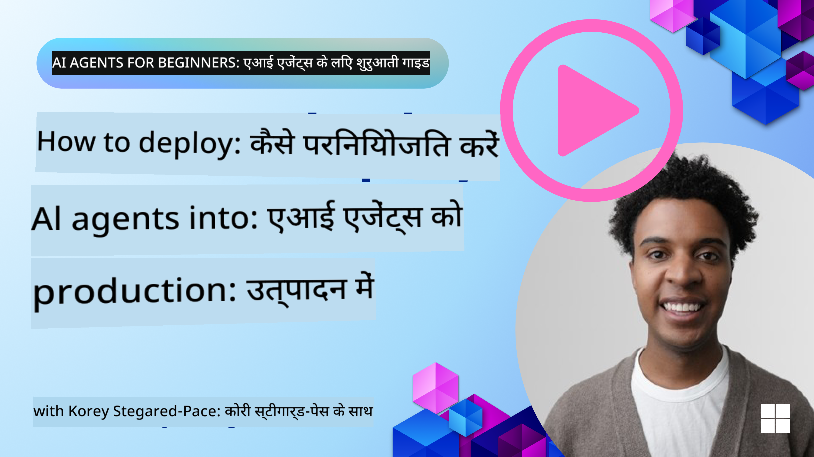

<!--
CO_OP_TRANSLATOR_METADATA:
{
  "original_hash": "44013a98d980c8b92d4b814dc49b545d",
  "translation_date": "2025-04-05T19:57:55+00:00",
  "source_file": "10-ai-agents-production\\README.md",
  "language_code": "hi"
}
-->

> _(ऊपर दी गई छवि पर क्लिक करें इस पाठ का वीडियो देखने के लिए)_
# उत्पादन में एआई एजेंट्स

## परिचय

इस पाठ में शामिल होगा:

- अपने एआई एजेंट को प्रभावी रूप से उत्पादन में लागू करने की योजना कैसे बनाएं।
- आम गलतियाँ और समस्याएँ जो आप उत्पादन में एआई एजेंट लागू करते समय सामना कर सकते हैं।
- लागत प्रबंधन कैसे करें जबकि अपने एआई एजेंट के प्रदर्शन को बनाए रखें।

## सीखने के लक्ष्य

इस पाठ को पूरा करने के बाद, आप जानेंगे/समझेंगे:

- उत्पादन एआई एजेंट सिस्टम के प्रदर्शन, लागत और प्रभावशीलता को सुधारने की तकनीकें।
- अपने एआई एजेंट्स का मूल्यांकन कैसे करें और क्या करें।
- उत्पादन में एआई एजेंट्स लागू करते समय लागत को कैसे नियंत्रित करें।

यह महत्वपूर्ण है कि आप भरोसेमंद एआई एजेंट्स लागू करें। "भरोसेमंद एआई एजेंट्स बनाना" पाठ भी देखें।

## एआई एजेंट्स का मूल्यांकन

एआई एजेंट्स को लागू करने से पहले, उसके दौरान और बाद में, उनके मूल्यांकन के लिए एक उचित प्रणाली होना आवश्यक है। यह सुनिश्चित करेगा कि आपका सिस्टम आपके और आपके उपयोगकर्ताओं के लक्ष्यों के अनुरूप है।

एआई एजेंट का मूल्यांकन करने के लिए, यह महत्वपूर्ण है कि आप केवल एजेंट के आउटपुट का ही नहीं बल्कि पूरे सिस्टम का मूल्यांकन कर सकें जिसमें आपका एआई एजेंट काम कर रहा है। इसमें शामिल हो सकते हैं लेकिन इन्हीं तक सीमित नहीं हैं:

- प्रारंभिक मॉडल अनुरोध।
- उपयोगकर्ता की मंशा को पहचानने की एजेंट की क्षमता।
- कार्य को पूरा करने के लिए सही उपकरण पहचानने की एजेंट की क्षमता।
- एजेंट के अनुरोध पर उपकरण की प्रतिक्रिया।
- उपकरण की प्रतिक्रिया की व्याख्या करने की एजेंट की क्षमता।
- एजेंट की प्रतिक्रिया पर उपयोगकर्ता की प्रतिक्रिया।

यह आपको सुधार के क्षेत्रों की पहचान करने में एक अधिक मॉड्यूलर दृष्टिकोण देता है। आप मॉडलों, प्रॉम्प्ट्स, उपकरणों और अन्य घटकों में किए गए परिवर्तनों के प्रभाव को बेहतर दक्षता के साथ मॉनिटर कर सकते हैं।

## एआई एजेंट्स से संबंधित सामान्य समस्याएँ और संभावित समाधान

| **समस्या**                                     | **संभावित समाधान**                                                                                                                                                                                                      |
| ---------------------------------------------- | ----------------------------------------------------------------------------------------------------------------------------------------------------------------------------------------------------------------------- |
| एआई एजेंट कार्यों को लगातार नहीं कर रहा है     | - एआई एजेंट को दिए गए प्रॉम्प्ट को परिष्कृत करें; उद्देश्यों को स्पष्ट करें। - यह पहचानें कि कार्यों को उप-कार्य में विभाजित करना और उन्हें कई एजेंट्स द्वारा संभालना कहाँ मददगार हो सकता है।                                                       |
| एआई एजेंट लगातार लूप में फंस रहा है           | - सुनिश्चित करें कि आपके पास स्पष्ट समाप्ति शर्तें हैं ताकि एजेंट को पता हो कि प्रक्रिया कब रोकनी है। - जटिल कार्यों के लिए जिनमें तर्क और योजना की आवश्यकता होती है, बड़े मॉडल का उपयोग करें जो इन कार्यों में विशेषज्ञ हो।                |
| एआई एजेंट के टूल कॉल्स अच्छा प्रदर्शन नहीं कर रहे हैं | - एजेंट सिस्टम के बाहर टूल के आउटपुट का परीक्षण और सत्यापन करें। - परिभाषित पैरामीटर, प्रॉम्प्ट्स और टूल्स के नाम को परिष्कृत करें।                                                                                 |
| मल्टी-एजेंट सिस्टम लगातार प्रदर्शन नहीं कर रहा है | - प्रत्येक एजेंट को दिए गए प्रॉम्प्ट्स को परिष्कृत करें ताकि वे विशिष्ट और एक-दूसरे से अलग हों। - "रूटिंग" या नियंत्रक एजेंट का उपयोग करके एक पदानुक्रमित प्रणाली बनाएं ताकि यह तय किया जा सके कि कौन सा एजेंट सही है।                        |

## लागत प्रबंधन

यहाँ उत्पादन में एआई एजेंट्स लागू करने की लागत प्रबंधन के लिए कुछ रणनीतियाँ दी गई हैं:

- **प्रतिक्रियाओं को कैश करना** - सामान्य अनुरोधों और कार्यों की पहचान करना और उनके उत्तरों को पहले से ही अपने एजेंटिक सिस्टम से गुजरने से पहले उपलब्ध कराना एक अच्छा तरीका है ताकि समान अनुरोधों की मात्रा कम हो सके। आप एक ऐसा प्रवाह भी लागू कर सकते हैं जो यह पहचान सके कि किसी अनुरोध की समानता आपके कैश किए गए अनुरोधों से कितनी है, इसके लिए अधिक बुनियादी एआई मॉडल का उपयोग करें।

- **छोटे मॉडल्स का उपयोग करना** - छोटे भाषा मॉडल्स (SLMs) कुछ एजेंटिक उपयोग मामलों में अच्छा प्रदर्शन कर सकते हैं और लागत को काफी हद तक कम कर सकते हैं। जैसा कि पहले बताया गया, प्रदर्शन बनाम बड़े मॉडल्स को समझने के लिए मूल्यांकन प्रणाली बनाना सबसे अच्छा तरीका है।

- **राउटर मॉडल का उपयोग करना** - एक समान रणनीति विभिन्न आकारों और मॉडलों का उपयोग करना है। आप जटिलता के आधार पर अनुरोधों को सही मॉडलों तक पहुँचाने के लिए LLM/SLM या सर्वरलेस फ़ंक्शन का उपयोग कर सकते हैं। यह लागत को कम करने में मदद करेगा और साथ ही सही कार्यों पर प्रदर्शन सुनिश्चित करेगा।

## बधाई हो

यह "शुरुआती लोगों के लिए एआई एजेंट्स" का वर्तमान में अंतिम पाठ है।

हम इस तेजी से बढ़ते उद्योग में प्रतिक्रिया और बदलावों के आधार पर पाठों को जोड़ते रहने की योजना बना रहे हैं, इसलिए निकट भविष्य में फिर से देखें।

यदि आप एआई एजेंट्स के साथ सीखना और निर्माण जारी रखना चाहते हैं, तो <a href="https://discord.gg/kzRShWzttr" target="_blank">Azure AI Community Discord</a> से जुड़ें।

हम वहाँ कार्यशालाएँ, सामुदायिक गोलमेज चर्चाएँ और "मुझसे कुछ भी पूछें" सत्र आयोजित करते हैं।

हमारे पास अतिरिक्त सामग्री का एक लर्न संग्रह भी है जो आपको उत्पादन में एआई एजेंट्स बनाना शुरू करने में मदद कर सकता है।

## पिछला पाठ

[मेटाकॉग्निशन डिज़ाइन पैटर्न](../09-metacognition/README.md)

**अस्वीकरण**:  
यह दस्तावेज़ AI अनुवाद सेवा [Co-op Translator](https://github.com/Azure/co-op-translator) का उपयोग करके अनुवादित किया गया है। जबकि हम सटीकता के लिए प्रयासरत हैं, कृपया ध्यान दें कि स्वचालित अनुवादों में त्रुटियां या अशुद्धियां हो सकती हैं। मूल भाषा में उपलब्ध मूल दस्तावेज़ को प्रामाणिक स्रोत माना जाना चाहिए। महत्वपूर्ण जानकारी के लिए, पेशेवर मानव अनुवाद की सिफारिश की जाती है। इस अनुवाद के उपयोग से उत्पन्न किसी भी गलतफहमी या गलत व्याख्या के लिए हम उत्तरदायी नहीं हैं।