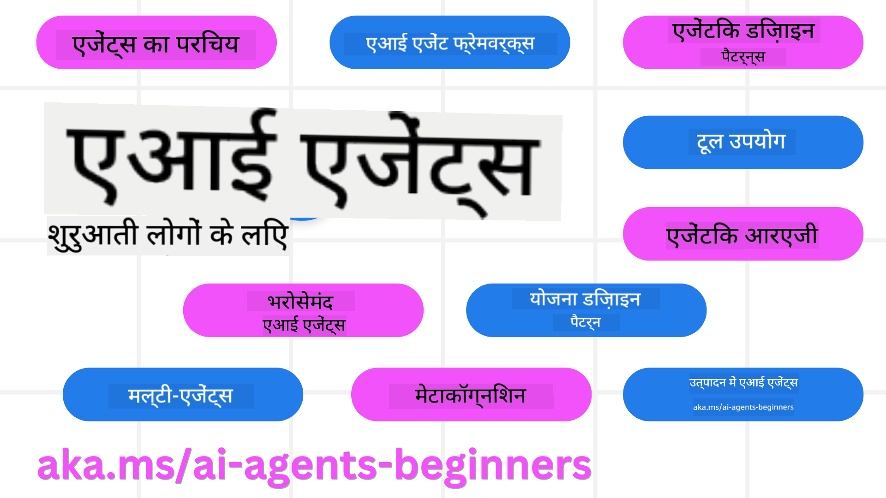

<!--
CO_OP_TRANSLATOR_METADATA:
{
  "original_hash": "715d22bec4a1a9f6d7ec58d4d9c69343",
  "translation_date": "2025-04-05T19:37:54+00:00",
  "source_file": "README.md",
  "language_code": "hi"
}
-->
# शुरुआती लोगों के लिए AI एजेंट्स - एक कोर्स

## 10 पाठ जो आपको AI एजेंट्स बनाना शुरू करने के लिए सब कुछ सिखाते हैं

  
  
  
  

### भाषा समर्थन
  
  
  
  
  
  
  
  
  
  
  
  

  
  
  

## 🌱 शुरुआत करें

यह कोर्स 10 पाठों में विभाजित है जो AI एजेंट्स बनाने की मूलभूत जानकारी को कवर करते हैं। हर पाठ एक अलग विषय पर आधारित है, तो आप कहीं से भी शुरू कर सकते हैं!

इस कोर्स में बहुभाषी समर्थन है। [यहां उपलब्ध भाषाओं](../..) पर जाएं।  

यदि आप पहली बार Generative AI मॉडल्स के साथ काम कर रहे हैं, तो हमारा [Generative AI For Beginners](https://aka.ms/genai-beginners) कोर्स देखें, जिसमें GenAI के साथ काम करने के 21 पाठ शामिल हैं।  

इस रिपॉजिटरी को [स्टार (🌟)](https://docs.github.com/en/get-started/exploring-projects-on-github/saving-repositories-with-stars?WT.mc_id=academic-105485-koreyst) और [फोर्क](https://github.com/microsoft/ai-agents-for-beginners/fork) करना न भूलें ताकि आप कोड को चला सकें।

### आपको क्या चाहिए

इस कोर्स के हर पाठ में कोड उदाहरण शामिल हैं, जिन्हें आप code_samples फोल्डर में पा सकते हैं। आप [इस रिपॉजिटरी को फोर्क](https://github.com/microsoft/ai-agents-for-beginners/fork) करके अपनी कॉपी बना सकते हैं।  

इन अभ्यासों के कोड उदाहरण, Language Models के साथ इंटरैक्ट करने के लिए Azure AI Foundry और GitHub Model Catalogs का उपयोग करते हैं:

- [Github Models](https://aka.ms/ai-agents-beginners/github-models) - मुफ्त / सीमित  
- [Azure AI Foundry](https://aka.ms/ai-agents-beginners/ai-foundry) - Azure अकाउंट आवश्यक  

इस कोर्स में Microsoft के निम्नलिखित AI एजेंट फ्रेमवर्क और सेवाओं का भी उपयोग किया गया है:

- [Azure AI Agent Service](https://aka.ms/ai-agents-beginners/ai-agent-service)  
- [Semantic Kernel](https://aka.ms/ai-agents-beginners/semantic-kernel)  
- [AutoGen](https://aka.ms/ai-agents/autogen)  

इस कोर्स के कोड को चलाने की जानकारी के लिए [Course Setup](./00-course-setup/README.md) पर जाएं।  

## 🙏 मदद करना चाहते हैं?  

क्या आपके पास सुझाव हैं या आपने वर्तनी या कोड में कोई त्रुटि पाई है? [Raise an issue](https://github.com/microsoft/ai-agents-for-beginners/issues?WT.mc_id=academic-105485-koreyst) या [Create a pull request](https://github.com/microsoft/ai-agents-for-beginners/pulls?WT.mc_id=academic-105485-koreyst) करें।  

अगर आप फंस गए हैं या AI एजेंट्स बनाने से संबंधित कोई सवाल है, तो हमारे [Azure AI Community Discord](https://discord.gg/kzRShWzttr) से जुड़ें।  

## 📂 प्रत्येक पाठ में शामिल है  

- README में लिखित पाठ और एक छोटा वीडियो  
- Azure AI Foundry और Github Models (मुफ्त) के साथ Python कोड के उदाहरण  
- आपकी सीखने की यात्रा जारी रखने के लिए अतिरिक्त संसाधनों के लिंक  

## 🗃️ पाठ  

| **पाठ**                                  | **पाठ्य सामग्री और कोड**                            | **वीडियो**                                                  | **अतिरिक्त शिक्षण**                                                                      |  
|------------------------------------------|----------------------------------------------------|------------------------------------------------------------|----------------------------------------------------------------------------------------|  
| AI एजेंट्स और उनके उपयोग के मामलों का परिचय | [Link](./01-intro-to-ai-agents/README.md)          | [Video](https://youtu.be/3zgm60bXmQk?si=z8QygFvYQv-9WtO1)  | [Link](https://aka.ms/ai-agents-beginners/collection?WT.mc_id=academic-105485-koreyst) |  
| AI एजेंटिक फ्रेमवर्क्स का अन्वेषण          | [Link](./02-explore-agentic-frameworks/README.md)  | [Video](https://youtu.be/ODwF-EZo_O8?si=Vawth4hzVaHv-u0H)  | [Link](https://aka.ms/ai-agents-beginners/collection?WT.mc_id=academic-105485-koreyst) |  
| AI एजेंटिक डिज़ाइन पैटर्न को समझना         | [Link](./03-agentic-design-patterns/README.md)     | [Video](https://youtu.be/m9lM8qqoOEA?si=BIzHwzstTPL8o9GF)  | [Link](https://aka.ms/ai-agents-beginners/collection?WT.mc_id=academic-105485-koreyst) |  
| टूल उपयोग डिज़ाइन पैटर्न                   | [Link](./04-tool-use/README.md)                    | [Video](https://youtu.be/vieRiPRx-gI?si=2z6O2Xu2cu_Jz46N)  | [Link](https://aka.ms/ai-agents-beginners/collection?WT.mc_id=academic-105485-koreyst) |  
| एजेंटिक RAG                               | [Link](./05-agentic-rag/README.md)                 | [Video](https://youtu.be/WcjAARvdL7I?si=gKPWsQpKiIlDH9A3)  | [Link](https://aka.ms/ai-agents-beginners/collection?WT.mc_id=academic-105485-koreyst) |  
| भरोसेमंद AI एजेंट्स बनाना                  | [Link](./06-building-trustworthy-agents/README.md) | [Video](https://youtu.be/iZKkMEGBCUQ?si=jZjpiMnGFOE9L8OK ) | [Link](https://aka.ms/ai-agents-beginners/collection?WT.mc_id=academic-105485-koreyst) |  
| प्लानिंग डिज़ाइन पैटर्न                    | [Link](./07-planning-design/README.md)             | [Video](https://youtu.be/kPfJ2BrBCMY?si=6SC_iv_E5-mzucnC)  | [Link](https://aka.ms/ai-agents-beginners/collection?WT.mc_id=academic-105485-koreyst) |  
| मल्टी-एजेंट डिज़ाइन पैटर्न                | [Link](./08-multi-agent/README.md)                 | [Video](https://youtu.be/V6HpE9hZEx0?si=rMgDhEu7wXo2uo6g)  | [Link](https://aka.ms/ai-agents-beginners/collection?WT.mc_id=academic-105485-koreyst) |  
| मेटाकॉग्निशन डिज़ाइन पैटर्न         | [लिंक](./09-metacognition/README.md)               | [वीडियो](https://youtu.be/His9R6gw6Ec?si=8gck6vvdSNCt6OcF)  | [लिंक](https://aka.ms/ai-agents-beginners/collection?WT.mc_id=academic-105485-koreyst) |
| उत्पादन में एआई एजेंट्स               | [लिंक](./10-ai-agents-production/README.md)        | [वीडियो](https://youtu.be/l4TP6IyJxmQ?si=31dnhexRo6yLRJDl)  | [लिंक](https://aka.ms/ai-agents-beginners/collection?WT.mc_id=academic-105485-koreyst) |

## 🌐 बहु-भाषा समर्थन

| भाषा                   | कोड | अनुवादित README का लिंक                              | अंतिम अपडेट |
|------------------------|------|-----------------------------------------------------|-------------|
| चीनी (सरलीकृत)        | zh   | [चीनी अनुवाद](../zh/README.md)          | 2025-03-24  |
| चीनी (पारंपरिक)        | tw   | [चीनी अनुवाद](../tw/README.md)          | 2025-03-28  |
| चीनी (हांगकांग)        | hk   | [चीनी (हांगकांग) अनुवाद](../hk/README.md) | 2025-03-28  |
| फ्रेंच                 | fr   | [फ्रेंच अनुवाद](../fr/README.md)        | 2025-03-28  |
| जापानी                | ja   | [जापानी अनुवाद](../ja/README.md)        | 2025-03-28  |
| कोरियाई               | ko   | [कोरियाई अनुवाद](../ko/README.md)       | 2025-03-28  |
| पुर्तगाली             | pt   | [पुर्तगाली अनुवाद](../pt/README.md)     | 2025-03-28  |
| स्पेनिश               | es   | [स्पेनिश अनुवाद](../es/README.md)       | 2025-03-28  |
| जर्मन                 | de   | [जर्मन अनुवाद](../de/README.md)         | 2025-03-28  |
| फारसी                 | fa   | [फारसी अनुवाद](../fa/README.md)         | 2025-03-28  |
| पोलिश                 | pl   | [पोलिश अनुवाद](../pl/README.md)         | 2025-03-28  |

## 🎒 अन्य पाठ्यक्रम

हमारी टीम अन्य पाठ्यक्रम भी बनाती है! इन्हें देखें:

- [**नया** .NET का उपयोग करके शुरुआती के लिए जनरेटिव एआई](https://github.com/microsoft/Generative-AI-for-beginners-dotnet?WT.mc_id=academic-105485-koreyst)
- [शुरुआती के लिए जनरेटिव एआई](https://github.com/microsoft/generative-ai-for-beginners?WT.mc_id=academic-105485-koreyst)
- [शुरुआती के लिए मशीन लर्निंग](https://aka.ms/ml-beginners?WT.mc_id=academic-105485-koreyst)
- [शुरुआती के लिए डेटा साइंस](https://aka.ms/datascience-beginners?WT.mc_id=academic-105485-koreyst)
- [शुरुआती के लिए एआई](https://aka.ms/ai-beginners?WT.mc_id=academic-105485-koreyst)
- [शुरुआती के लिए साइबर सुरक्षा](https://github.com/microsoft/Security-101??WT.mc_id=academic-96948-sayoung)
- [शुरुआती के लिए वेब डेवलपमेंट](https://aka.ms/webdev-beginners?WT.mc_id=academic-105485-koreyst)
- [शुरुआती के लिए IoT](https://aka.ms/iot-beginners?WT.mc_id=academic-105485-koreyst)
- [शुरुआती के लिए एक्सआर विकास](https://github.com/microsoft/xr-development-for-beginners?WT.mc_id=academic-105485-koreyst)
- [एआई पेयर्ड प्रोग्रामिंग के लिए GitHub Copilot में महारत हासिल करें](https://aka.ms/GitHubCopilotAI?WT.mc_id=academic-105485-koreyst)
- [C#/.NET डेवलपर्स के लिए GitHub Copilot में महारत हासिल करें](https://github.com/microsoft/mastering-github-copilot-for-dotnet-csharp-developers?WT.mc_id=academic-105485-koreyst)
- [अपना खुद का Copilot एडवेंचर चुनें](https://github.com/microsoft/CopilotAdventures?WT.mc_id=academic-105485-koreyst)

## 🌟 सामुदायिक धन्यवाद

एजेंटिक RAG का प्रदर्शन करने वाले महत्वपूर्ण कोड नमूने योगदान करने के लिए [शिवम गोयल](https://www.linkedin.com/in/shivam2003/) का धन्यवाद। 

## योगदान

यह प्रोजेक्ट योगदान और सुझावों का स्वागत करता है। अधिकांश योगदानों के लिए आपको एक 
Contributor License Agreement (CLA) से सहमत होना होगा, जिसमें आप यह घोषणा करते हैं कि आपके पास अपने योगदान का उपयोग करने के अधिकार हैं और आप वास्तव में हमें यह अधिकार प्रदान कर रहे हैं। अधिक जानकारी के लिए, <https://cla.opensource.microsoft.com> पर जाएं।

जब आप एक पुल अनुरोध सबमिट करते हैं, तो एक CLA बॉट स्वचालित रूप से यह निर्धारित करेगा कि क्या आपको CLA प्रदान करने की आवश्यकता है और PR को उपयुक्त रूप से सजाएगा (जैसे, स्थिति जांच, टिप्पणी)। बस बॉट द्वारा दिए गए निर्देशों का पालन करें। आपको यह केवल एक बार उन सभी रिपॉजिटरीज़ के लिए करना होगा जो हमारे CLA का उपयोग करते हैं।
इस प्रोजेक्ट ने [Microsoft Open Source Code of Conduct](https://opensource.microsoft.com/codeofconduct/) को अपनाया है।  
अधिक जानकारी के लिए [Code of Conduct FAQ](https://opensource.microsoft.com/codeofconduct/faq/) देखें या  
किसी भी अतिरिक्त प्रश्न या टिप्पणी के लिए [opencode@microsoft.com](mailto:opencode@microsoft.com) पर संपर्क करें।

## ट्रेडमार्क

इस प्रोजेक्ट में प्रोजेक्ट्स, प्रोडक्ट्स, या सेवाओं के लिए ट्रेडमार्क या लोगो हो सकते हैं। Microsoft  
ट्रेडमार्क या लोगो के अधिकृत उपयोग को [Microsoft's Trademark & Brand Guidelines](https://www.microsoft.com/legal/intellectualproperty/trademarks/usage/general) का पालन करना होगा।  
इस प्रोजेक्ट के संशोधित संस्करणों में Microsoft ट्रेडमार्क या लोगो का उपयोग भ्रम पैदा नहीं करना चाहिए या Microsoft प्रायोजन का संकेत नहीं देना चाहिए।  
किसी भी तृतीय-पक्ष ट्रेडमार्क या लोगो का उपयोग उन तृतीय-पक्ष की नीतियों के अधीन है।

**अस्वीकरण**:  
यह दस्तावेज़ AI अनुवाद सेवा [Co-op Translator](https://github.com/Azure/co-op-translator) का उपयोग करके अनुवादित किया गया है। जबकि हम सटीकता सुनिश्चित करने का प्रयास करते हैं, कृपया ध्यान दें कि स्वचालित अनुवाद में त्रुटियां या अशुद्धियां हो सकती हैं। मूल भाषा में लिखा गया मूल दस्तावेज़ प्रामाणिक स्रोत माना जाना चाहिए। महत्वपूर्ण जानकारी के लिए, पेशेवर मानव अनुवाद की सिफारिश की जाती है। इस अनुवाद के उपयोग से उत्पन्न किसी भी गलतफहमी या गलत व्याख्या के लिए हम उत्तरदायी नहीं हैं।